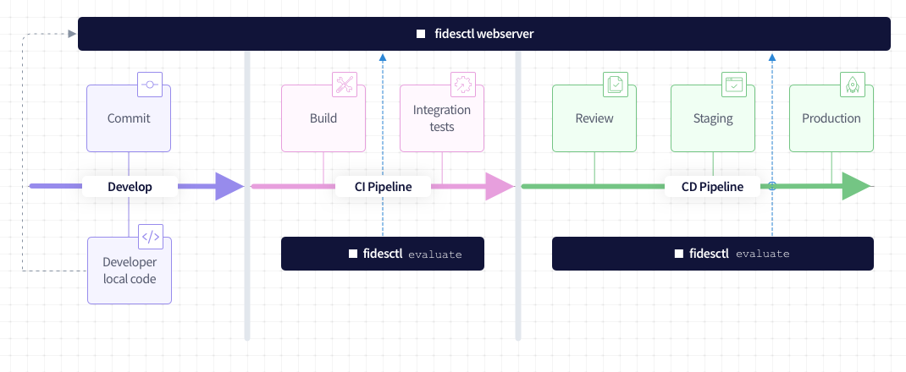

# Meet Fidesctl: Privacy Policies as Code

[![Latest Release Version][release-image]][release-url]
[![Docker][docker-workflow-image]][docker-actions-url]
[![Docs][docs-workflow-image]][docs-actions-url]
[![Package][release-workflow-image]][publish-actions-url]
[![License][license-image]][license-url]
[![Code style: black][black-image]][black-url]
[![Checked with mypy][mypy-image]][mypy-url]
[![Twitter][twitter-image]][twitter-url]


 _[Join the waitlist](https://ethyca.com/waitlist/) to get started with our free, hosted version!_

## :zap: Overview

Fides (_fee-dhez_, Latin: Fidēs) is an open-source tool that allows you to easily [declare your systems' privacy characteristics](https://ethyca.github.io/fides/tutorial/system/), [track privacy related changes](https://ethyca.github.io/fides/tutorial/policy/) to systems and data in version control, and [enforce policies](https://ethyca.github.io/fides/tutorial/pass/#evaluate-the-fidesctl-policies) in both your source code and [your runtime infrastructure](https://ethyca.github.io/fides/deployment/#step-5-install-fidesctl-cli-on-ci-build-server).



## :rocket: Quick Start

### System Requirements

* **Optional:** [`pipx`](https://pypa.github.io/pipx/) for environment isolation. The following documentation assumes `pipx` is installed, but `pip` commands can be substituted when needed.
* [Docker](https://www.docker.com/products/docker-desktop) (20.10.8+) and [Docker Compose](https://docs.docker.com/compose/install/) (1.29.0+)
* [Python](https://www.python.org/downloads/) (3.9+)
* [Nox](https://nox.thea.codes/en/stable/) (`pipx install nox`)

### Getting Started

Fides is capable of generating a series of YAML configuration files to represent your stored data, processes, and organizations. These [configuration resources](https://ethyca.github.io/fides/language/resources/system/) can then be exported into both a data map, and an Article 30-compliant Record of Processing Activities (RoPA).

This guide will walk through generating a mock RoPA using predefined resources included in the [Fides repository](https://github.com/ethyca/fides).

1. Ensure `nox` and `docker` and installed locally, and clone the Fides repo.

2. From the root fides directory, run the following commands:

    ```
    nox -s dev
    ```

    This will spin up the entire project and open a shell within the `fidesctl` container.

    Once you see the `fides#` prompt (takes ~3 minutes the first time), you can run the next command:

    ```
    fidesctl init
    ```

    This builds the required images, spins up the database, and runs the initialization scripts.

3. Use the `export datamap` command to generate a [data map](/docs/fides/docs/guides/generating_datamap.md) of the provided [demo resources](demo_resources/):

    ```sh
    fidesctl push demo_resources/
    fidesctl export datamap --output-dir demo_resources/
    ```

    This will `push` the provided demo resources, and `export` an `.xlsx` file of their contents to the `demo_resources/` directory.

4. View the newly-generated data map generated from the provided resources.

    #### **Controller**

    The header block at the top of the data map is composed of properties found in the [Organization resource](/demo_resources/demo_organization.yml). In a production deployment, this would be composed of publicly available information for your company or organization.

    #### **Article 30 Record of Processing Activities**

    The remainder of the information on the data map is generated from the provided [configuration resources](https://ethyca.github.io/fides/language/resources/system). In a production environment, these could be [automatically generated](https://ethyca.github.io/fides/guides/generate_resources/) from your databases and system resources.

    The [Dataset resource](demo_resources/demo_dataset.yml) is primarily used to provide a list of categories of personal data, recorded here using the [Fides taxonomy](https://github.com/ethyca/fideslang), that your systems store or process, as well as their retention policies. Any Datasets referenced by a System will have this information included as rows of your data map.

    The [System resource](demo_resources/demo_system.yml) describes anything that processes data for your organization, such as applications, services, and third party APIs. In the resulting data map, this populates system-relevant items like the purpose of processing and use, as well as categories of individual the data pertains to.

    Together, these configuration files build out an initial map of RoPA-required data and resources.

5. Assess the Organization and System datasets using the `--audit` flag.

    ```
    fidesctl evaluate demo_resources/ --audit
    ```

    This command will identify any missing information in your resources, which should be added to generate a compliant Record of Processing Activities.

    <details>

    <summary>Example Output</summary>

    ```sh
    "Auditing Organization Resource Compliance"
    Found 1 Organization resource(s) to audit...
    Auditing Organization: Demo Organization
    controller for default_organization in Demo Organization is compliant
    data_protection_officer for default_organization in Demo Organization is compliant
    representative for default_organization in Demo Organization is compliant
    security_policy for default_organization in Demo Organization is compliant
    All audited organization resource(s) compliant!
    ----------
    "Auditing System Resource Compliance"
    Found 2 System resource(s) to audit...
    "Auditing System: Demo Analytics System"
    improve.system missing recipients in Demo Analytics System.
    improve.system missing legal_basis in Demo Analytics System.
    improve.system missing special_category in Demo Analytics System.
    customer missing rights in Demo Analytics System.
    customer missing automated_decisions_or_profiling in Demo Analytics System.
    "Auditing System: Demo Marketing System"
    advertising missing recipients in Demo Marketing System.
    advertising missing legal_basis in Demo Marketing System.
    advertising missing special_category in Demo Marketing System.
    customer missing rights in Demo Marketing System.
    customer missing automated_decisions_or_profiling in Demo Marketing System.
    10 issue(s) were detected in auditing system completeness.
    ```

    </details>

    `--audit` flags any empty fields, along with the System or Organization they belong to, and returns where or not the system is incomplete or fully compliant. In the above example, the Organization resource is compliant, but both the Marketing and Analytics systems are missing information that would be required in your RoPA.

Now that you've seen how Fides can generate a data map from your resources and assess them for compliance, learn how you can [extend the Fides taxonomy](https://ethyca.github.io/fides/guides/generating_datamap/#extend-the-default-taxonomy) to replace the missing values revealed by `--audit` with additional data, and push your changes to generate an [Article 30-compliant RoPA](https://ethyca.github.io/fides/guides/generating_datamap/#generate-a-ropa).

## :book: Learn More

The Fides core team is committed to providing a variety of documentation to help get you started using Fidesctl.  As such, all interactions are governed by the [Fides Code of Conduct](https://ethyca.github.io/fides/community/code_of_conduct/).

### Documentation

For more information on getting started with Fides, how to configure and set up Fides, and more about the Fides ecosystem of open source projects:

* Documentation: <https://ethyca.github.io/fides/>
* Tutorial: <https://ethyca.github.io/fides/tutorial/>
* Installation: <https://ethyca.github.io/fides/installation/installation/>
* Roadmap: <https://github.com/ethyca/fides/projects>
* Website: www.ethyca.com/fides

### Support

Join the conversation on:

* [Slack](https://fid.es/join-slack)
* [Twitter](https://twitter.com/ethyca)
* [Discussions](https://github.com/ethyca/fides/discussions)

### Contributing

We welcome and encourage all types of contributions and improvements!  Please see our [contribution guide](https://ethyca.github.io/fides/development/overview/) to opening issues for bugs, new features, and security or experience enhancements.

Read about the [Fides community](https://ethyca.github.io/fides/community/hints_tips/) or dive into the [development guides](https://ethyca.github.io/fides/development/overview) for information about contributions, documentation, code style, testing and more. Ethyca is committed to fostering a safe and collaborative environment, such that all interactions are governed by the [Fides Code of Conduct](https://ethyca.github.io/fides/community/code_of_conduct/).

## :balance_scale: License

The Fides ecosystem of tools ([Fidesops](https://github.com/ethyca/fidesops) and [Fidesctl](https://github.com/ethyca/fides)) are licensed under the [Apache Software License Version 2.0](https://www.apache.org/licenses/LICENSE-2.0).
Fides tools are built on [Fideslang](https://github.com/ethyca/privacy-taxonomy), the Fides language specification, which is licensed under [CC by 4](https://github.com/ethyca/privacy-taxonomy/blob/main/LICENSE).

Fides is created and sponsored by Ethyca: a developer tools company building the trust infrastructure of the internet. If you have questions or need assistance getting started, let us know at fides@ethyca.com!

[release-image]: https://img.shields.io/github/release/ethyca/fides.svg
[release-url]: https://github.com/ethyca/fides/releases
[docker-workflow-image]: https://github.com/ethyca/fides/workflows/Docker%20Build%20&%20Push/badge.svg
[docs-workflow-image]: https://github.com/ethyca/fides/workflows/Publish%20Docs/badge.svg
[release-workflow-image]: https://github.com/ethyca/fides/workflows/Publish%20fidesctl/badge.svg
[docker-actions-url]: https://github.com/ethyca/fides/actions/workflows/docker.yaml
[docs-actions-url]: https://github.com/ethyca/fides/actions/workflows/publish_docs.yaml
[publish-actions-url]: https://github.com/ethyca/fides/actions/workflows/publish_package.yaml
[license-image]: https://img.shields.io/:license-Apache%202-blue.svg
[license-url]: https://www.apache.org/licenses/LICENSE-2.0.txt
[black-image]: https://img.shields.io/badge/code%20style-black-000000.svg
[black-url]: https://github.com/psf/black/
[mypy-image]: http://www.mypy-lang.org/static/mypy_badge.svg
[mypy-url]: http://mypy-lang.org/
[twitter-image]: https://img.shields.io/twitter/follow/ethyca?style=social
[twitter-url]: https://twitter.com/ethyca
