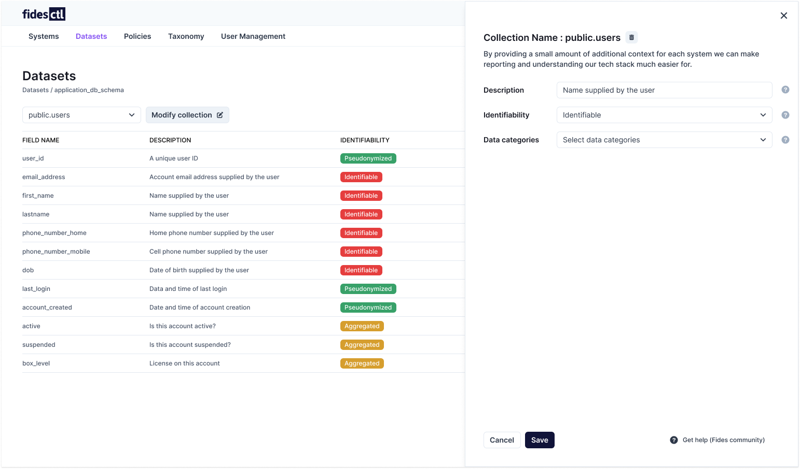

# Managing Datasets 

The Admin UI's Datasets pane allows you to easily view, add, edit, and configure your existing [datasets](../language/resources/dataset.md) and their connections.

## Adding a dataset 

Datasets can be added to the Fidesctl UI by walking through new dataset creation, or uploading an existing dataset's YAML configuration.

### Creating a new dataset

New datasets 

## Connect to your database 

### Loading an existing dataset

## Classifying a dataset

![classify a dataset]

## Modifying a dataset

### Modifying fields 

### Modifying a collection

## Delete a dataset