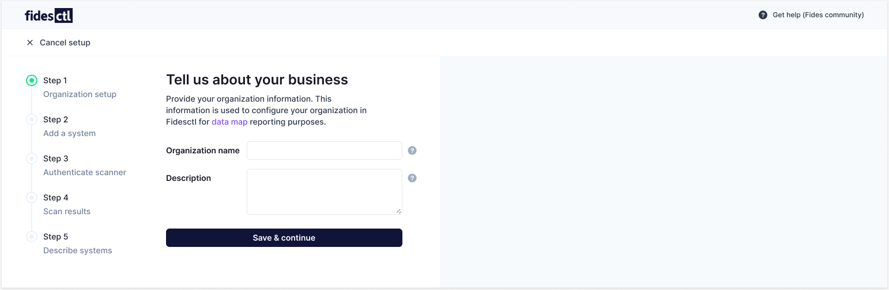
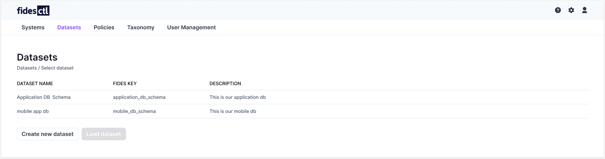

# Fides UI

Fidesctl provides several user interfaces to assist in managing your systems, datasets, and configuration settings.

## Configuration Wizard
The Fidesctl [Configuration Wizard](wizard.md) provides a guided walkthrough for configuring Fidesctl and building your first data map. The Configuration Wizard covers an introduction to understanding privacy engineering fundamentals, as well as explaining Fides' terminology and resources.

## Admin UI
The Admin UI organizes creating systems, policies, and datasets into a single control panel. Once configured, the Admin UI allows authorized users to manage policies, [update datasets](datasets.md), and customize your Fides [taxonomy](../language/taxonomy/overview.md).

