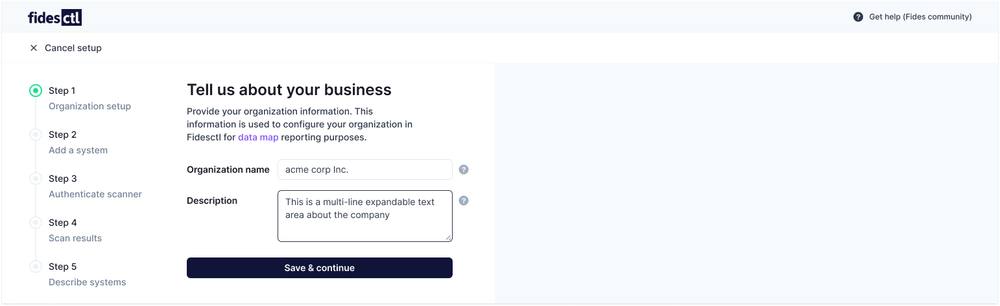
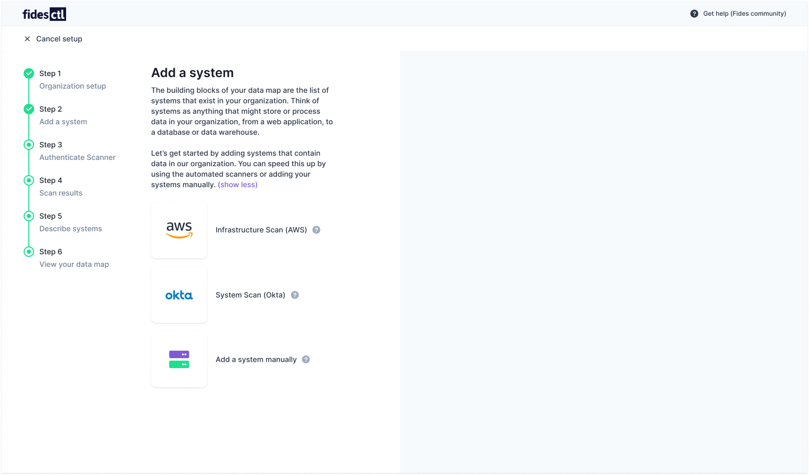
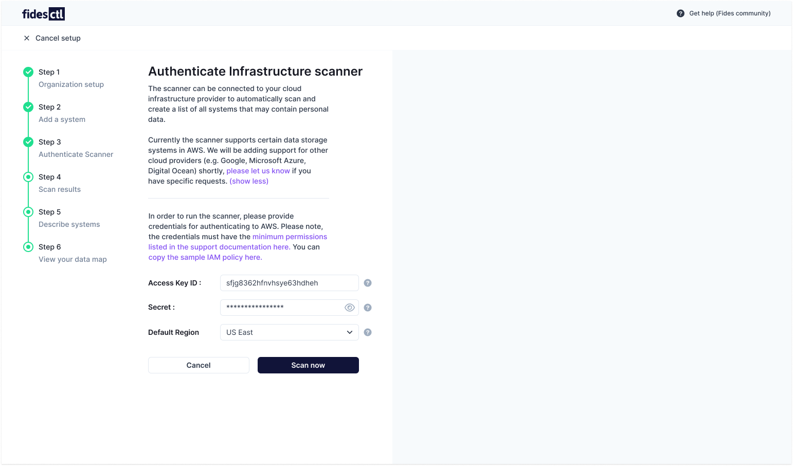
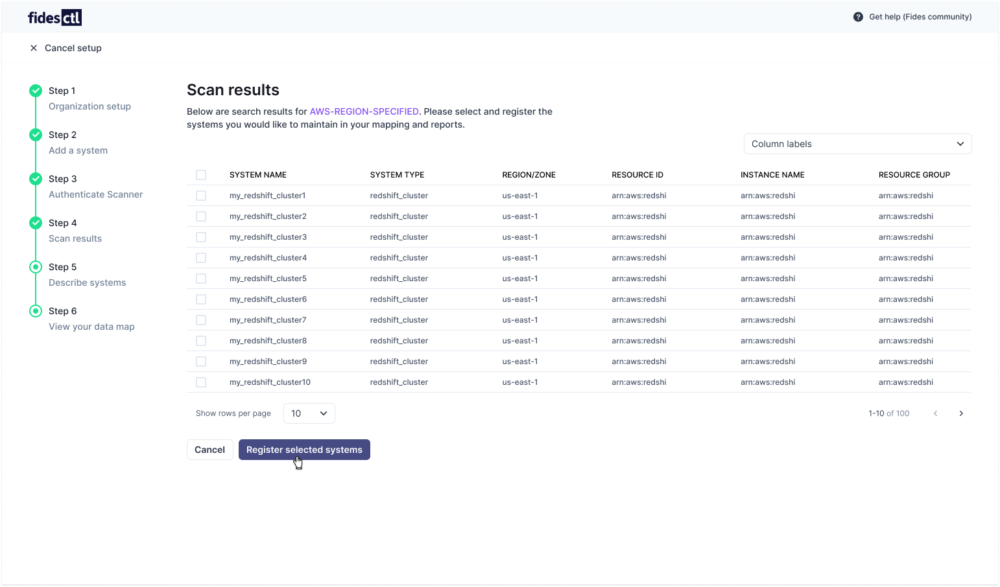
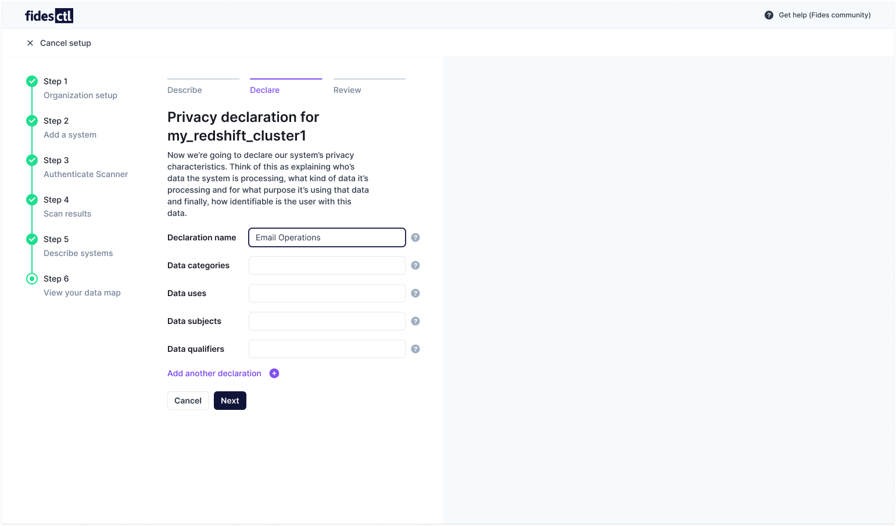
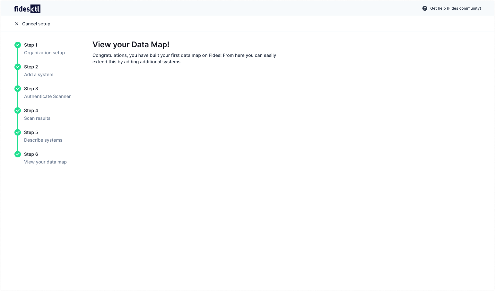

# Configuration Wizard

The Configuration Wizard is designed to simplify Fidesctl setup. Along with building your first data map, using the Config Wizard will provide you with a step-by-step introduction to privacy engineering fundamentals and Fides terminology and resources.

To get started, select **Config Wizard** from the Admin UI navigation bar.

## Step 1: Add your business or organization

Organization or business information is used to build your [data map](../guides/generating_datamap.md) for reporting purposes. Your organization name must be provided, along with a description of the company.

## Step 2: Add a system

**Systems** are anything that might store or process data in your information, and represent the building blocks of your data map. These might include web applications, databases, and data warehouses.

Systems can be added with automated scanning tools, or manually.

### Automatic scans
Scanning allows you to connect to your either your AWS cloud infrastructure or your Okta instance and automatically identify systems that should be on your data map. Support for additional systems (e.g. Google, Microsoft Azure, Digital Ocean) is planned shortly.
### Add a system manually
Systems can be added manually by entering information about them directly. Manual system creation allows you to include information not easily scannable by Fidesctl in your data map.
## Step 3: Scan your resources

Authentication credentials must be provided for Fidesctl to connect to your cloud infrastructure or sign-on provider. These credentials will be used to create a list of all systems that may contain personal data.

### Authenticate with AWS
To authenticate with AWS, you must provide an Access Key ID, associated secret, and the AWS region your infrastructure is located in. Fidesctl should be granted enough permissions to scan your AWS resources via an appropriate IAM policy.

### Authenticate with Okta
Fidesctl requires a token to authenticate with Okta. You can find [instructions here](https://help.okta.com/oie/en-us/Content/Topics/Security/API.htm) on how to retrieve a suitable token from your Okta administration panel.

## Step 4: View your results

Once your systems have been scanned and your resources added, you will be provided with a list of all the systems found which might contain personal data. 

Individual systems can be kept and registered by selecting their associated check box. To register all systems, select the checkbox at the top of the list.

## Step 5: Describe your systems

Describing your systems involves **declaring their privacy characteristics.** This description includes what data is being stored, how the data is being processed, and for what purpose the data is being kept.

You can add multiple declarations, and will have the opportunity to review the information you've provided before registering the system with Fides. 
## Step 6: View your data map
Congratulations! You have now provided everything Fidesctl needs to build a data map of your systems and resources. From here, you can extend this map by scanning and adding additional systems.

