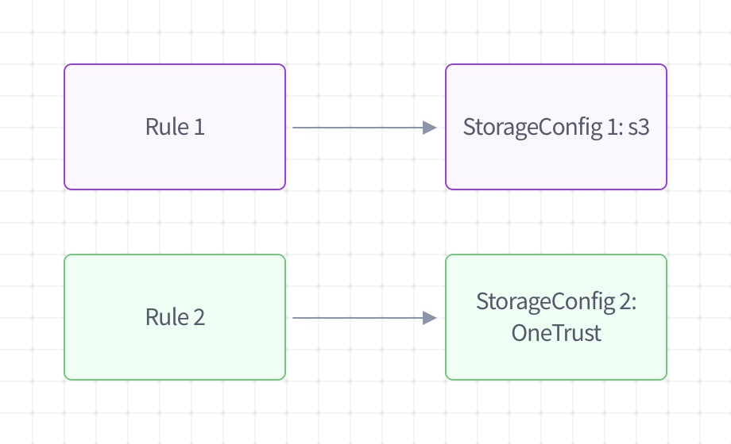

# Configure Storage Destinations

## What is a storage destination?
Access requests produce a package of returned data upon completion. This data will need to be uploaded to a storage destination (e.g. an S3 bucket) in order to be returned to the user.

!!! Tip "Fides never stores privacy request results locally. At least one storage destination must be configured if you wish to process access requests."

Storage destinations are associated to execution policies in their [Rules](./execution_policies.md#add-a-rule), allowing multiple storage destinations to be configured per execution policy.



## Create a storage destination
### Configure your storage method
To configure a Storage destination, first choose a method to store your results. Fides currently supports the following methods of storage:

- **local** - This saves upload packages locally, generating a `fides_uploads` directory at the root of your project. This destination type should only be used for testing purposes, and not to process real-world access requests.
- **S3** - Files are uploaded to an S3 bucket of your choosing upon completion of an access request. Use S3 if you need a place to store those files.


### Create your storage destination
Storage destinations are created and managed via the API. To create a new Storage destination, use the following endpoint:

```json title="<code>PATCH {host}/api/v1/storage/config</code>"
  {
    "destinations": [
      {
        "name": str,
        "key": FidesKey (optional),
        "type": str,
        "format": str
        "details": {
          # s3
          "auth_method": str,
          "bucket": str,
          "naming": str,
        }
      }
    ]
  }

```

#### Destination attributes
| Attribute | Description |
|---|---|
| `name` | A unique user-friendly name for your storage destination. |
| `key` | A unique key used to manage your storage destination. This is auto-generated from `name` if left blank. Accepted values are alphanumeric, `_`, and `.`. |
| `type` | Type of storage destination. Supported types include `s3`, and `local`. You may configure multiple destinations of the same type. |
| `format` | The format of uploaded data. Supported formats include `json` and `csv`. |

#### Additional attributes for s3 buckets
| Attribute | Description |
|---|---|
| `auth_method` | The [authentication method](#authentication) for creating a session with S3. Either `automatic` or `secret_keys`. |
| `bucket` | The name of the bucket in S3. |
| `naming` | This defines how the uploaded files will be named. Currently, Fides only supports upload file naming by `request_id`. Use this value for all your storage destinations. |

#### Additional attributes for local storage
| Attribute | Description |
|---|---|
| `naming` | This defines how the uploaded files will be named. Currently, Fides supports upload file naming by `request_id`. Use this value for all your storage destinations. |

On success, the response from the above endpoint will include a `storage_key` for each destination, which can be used when defining execution policy [Rules](./execution_policies.md#add-a-rule).

```json title="Example response"
{
    "items": [
        {
            "id": "sto_fe4e4dc0-b5d3-4ac1-bfcd-86e60e9891b9",
            "name": "s3 storage 2",
            "type": "s3",
            "details": {
                "auth_method": "secret_keys",
                "bucket": "my-bucket",
                "naming": "request_id",
                "object_name": "requests"
            },
            "key": "s3_storage_2"
        }
    ],
    "total": 1,
    "page": 1,
    "size": 1
}
```

### Authenticate with your destination
Fides requires authenticated access to update and erase/mask data in your storage destination. 

Use `storage_key` returned during your storage creation to provide access credentials:

```json title="<code>PUT {host}/api/v1/storage/config/{storage_key}/secret</code>"
  {
    # s3
    "aws_access_key_id": str,
    "aws_secret_access_key": str
  }

```

#### Additional attributes for S3 buckets
!!! Tip "Fides supports automatically creating a session for S3. If your `auth_method` is set to `automatic`, no secrets need to be provided. Boto3 will look for credentials on the server."

| Attribute | Description |
|---|---|
| `aws_access_key_id` | AWS access key id, obtained from AWS console. |
| `aws_secret_access_key` | AWS secret access key, obtained from AWS console. |

Secrets are not saved if credentials fail authentication with the given storage destination.

## Test your storage connection

To test that your storage destination works correctly, you can call the `upload` endpoint directly. Specify a `request_id` in the path with an arbitrary string:

```json title="<code>PUT {host}/api/v1/storage/{request_id}</code>"
  {
    "storage_key": {storage_key},
    "data": {
      #data here
    }
  }

```

| Attribute | Description |
|---|---|
| `storage_key` | The key associated with the storage destination. |
| `data` | A dictionary of arbitrary data you wish to upload to storage destination. |


## Extensibility
Fides can be extended to support additional storage destinations by:

1. Adding destination-specific enums in `src/fides/ops/schemas/storage/storage.py`
2. Implementing an authenticator in `src/fides/ops/service/storage/storage_authenticator_service.py`
3. Implementing the uploader in `src/fides/ops/service/storage/storage_uploader_service.py`
