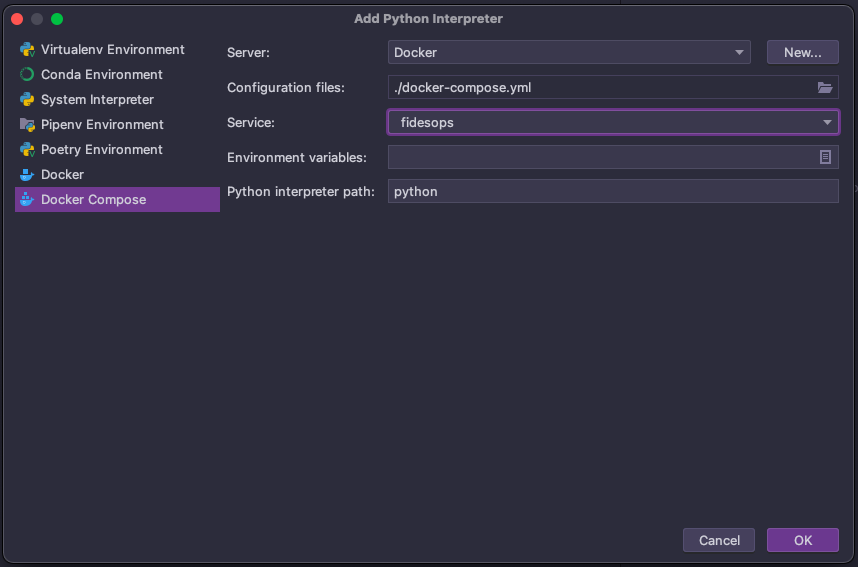
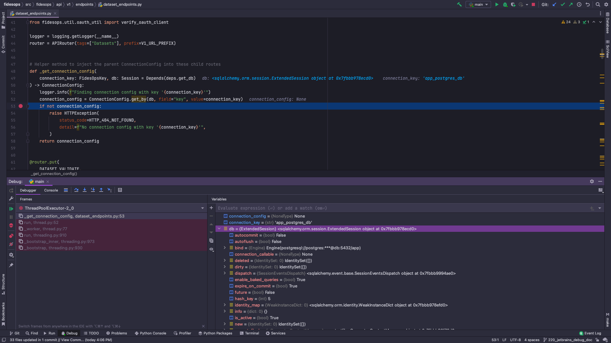

# Developing Fides

The primary developer interface for Fides is via a tool called Nox. Nox is a pure-Python replacement for tools like `make`. You can read more about Nox in the official documentation [here](https://nox.thea.codes/en/stable/index.html).

Additionally, much of what `nox` helps abstract is related to Docker. This usually makes it possible to troubleshoot potential `nox` issues by using various Docker commands directly.

If you haven't already, read the [Requirements Installation Guide](overview.md#requirements) to get up and running with the required tools and optimal configurations.

## Terminology

For the purposes of this documentation, there is some Nox-specific terminology that is used and is helpful to understand before reading the rest of the guide.

* `session` - This is the equivalent of a single command, or a `target` in Make. They can be chained together arbitrarily, and the order of execution will be preserved. For example `nox -s isort black`
* `posarg` - This refers to a _Positional Argument_. These can be provided to _any_ Nox command by putting `--` at the end of a command followed by the argument that you would like to provide. For instance `nox -s dev -- shell`
* `param` - This is a specified value that is provided directly to a session. For instance `nox -s "isort(<param>)"`. Note that due to terminal limitations, the `session` + `param` must be wrapped in quotes for proper escaping. Additionally, if a `session` has multiple params but none are specific, all permutations of that session will be run.

## Sessions to Know

While there are many sessions available in our `nox` setup, these are the ones that you are most likely to use regularly. This is intended as a brief introduction, as many of these commands will be explained further in specific sections below.

| Command | Description |
| :-----: | :--------- |
| `nox` | This is the default session that runs when no other session is provided. Automatically opens this page. |
| `nox -l`| Provides a list of all available `nox` sessions. |
| `nox -s usage -- <command>` | Shows the full docstring for a single session. The name of the session is provided as a positional argument. Use this whenever you want to know more about a specific session's usage. |
| `nox -s dev` | Spins up the Fides webserver with all required infrastructure. |
| `nox -s shell` | Opens an interactive shell in a running Fides webserver container. |
| `nox -s build` | Builds and tags docker containers. |
| `nox -s clean` | Completely wipes out all Docker volumes, images, and caches across the entire machine. _Note: This should only be used as a last resort! If you find yourself running this command often, there is probably an issue that needs to be addressed._ |
| `nox -s teardown` | Spins down all of the Docker containers for the Fides project. Including the `-- volumes` posarg will also delete the application database data. |

## Getting Started

This section will run through the basics of getting everything up and running so that you can start making changes.

### Docker

Given that the majority of commands rely on Docker images, the first step is going to be getting some Docker images built. This is handled by the `build` session. As an excercise, let's check the docs for the `build` session via the `usage` session:

```sh
nox -s usage -- build
```

The simplest way to build everything is to run `nox -s build`. This will build all available Docker images used for development and testing. Additionally, to build only a specific image(s), run `nox -s usage -- build` to see what params have been documented.

### Running the Webserver

Now that all of the potential images we'll need are built, it's time to spin up the webserver:

`nox -s dev`

Depending on your computer, this will take anywhere from ~30 seconds to ~2 minutes. The webserver will log all of its activity to that window which is useful for debugging and checking potential server-side errors.

!!! warning
    When running `nox -s dev`, if you get an `importlib.metadata.PackageNotFoundError: fides`, it means that `fides` was not properly installed. Run `nox -s dev -- shell`, and then run `pip install -e .`

    You can verify Fides is installed with `pip list | grep fides`

### Opening a Shell

Now that the webserver is up and running, a convenient way to interact with it as well as the Fides CLI is to open a shell directly into the running webserver container. Open a new terminal and run the following:

`nox -s shell`

With the shell open, we'll need to authenticate before we can start using the CLI. Run the following to authenticate the shell and get ready to run the CLI:

`fides user login`

With that done, we can do things like evaluations:

`fides evaluate`

Listing all resources of a type:

`fides ls system`

and more. Run `fides -h` to see the full list of commands offered by the CLI.

## Checking Your Changes

Once you've made some changes, it's time to verify that they are working as expected.

If you've made changes to the CLI, you can verify them directly using the `shell` method described [here](#opening-a-shell).

If you've made an API change, there are a few different ways to verify your changes. The first and most simple is to go to `localhost:8080/docs` and verify that the changes you made show up as expected in the documentation. This is most useful when adding a new endpoint or changing a schema.

To dig in even deeper, you can use the **Authorize** button at the top of the API docs page to login (credentials are available in the `.fides/fides.toml` config file). This will allow you to send requests, view responses, etc.

## Running Tests

For a full walkthrough on testing, head over to the [Testing](testing.md) page.

## Static Checks

For the sake of simplicity, all of the typical pre-commit static checks are packaged into a single session:

`nox -s static_checks`

This installs and runs the various checks in their own virtual environment for maximum consistency. For more information about code style in Fides, check [Code Style](code_style.md).

## Debugging Fides in VSCode

This is a quick guide to show how VSCode can be used to debug Fides running locally in Docker. The general approach is to allow the local `fides` Docker Compose service to allow remote debugging connections, and to start a remote debugger from a host VSCode workspace.

### Setup

#### Run Fides with Remote Debugging Enabled

In order to accept incoming remote debugging connections, the `fides` Docker Compose service must be run with slight alterations. To enable this functionality, simply add the `remote_debug` flag to a `nox` command. For example:

`nox -s dev -- remote_debug`

or

`nox -s dev -- remote_debug postgres timescale`

With those commands, the `fides` Docker Compose service that's running the Fides server locally is able to accept incoming remote debugging connections.

Note that, at this point, the `remote_debug` flag is not enabled for other `nox` sessions, e.g. `fides_env`, `pytest_ops`, etc.

#### Attach a Remote Debugger to the Fides Server 

Now that the running Fides server can accept incoming remote debugging connections, you can attach a remote debugger from a local VSCode workspace to actively debug the server application. A launch configuration is included in the `fides` repo to facilitate this step.

* Open up the `fides` repo in a VSCode workspace
* Go to the `Run and Debug` view
* From the debugger dropdown list, select the `Python debugger: Remote Attach Fides` configuration
* Click the `Start Debugging` play button
* The remote debugger should now be attached to the Fides server!
  * To confirm the debugger is attached, at least one `RUNNING` line item should appear in the `CALL STACK` window

### Debug!

At this point, VSCode is ready to debug the running Fides server. Try setting breakpoints and hitting them by, e.g., making certain HTTP requests against the Fides server. [This guide](https://code.visualstudio.com/docs/python/python-tutorial#_configure-and-run-the-debugger) provides more information on how to use the VSCode Python debugger. 

### Links

Some relevant VSCode documentation for reference:

* <https://code.visualstudio.com/docs/python/debugging#_debugging-by-attaching-over-a-network-connection>
* <https://code.visualstudio.com/docs/python/python-tutorial#_configure-and-run-the-debugger>

## Debugging Fides in IntelliJ IDEA Ultimate

This guide will show how to use the IntelliJ debugger with Fides running in Docker.
The setup for PyCharm Professional should be very similar.

### Prerequisites

* [Intellij IDEA Ultimate](https://www.jetbrains.com/idea/buy/#commercial) or [PyCharm Professional](https://www.jetbrains.com/pycharm/buy/#commercial)
* [Docker plugin](https://plugins.jetbrains.com/plugin/7724-docker)
* [Python plugin](https://plugins.jetbrains.com/plugin/631-python) *(this is needed for Intellij)*
* [Docker Desktop](https://www.docker.com/products/docker-desktop)

### Setup

#### Connect to Docker daemon

This step will allow the IDE to connect to Docker Desktop.

Go to: **Settings/Preferences** -> **Docker** -> **+**

* Select **Docker for "your operating system"**

See the screenshot below:


### Configure Python Remote Interpreter

Define a Docker-based remote interpreter.

Go to: **File** -> **Project Structure...** -> **Platform Settings** -> **SDKs** -> **+**

* Set **Server** to `Docker`
* Set **Configuration files** to `.docker-compose.yml`
* Set **Python interpreter path** to `python`

After clicking **OK** the Remote Python Docker Compose should be listed as an SDK.

See screenshots below:




### Run/Debug Configuration

Set up a Run/Debug Configuration so that breakpoints can be hit in the f sourcecode.

Go to: **Run/Debug Configurations** -> **+** -> **Python**

* To debug Fides, debug the `<path on your machine>/src/fides/main.py` script
* Make sure to select **Use specified interpreter** set the Remote Python Docker Compose *(created in the previous section)*
* Add `FIDES__CONFIG_PATH=/fides` to **Environment variables**

See screenshot below:


### Hit a Breakpoint

Now the IDE is ready to debug the source code. Click the debug button for **main** *(setup in the previous section)*.

Try firing a http request to Fides from Postman or Curl and hit a break point.

There is a postman collection in this repo: `docs/fides/docs/development/postman/Fides.postman_collection.json`

Screenshot of hit breakpoint below:



### Links

The information is this guide is largely based on these docs

* <https://www.jetbrains.com/help/pycharm/using-docker-as-a-remote-interpreter.html>
* <https://www.jetbrains.com/help/idea/configuring-local-python-interpreters.html>
