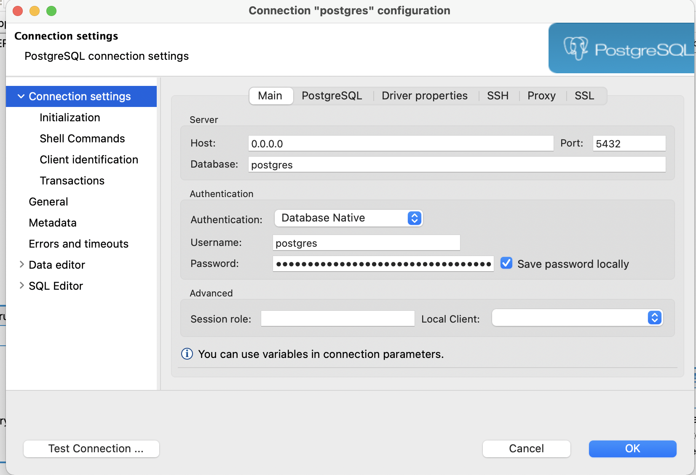

# Updating database diagram

If you make updates to the Fides application database, you should update the DB Architecture diagram in the documentation.

1. Connect [DBeaver](https://dbeaver.io/) to our `app` DB container
   1. DBeaver > Database > New Database Connection > PostgreSQL
      1. Add configuration details
      
      2. Right-click on postgres connection > Create > Other
      3. Select ER Diagram, Click Next
      4. Drill down to Postgres > app > Schemas > public and click the checkbox.
      5. Add a name to your ER Diagram
      6. Click Finish
2. Drag and drop tables so they are less messy.
3. File > Save As (app_database.png)
4. Replace img/app_database.png with the new file
