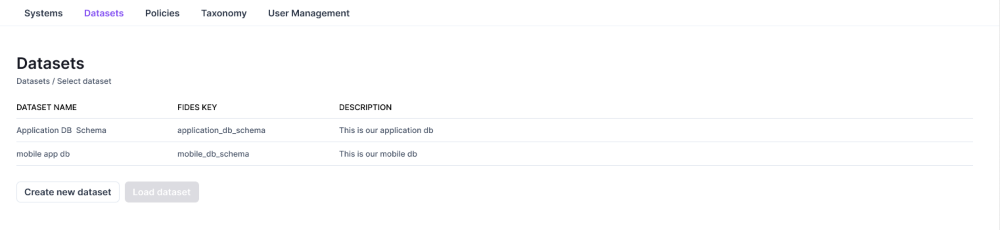
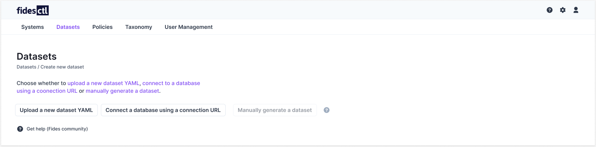
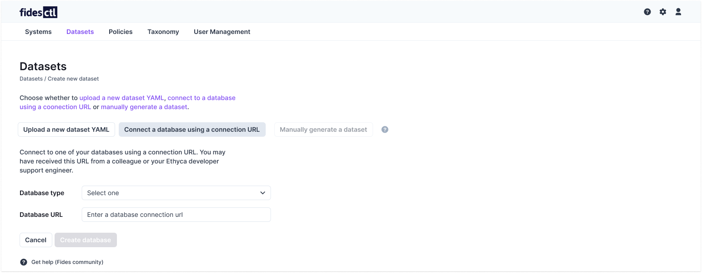

# Connect Databases 

The Datasets panel allows you to easily view, add, edit, and configure [datasets](https://ethyca.github.io/fideslang/resources/dataset/), which represent your external databases.

## Adding a dataset 

Datasets can be added to the Fides UI by connecting to your databases. To add a new dataset, select **Create new dataset** from the Datasets panel.

You will then be given a list of options for creating your new dataset:

### Connect to a database 

To generate a dataset by connecting directly to a database, select **Connect a database using a connection URL**.

You will need to provide your **database type** from the dropdown, as well as the **database URL string.** 

Once the required information is entered, select **Create database**. Fides will display a success notification when the process is completed.

## Additional resources
To learn more about modifying datasets or manually uploading a configuration YAML, see the [datasets](../ui/datasets.md) reference guide.
## Next steps
With your databases connected and your SaaS applications configured, you're ready to [process a DSR](./dsr_processing.md)!