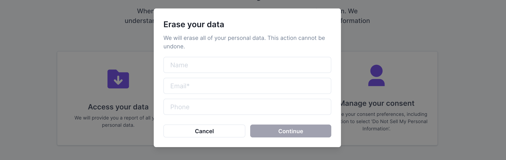

# Process a Data Subject Request

You can now navigate to your hosted Privacy Center, and begin accepting data subject requests!

## Using the Control Panel

Your administrator control panel allows you to view and process submitted privacy requests. The Privacy Request console provides search and sort capabilities, quick approve and deny functions, and in-depth details on individual request histories and statuses.

## View request details

Double-clicking a request row will display the request detail page, which allows access to additional information about the request, including the request ID, request type, and current status.

## Additional resources
For more information on processing requests and viewing request details, see the [Admin UI](../ui/privacy_requests.md) guides.

## Next steps
Congratulations - you've gone from **0 to DSR Automation**! Fides offers many more tools help take control of your data privacy. To find out more, check out our guides on [data mapping](../guides/generate_datamaps.md), [privacy-as-code](../cicd.md), and the [Fides Taxonomy](https://ethyca.github.io/fideslang/).