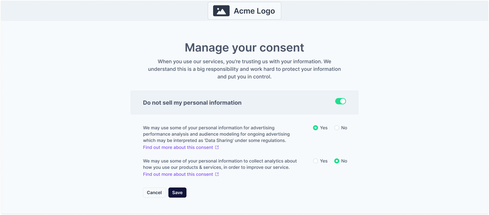

# Privacy Center

The Fides [Privacy Center](privacy_center.md) is a configurable webpage where users can request to download or delete their data. The Privacy Center also provides configurable consent settings for regulatory compliance, allowing users to access and edit their data use preferences.


## Run the Privacy Center
The Privacy Center is provided in a separate Docker image. To begin, run the following command:

```
docker pull ethyca/fides-privacy-center
```

The Privacy Center can be deployed independently, or alongside any other hosted components. 

## Configuration

The Fides Privacy Center's text and actions are managed by a `config.json` file in the Fides `/privacy-center/config` directory.

```json title="<code>config.json</code>"
{
  "title": "Take control of your data",
  "description": "When you use our services, you’re trusting us with your information. We understand this is a big responsibility and work hard to protect your information and put you in control.",
  "server_url_development": "http://localhost:8080/api/v1",
  "server_url_production": "https://<$YOUR_SERVER_URL>/api/v1",
  "logo_path": "/logo.svg",
  "actions": [
    {
      "policy_key": "default_access_policy",
      "icon_path": "/download.svg",
      "title": "Access your data",
      "description": "We will email you a report of the data related to your account.",
      "identity_inputs": {
        "name": "optional",
        "email": "required",
        "phone": "optional"
      }
    },
    {
      "policy_key": "default_erasure_policy",
      "icon_path": "/delete.svg",
      "title": "Erase your data",
      "description": "We will delete all of your account data. This action cannot be undone.",
      "identity_inputs": {
        "name": "optional",
        "email": "required",
        "phone": "optional"
      }
    }
  ],
  "includeConsent": true,
  "consent": {
    "cookieName": "fides_consent",
    "consentOptions": [
      {
        "fidesDataUseKey": "advertising",
        "name": "Advertising / Data Sharing",
        "description": "We may use some of your personal information for advertising performance analysis and audience modeling for ongoing advertising which may be interpreted as 'Data Sharing' under some regulations.",
        "url": "https://example.com/privacy#advertising",
        "default": true,
        "highlight": false,
        "cookieKeys": ["data_sales"]
      },
      {
        "fidesDataUseKey": "improve",
        "name": "Product Analytics",
        "description": "We may use some of your personal information to collect analytics about how you use our products & services, in order to improve our service.",
        "url": "https://example.com/privacy#data-sales",
        "default": true,
        "highlight": false,
        "cookieKeys": ["data_sales"]
      },
      {
        "name": "Analytics",
        "fidesDataUseKey": "third_party_sharing",
        "description": "...",
        "url": "https://example.com/privacy#analytics",
        "cookieKeys": ["data_sharing"]
      },
      {
        "name": "Personalize",
        "fidesDataUseKey": "personalize",
        "default": true,
        "url": "https://example.com/privacy#personalize",
        "description": "...",
        "cookieKeys": ["functional"]
      },
      {
        "name": "Essential",
        "fidesDataUseKey": "provide.service",
        "default": true,
        "url": "https://example.com/privacy#essential",
        "highlight": true,
        "description": "...",
        "cookieKeys": ["essential"]
      }
    ]
  }
}
```

| Key | Description |
|----|----|
| `title` and `description` | Text fields to override the default text of either the main portal, or the associated action. |
| `server_url_development` | The Fides server URL to use for development deployments. |
| `server_url_production` | The Fides server URL to use for production deployments. |
| `logo_path` | The relative path to a brand or site logo to replace the default. |
| `actions` | A list of [action objects](#actions), each of which represent a new tile available in the portal, and are associated to a single Fides policy. |
| `policy_key` | The key of the [policy](../guides/policies.md) to use for this action. |
| `icon_path` | The relative path of an icon to replace the defaults. |
| `identity_inputs` | The list of personally identifiable information required by an action. |

### Actions

Actions represent available privacy rights executable from the Privacy Center. The provided `config.json` includes Download and Delete default, representing common requests to access or remove data under most privacy regulations. Each action is associated with a Fides [policy key](../guides/policy_webhooks.md), which defines the policy executed when the DSR is approved.

Additional actions can be added to this list, and removed at any time.

### Consent
To provide compliance with local and internal regulations, you may define a series of [data uses](https://ethyca.github.io/fideslang/taxonomy/data_uses/) in your Privacy Center configuration. This list of data uses will allow users to configure their personal privacy preferences, which will be stored as a cookie.



| Key | Description |
|----|----|
| `includeConsent` | Where or not the consent options are enabled. |
| `cookieName` | The name of the stored cookie. |
| `title` and `description` | Text fields to override the default text of the associated consent option. |
| `url` | The URL where a user can find additional information about this data use. |
| `default` | If this consent preference is enabled (true) or disabled (false) by default. |
| `highlight` | Whether or not this consent preference is highlighted. |
| `cookieKeys` | The data use represented within your stored cookie. |

### Styling

Any overrides for CSS styling can be included in a `config.css` file in the `/privacy-center/config` directory.

## Next steps
With all the components for DSR automation configured, you can now process a [data subject request](./dsr_processing.md)!