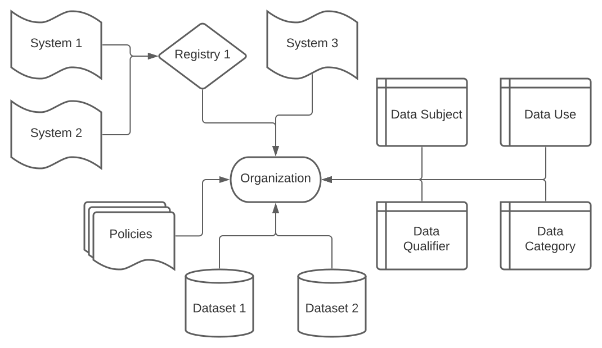

# Fides Resource Types

This page describes the various objects that make up the Fides platform.

## Object Relationship Diagram



## Organization

An organization is a logical grouping of objects, and all objects must belong to an organization. Fides includes a default organization with an id of 1.

=== "Example Manifest"

    ```yaml
    organization:
      fidesKey: "test_organization"
      name: "Test Organization"
      description: "A test organization used to check the validity of changes."
    ```

| Name | Type | Description |
| --- | --- | --- |
| fidesKey | String | A fides key is an identifier label that must be unique within your organizations systems. A fides key can only contain alphanumeric characters, '_', and '-' |
| name | String |  A name for this organization |
| description | String | A description of what this organiztion encapsulates |

---

## Privacy Classifiers

Fides uses four classifiers for describing how systems use privacy data, and for describing what privacy data can be used in what ways. All of these types support organization into hierarchical trees.

### Data Category

A Data Category describes the kind of data that is being used.

=== "Example Manifest"

    ```yaml
    data-category:
    - fidesKey: "date_of_birth"
      name: "Date of Birth"
      parentKey: "user_provided_data"
      description: "User's date of birth."
    ```

=== "Example Hierarchy"

    ```yaml
    - user_provided_data
        - date_of_birth
        - job_title
    - derived data
      - sensor_data
      - user_identifiable_data
        - telemetry_data
    - account data
        - account_contact_information
        - payment_information
    ```

| Name | Type | Description |
| --- | --- | --- |
| organizationId | Optional[Int] | Id of the organization this data category belongs to, defaults to 1 |
| fidesKey | String | A fides key is an identifier label that must be unique within your organizations systems. A fides key can only contain alphanumeric characters, '_', and '-' |
| name | String |  A name for this data category |
| parentKey | Optional[String] | the fidesKey of the parent category |
| description | String | A description of what this data category means or encapsulates |

### Data Use

A Data Use describes what the data is being used for.

=== "Example Manifest"

    ```yaml
    data-use:
    - fidesKey: "provide_operational_support_for_contracted_service"
      name: "Provide Operational Support for Contracted Service"
      parentKey: "provide"
      description: "This usage is related to the acquisition, processing and storage of data about the usage of a cloud service (derived data) contracted by a specific cloud service customer in order to operate and protect the systems and processes necessary for the provision of this cloud service."
    ```

=== "Example Hierarchy"

    ```yaml
    - personalize
    - share
        - share_when_required_to_provide_the_service
    - promote
        - promote_based_on_contextual_information
        - promote_based_on_personalization
    ```

| Name | Type | Description |
| --- | --- | --- |
| organizationId | Optional[Int] | Id of the organization this data use belongs to, defaults to 1 |
| fidesKey | String | A fides key is an identifier label that must be unique within your organizations systems. A fides key  can only contain alphanumeric characters, '_', and '-' |
| name | String | A name for this data use |
| parentKey | Optional[String] | the fidesKey of the parent category |
| description | String | A description of what this data use means or encapsulates |

### Data Subject

A Data Subject describes who the data belongs to.

=== "Example Manifest"

    ```yaml
    data-subject:
    - fidesKey: "anonymous_user"
      name: "Anonymous User"
      description: "A user without any identifiable information tied to them."
    ```

=== "Example Hierarchy"

    ```yaml
    - customer
    - supplier
    - job applicant
    ```

| Name | Type | Description |
| --- | --- | --- |
| organizationId | Optional[Int] | Id of the organization this data subject belongs to, defaults to 1 |
| fidesKey | String | A fides key is an identifier label that must be unique within your organizations systems. A fides key  can only contain alphanumeric characters, '_', and '-' |
| name | String | A name for this data subject |
| parentKey | Optional[String] | the fidesKey of the parent category |
| description | String | A description of what this data subject means or encapsulates |

### Data Qualifier

A Data Qualifier describes how private the data being used is. The hierarchy for Data Qualifiers is in order of increasing exposure.

=== "Example Manifest"

    ```yaml
    data-qualifier:
    - fidesKey: "aggregated_data"
      name: "Aggregated Data"
      description: "Aggregated data is statistical data that does not contain individual-level entries and is combined from information about enough different persons that individual-level attribtures are not identifiable."
    ```

=== "Example Hierarchy"

    ```yaml
    - aggregated data
        - anonymized data
            - unlinked pseudonymized data
                - pseudonymized data
                    - identified data
    ```

| Name | Type | Description |
| --- | --- | --- |
| organizationId | Optional[Int] | Id of the organization this data qualifier belongs to, defaults to 1 |
| fidesKey | String | A fides key is an identifier label that must be unique within your organizations systems. A fides key can only contain alphanumeric characters, '_', and '-' |
| name | String | A name for this data qualifier |
| parentKey | Optional[String] | the fidesKey of the parent category |
| description | String | A description of what this data qualifier means or encapsulates |

---

## Registry

A registry can optionally be used to group systems.

=== "Example Manifest"

    ```yaml
    registry:
    - organizationId: 1
      fidesKey: "user_systems_registry"
      name: "User Systems Registry"
      description: "A registry for all of the user-related systems."
    ```

| Name | Type | Description |
| --- | --- | --- |
| organizationId | Int | Id of the organization this registry belongs to |
| fidesKey | String | A fides key is an identifier label that must be unique within your organizations systems. A fides key can only contain alphanumeric characters, '_', and '-' |
| name | String |  A name for this registry |
| description | String | A description of what this registry means or encapsulates |

---

## System

A system represents the privacy usage of a single software project, service, codebase, or application.

=== "Example Manifest"

    ```yaml
    system:
      - organizationId: 1
        fidesOrganizationKey: "Ethyca"
        registryId: 1
        fidesKey: "demoSystem"
        systemType: "service"
        metadata:
          name: "Demo System"
        privacyDeclarations:
          - dataCategories:
              - "customer_content_data"
            dataUse: "provide"
            dataQualifier: "anonymized_data"
            dataSubjects:
              - "anonymous_user"
            dataSets:
              - "user_data"
        systemDependencies: []
    ```

| Name | Type | Description |
| --- | --- | --- |
| organizationId | Int | Id of the organization this system belongs to |
| registryId | Optional[Int] | Id of the registry this system belongs to |
| fidesKey | String | A fides key is an identifier label that must be unique within your organizations systems. A fides key  can only contain alphanumeric characters, '_', and '-' |
| systemType | String | The type of system being declared |
| metadata | Map[String, String] | A key-value pair field to add various additional info |
| privacyDeclarations | List[privacyDeclaration] | A list of privacy declarations (see `Privacy Declaration` below) |
| systemDependencies | List[fidesKey] | Systems that this system depends on, identified by their fidesKey |

### Privacy Declaration

A Privacy Declaration describes the usage of data within a system. It is included as a composite object within a system declaration.

| Name | Type | Description |
|  --- | --- | --- |
| dataCategories | List[String] | Id of the organization this system belongs to |
| dataSubjects | List[String] | Id of the organization this system belongs to |
| dataUse | String | Id of the organization this system belongs to |
| dataQualifier | String | Id of the organization this system belongs to |
| dataSets | String | Id of the organization this system belongs to |

A Privacy Declaration can be read as "This system uses data in categories `dataCategories` for `dataSubjects` with the purpose of `dataUse` at a qualified privacy level of `dataQualifier`"

---

## Dataset

A Dataset represents any kind of place where data is stored and includes a sub-object that describes the fields within that dataset.

=== "Example Manifest"

    ```yaml
    dataset:
      - organizationId: 1
        fidesKey: "sample_db_dataset"
        name: "Sample DB Dataset"
        description: "This is a Sample Database Dataset"
        datasetType: "MySQL"
        location: "US East" # Geographic location of the dataset
        fields:
          - name: "first_name"
            description: "A First Name Field"
            dataCategories:
              - "derived_data"
            dataQualifier: "identified_data"
          - name: "email"
            description: "User's Email"
            dataCategories:
              - "account_data"
            dataQualifier: "identified_data"
          - name: "Food Preference"
            description: "User's favorite food"
    ```

| Name | Type | Description |
| --- | --- | --- |
| organizationId | Int | Id of the organization this system belongs to |
| fidesKey | String | A fides key is an identifier label that must be unique within your organizations systems. A fides key  can only contain alphanumeric characters, '_', and '-' |
| name | String | A name for this dataset |
| description | String | A description of what this dataset exists for |
| datasetType | String | The type of dataset being declared |
| location | String | The physical location of the dataset |
| fields | List[Fields] | A list of fields (see `Field` below) |

### Field

A Field describes a single column or array of data within a dataset. Data descriptions for dataset fields do not contain data use or data subject values as those refer specifically to data usage.

| Name | Type | Description |
|  --- | --- | --- |
| name | String | A name for this field |
| description | String | A description of what this field contains |
| dataCategories | List[String] | The data categories that apply to this field |
| dataQualifier | String | The data qualifier for this data |

---

## Policies

Policies group together sets of privacy rules into a single object. These are the objects that systems and registries will be evaluated against.

=== "Example Manifest"

    ```yaml
    policy:
      organizationId: 1
      fidesKey: "primaryPrivacyPolicy"
      privacyRules:
        - fidesKey: "rejectTargetedMarketing"
          dataCategories:
            inclusion: "ANY"
            values:
              - profiling_data
              - account_data
              - derived_data
              - cloud_service_provider_data
          dataUses:
            inclusion: ANY
            values:
              - market_advertise_or_promote
              - offer_upgrades_or_upsell
          dataSubjects:
            inclusion: ANY
            values:
              - trainee
              - commuter
          dataQualifier: pseudonymized_data
          action: REJECT
        - fidesKey: rejectSome
          dataCategories:
            inclusion: ANY
            values:
              - user_location
              - personal_health_data_and_medical_records
              - connectivity_data
              - credentials
          dataUses:
            inclusion: ALL
            values:
              - improvement_of_business_support_for_contracted_service
              - personalize
              - share_when_required_to_provide_the_service
          dataSubjects:
            inclusion: NONE
            values:
              - trainee
              - commuter
              - patient
          dataQualifier: pseudonymized_data
          action: REJECT
    ```

| Name | Type | Description |
| --- | --- | --- |
| organizationId | Int | Id of the organization this system belongs to |
| fidesKey | String | A fides key is an identifier label that must be unique within your organizations systems. A fides key  can only contain alphanumeric characters, '_', and '-' |
| privacyRules | List[privacyRule] | A list of privacy rules (see `Privacy Rule` below) |

### Privacy Rule

A Privacy Rule describes a single combination of data privacy classifiers that are acceptable or not.

| Name | Type | Description |
| --- | --- | --- |
| fidesKey | String | A fides key is an identifier label that must be unique within your organizations systems. A fides key  can only contain alphanumeric characters, '_', and '-' |
| dataCategories | List[dataRule] | A list of data rules (see `Data Rule` below) |
| dataUses | List[dataRule] | A list of data rules (see `Data Rule` below) |
| dataSubjects | List[dataRule] | A list of data rules (see `Data Rule` below) |
| dataQualifier | String | A data qualifier for this privacy rule |
| action | Choice | A string, either `ACCEPT` or `REJECT` |

### Data Rule

A Data Rule states what inclusion operator to use as well as a list of values to match on.

| Name | Type | Description |
| --- | --- | --- |
| inclusion | Choice | A string, either `ALL`, `NONE` or `ANY` |
| values | List[fidesKey] | A list of specific data privacy classifier fidesKeys |

### Policy Rule Application

Fides uses a matching algorithm to determine whether or not each Privacy Declaration is acceptable or not. The following are some examples of how it works.

=== "Matching Rule"

    ```yaml
    # Example Privacy Rule:

    - fidesKey: "rejectTargetedMarketing"
      dataCategories:
        inclusion: "ANY"
        values:
          - customer_content_data
          - cloud_service_provider_data
      dataUses:
        inclusion: ANY
        values:
          - provide
          - market_advertise_or_promote
          - offer_upgrades_or_upsell
      dataSubjectCategories:
        inclusion: ANY
        values:
          - trainee
          - commuter
      dataQualifier: pseudonymized_data
      action: REJECT

    # Example Privacy Declaration:

    - dataCategories:
        - "customer_content_data"
      dataUses: "provide"
      dataSubjects:
        - "anonymous_user"
        - "commuter"
      dataQualifier: "psuedonymized_data"
      dataSets:
        - "user_data"

    # Example Evaluation Logic:

    - Do "ANY" of the dataCategories match?
        - Yes
    - Do "ANY" of the dataUses match?
        - Yes
    - Do "NONE" of the dataSubjects match?
        - Yes
    - Is the dataQualifier at the same level of exposure or higher?
        - Yes
    - Was the answer "yes" to all of the above questions?
        - Yes
    There is a match, and the Privacy Declaration evaluates to "REJECT"!
    ```

=== "Non-Matching Rule"

    ```yaml
    # Example Privacy Rule:

    - fidesKey: "rejectTargetedMarketing"
      dataCategories:
        inclusion: "ANY"
        values:
          - customer_content_data
          - cloud_service_provider_data
      dataUses:
        inclusion: ANY
        values:
          - provide
          - market_advertise_or_promote
          - offer_upgrades_or_upsell
      dataSubjects:
        inclusion: NONE
        values:
          - trainee
          - commuter
      dataQualifier: pseudonymized_data
      action: REJECT

    # Example Privacy Declaration:

    - dataCategories:
        - "customer_content_data"
      dataUses: "provide"
      dataSubjects:
        - "anonymous_user"
      dataQualifier: "anonymized_data"
      dataSets:
        - "user_data"

    # Example Evaluation Logic:

    - Do "ANY" of the dataCategories match?
        - Yes
    - Do "ANY" of the dataUses match?
        - Yes
    - Do "NONE" of the dataSubjects match?
        - Yes
    - Is the dataQualifier at the same level of exposure or higher?
        - No
    - Was the answer "yes" to all of the above questions?
        - No
    There is no match!
    ```

When evaluating against a policy, Fides evaluates all privacy rules and takes the _most_ restrictive position.

---

## Evaluation

Fides evaluates both systems and registries. Since a registry is a graph of systems, a registry evaluation is an evaluation of each individual system as well as a few additional checks on the graph as a whole.

When the evaluation of a registry or system is triggered, the following actions take place:

- If the privacy declarations are narrower than the declared privacy exposure of its dependent datasets, Fides generates a warning. For example, the system declares that it uses a dataset that includes "customer content data" at the "anonymized" level, but the system doesn't declare that it's exposing that.
- If the system's privacy declarations are narrower than the declared privacy exposure of a dependent system, we generate a warning. This is similar to the above restriction, except that we examine the privacy declarations of a dependent system rather than a dataset.
- For each policy rule we check each system declaration and take action on any declaration that falls within that policy rule's scope. For example, if a policy rule declares that **profiling_data** that is **identified_data** is disallowed, and the system contains a declaration that includes such data, an error will be generated.

Additionally, when a registry is evaluated, we also check that

- The registry system graph contains a dependency cycle (that is, **system_a** declares that it depends on **system_b** that declares that it depends on **system_a**).
- A system declares a dependency on a system that is not referenced in the registry.

=== "Sample Evaluation Object"

```yaml
# The organization version stamp. This is maintained per organization and is incremented on
# each state change
versionStamp: 65
organizationId: 1
userId: 1
action: dry-run
id: 0
#the overall response status. This will be the worst of any individual system responses
# in descending order:
#  - ERROR: at least one component was invalid; the registry can't be evaluated
#  - FAIL: at least one component failed validation
#  - MANUAL: at least one component requires manual approval
#  - PASS: none of the above conditions were found
status: ERROR
registryId: 6
details:
  overall:
    FAIL:
    - system2
    ERROR:
    - system1
  # detailed evaluations
  # Here, for example, system3 failed because its privacy declaration "sensitive data"
  # violated  policy1.any identified data;
  evaluations:
    system3:
      FAIL:
        policy1.any identified data:
        - sensitiveData
      warnings:
      - 'The system system2 includes privacy declarations
        that do not exist in system3 : identified
        credentials for providing,operations data for improvement'
      errors: []
    system2:
      FAIL:
        policy1.any identified data:
        - operations data for improvement
        - identified credentials for providing
      warnings:
        # this warning shows that the system declares useage of a dataset that contains
        # privacy data that the system does not declare. For example, here the dataset
        # contains identified (i.e. unencrypted) customer content data but the system
        # declarations do not state that they are exposing identified customner content
        # data. This is returned as a warning since datasets may often contain a wide
        # privacy range.
      - 'The system system3 includes privacy declarations
        that do not exist in system2 : sensitiveData'
      errors: []
    system1:
      FAIL:
        policy1.any identified data:
        - test1
        - identified end-user data for prospecting
        - identified account data for prospecting
      warnings: []
      errors:
        # this error indicated that a data set or field referenced in the privacy declaration
        # contained more sensitive data then the declaration claimed
      - The dataset d1 contains categories [operations_data]
        under data qualifier [identified_data] not accounted for in the privacy declaration
        test1
      - The dataset field d1.d1f3 contains categories
        [operations_data] under data qualifier [identified_data] not accounted for
        in the privacy declaration identified account data for prospecting
  warnings:
    #system references containing dependency cycles will generate a warning
  - cyclic reference: system3->system2->system3'


```
