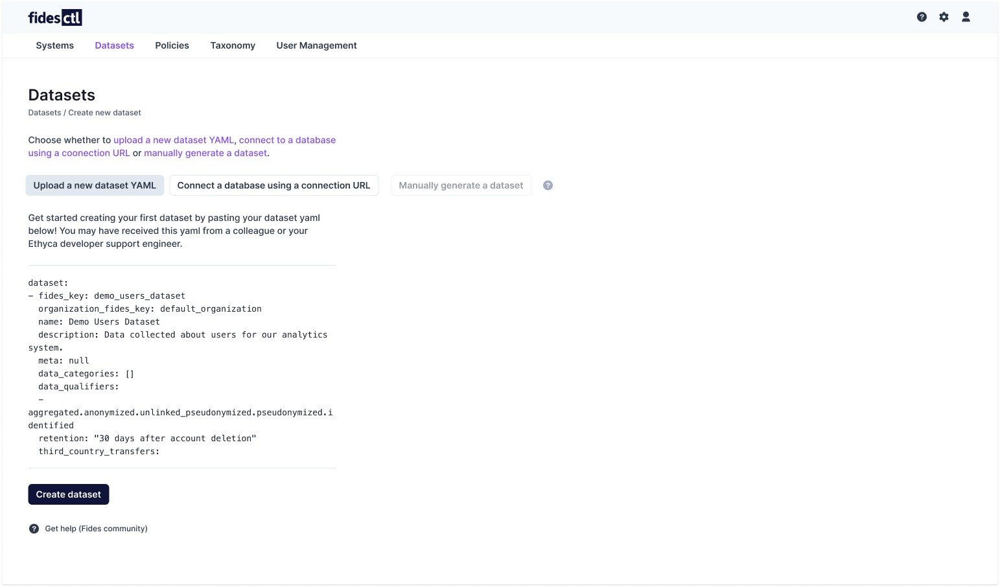
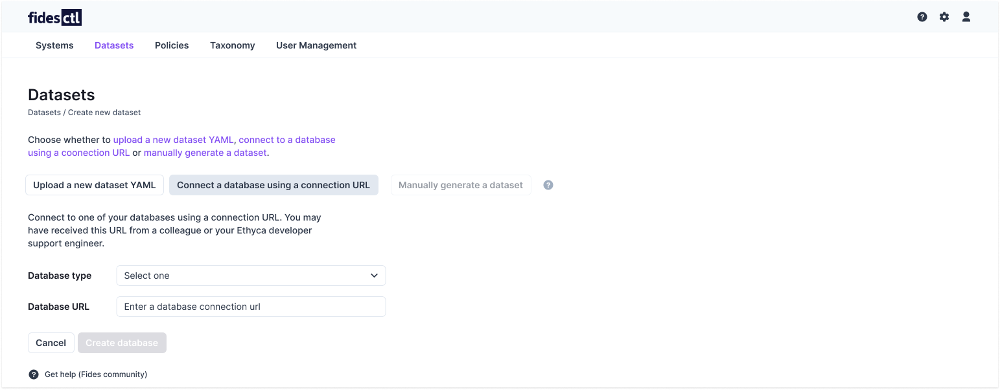

# Managing Datasets 

The Admin UI's Datasets panel allows you to easily view, add, edit, and configure your existing [datasets](../language/resources/dataset.md) and their connections.

## Adding a dataset 

Datasets can be added to the Fidesctl UI by connecting to your databases, or by uploading a pre-configured dataset YAML. An `empty state` label on the Datasets panel shows no datasets have been configured.

To add a new dataset, select **Create new dataset** from the Datasets panel.

You will then be given a list of options for creating your new dataset:

Fidesctl provides two options for creating new datasets: [uploading a YAML file](#upload-a-dataset-yaml), or [connecting to a database](#connect-to-your-database), each of which are outlined below.

### Upload a dataset YAML
Preexisting dataset configurations can be easily uploaded using the built-in uploader. These YAML configuration files might have come from a previous [fidesctl installation](../guides/generate_resources.md), or a support engineer.

To upload a new dataset, select the **Upload a new dataset YAML** option.

Paste the context of your YAML file into the provided text box, and select **Create dataset.** Fidesctl will upload and store your file for use with the rest of the Fides UI.

### Connect to a database 

To generate a dataset by connecting directly to a database, select **Connect a database using a connection URL**.

You will need to provide your **database type** from the dropdown, as well as the **database URL string.** 

Once the required information is entered, select **Create database**. Fidesctl will display a success notification when the process is completed.

## Load a dataset
To view the details of an existing dataset, highlight the row of the dataset you would like to view, and select **Load dataset.** 

Viewing a dataset gives you access to additional information and details:

Datasets may be modified and deleted from this window.

## Modifying a dataset

Datasets can be modified at both the collection (top-level) and field levels, allowing you to edit and customize your labels, descriptions, and data categories.

### Modifying fields 

Selecting any field will bring up a side panel where that field's information may be edited. You may edit the field's description, identifiability, and modify the data categories it belongs to.

To save your changes, select **Save**, and Fidesctl will apply them.

### Modifying a collection
The **Modify collection** button allows you to change the collection's description, identifiability, and any top-level data categories that pertain to the data it contains. 

To save your changes, select **Save**, and Fidesctl will apply them.

## Delete a dataset or field

A dataset may be deleted by selecting **Modify collection**, and finding the **trash bin icon** beside the dataset's name.

You will need to provide and confirm the dataset's name in order to delete it. **Deleting a dataset cannot be undone.**

To delete a field, find the **trash bin icon** beside the field's name when [modifying it](#modifying-fields). Enter and confirm the field's name to delete it. **Deleting a field cannot be undone.**

