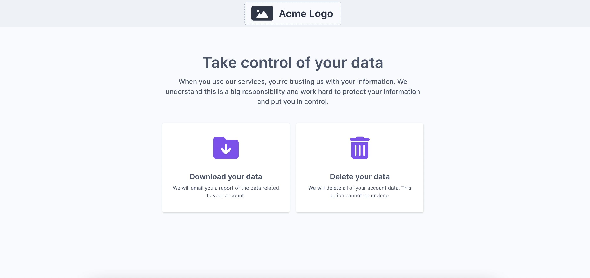
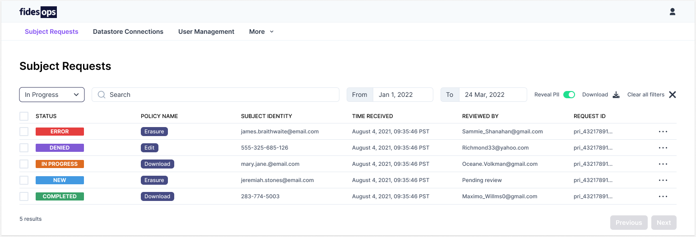

# Fidesops UI

Fidesops provides several user interfaces to assist in receiving and managing privacy requests. The Privacy Center and Admin UI work together to allow users to submit data subject requests (DSRs), which can then be reviewed and executed by privacy administrators.

## Privacy Center
The fidesops [Privacy Center](privacy_center.md) is a configurable webpage where users can request to download or delete their data. Requests submitted through the Privacy Center are available for review in the Admin UI.

## Admin UI
The Admin UI organizes processes like fulfilling [data subject requests](subject_requests.md), customizing [database connections](datastores.md), and [managing user access](user_management.md) into a single control panel. Once configured, the Admin UI allows authorized users to approve or deny privacy requests, manage datastores, and create or update fidesops [policies](../guides/policies.md).

