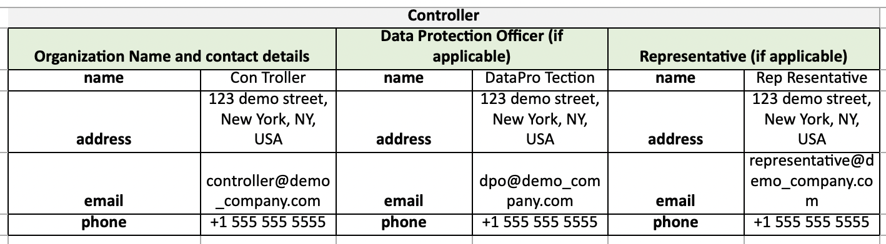

# Generating a Data Map

Fides is capable of exporting a data map of your [resources](./../language/resources/system.md) to generate an Article 30-compliant Record of Processing Activities (RoPA). This guide will walk through generating a mock RoPA using predefined resources included in the [Fides repository](https://github.com/ethyca/fides).

To follow along, ensure you have the Fides repository cloned and fidesctl installed. Additional support for running fidesctl locally can be found in the first step of the [Quick Start guide](https://github.com/ethyca/fides/#rocket-quick-start).
## Export the Demo Resources

First, ensure `fidesctl` is running with `nox -s cli`.

To apply and export the provided `demo_resources`, run the following commands:

```sh title="Apply and Export Defaults"
$ fidesctl apply demo_resources/
$ fidesctl export datamap --output-dir demo_resources/
```

This will export a data map to the `demo_resources/` directory.

### Organization

The header block at the top of a data map is composed of properties found in the [Organization resource](./../language/resources/organization.md). In a production deployment, this would be composed of publicly available information for your company/organization, but has been pre-populated here to allow exploration.



The newly-generated data map is a direct result of the provided Organization resource manifest (`demo_resources/demo_organization.yml`):

```yaml title='<code>demo_organization.yml</code>'
organization:
  - fides_key: default_organization
    name: Demo Organization
    description: An e-commerce organization
    security_policy: https://ethyca.com/privacy-policy/
    controller:
      name: Con Troller
      address: 123 demo street, New York, NY, USA
      email: controller@demo_company.com
      phone: +1 555 555 5555
    data_protection_officer:
      name: DataPro Tection
      address: 123 demo street, New York, NY, USA
      email: dpo@demo_company.com
      phone: +1 555 555 5555
    representative:
      name: Rep Resentative
      address: 123 demo street, New York, NY, USA
      email: representative@demo_company.com
      phone: +1 555 555 5555
```
Each of `controller`, `data_protection_officer`, and `representative` are composed of Contact Detail properties populated in the exported data map.

Additionally, the link to the security policy of an organization can be populated from the Organization resource's `security_policy` field.


### Dataset

The Dataset is primarily used to provide a list of Data Categories which populate the data map. Additional properties can optionally be applied for `retention` and `third_country_transfers`.


The newly-generated data map is a direct result of the provided Dataset resource manifest (`demo_resources/demo_dataset.yml`):

```yaml title='<code>demo_dataset.yml</code>'
dataset:
- fides_key: demo_users_dataset
  organization_fides_key: default_organization
  name: Demo Users Dataset
  description: Data collected about users for our analytics system.
  meta: null
  data_categories: []
  data_qualifiers:
  - aggregated.anonymized.unlinked_pseudonymized.pseudonymized.identified
  retention: "30 days after account deletion"
  third_country_transfers:
    - GBR
    - CAN
  collections:
  - name: users
    description: User information
    data_categories: []
    data_qualifiers:
    - aggregated.anonymized.unlinked_pseudonymized.pseudonymized.identified
    fields:
    - name: created_at
      description: User's creation timestamp
      data_categories:
      - system.operations
      data_qualifier: aggregated.anonymized.unlinked_pseudonymized.pseudonymized.identified

    ...
```

`data_categories` and `retention` can be set at any/all of the Dataset, DatasetCollection, and DatasetField levels.

`third_country_transfers` should be set at the `dataset` level.

Any Datasets referenced by a System will have this information included as rows of your data map.

### System

The System contains the remainder of the attributes on the initial data map.

Each populated property is referenced directly from an associated label in `fides_resources/demo_system.yml`:

|Data Map Label    |Resource Label   | Description    |
|--|----|----|
| **Fides Dataset** | `dataset_references` | Used to join dataset(s) to the system. |
| **Fides System** | `name` | The `name` defined at the top level of the system. |
| **Department or Business Function** |  `administering_department` | Set at the top level of the system. |
| **Purpose of Processing** | `data_use` | The `data_use` defined in the `privacy_declaration`. |
| **Categories of Individuals** | `data_subject` | A `data_subject` list defined in the `privacy_declaration`. |
| **Categories of Personal Data** | `data_categories` | Any `data_categories` set as part of the `privacy_declaration` (see the output for Demo Marketing System as a clear example).|
| **Role or Responsibility** | `data_responsibility_title` | Set at the top level of the system. |
| **Source of the Personal Data** | `dataset_references` | The Fides dataset name, if referenced by the system.
| **Data Protection Impact Assessment**  | `data_protection_impact_assessment` | All the information related to a Data Protection Impact Assessment, set at the top level of the system.|


## Extend the Default Taxonomy

In your initial export, several data map columns are populated with `N/A`. The default [Fides Taxonomy](./../language/taxonomy/overview.md) can be extended to replace these empty values with additional data required as part of a Record of Processing Activities.

Example manifest updates are included in `demo_resources/demo_extended_taxonomy.yml`.

### Auditing Resources

Your Organization and System datasets can be assessed using the `audit` command, which will identify how your resources could be extended to generate a compliant data map.

1. `fidesctl audit`

The output of this command will highlight any missing information:

```bash title="Example Output: <code>fidesctl audit</code>"
...
Auditing System: Demo Analytics System
improve.system missing recipients in Demo Analytics System.
improve.system missing legal_basis in Demo Analytics System.
improve.system missing special_category in Demo Analytics System.
customer missing rights in Demo Analytics System.
customer missing automated_decisions_or_profiling in Demo Analytics System.
Auditing System: Demo Marketing System
advertising missing recipients in Demo Marketing System.
advertising missing legal_basis in Demo Marketing System.
advertising missing special_category in Demo Marketing System.
customer missing rights in Demo Marketing System.
customer missing automated_decisions_or_profiling in Demo Marketing System.
10 issue(s) were detected in auditing system completeness.
Auditing Organization: Demo Organization
All organizations fully compliant!
```
### Data Use
Below is an extended [Data Use](./../language/taxonomy/data_uses.md) example. Each of these properties is responsible for populating a field on your data map.

```yaml title="Extended Data Use"
data_use:
  - fides_key: third_party_sharing.personalized_advertising.direct_marketing
    name: Direct Marketing
    description: User information for direct marketing purposes
    recipients:
    - Processor - marketing co.
    legal_basis: Legitimate Interests
    special_category: Vital Interests
    legitimate_interest_impact_assessment: https://example.org/legitimate_interest_assessment
    parent_key: third_party_sharing.personalized_advertising
```


Apply this `data_subject` by adding it to the Demo Marketing System in `demo_system.yml`.

Replace the Demo Marketing System's Data Use of `advertising` with the above fides_key of `third_party_sharing.personalized_advertising.direct_marketing` to include its information in your data map.

### Data Subject

A [Data Subject](./../language/taxonomy/data_subjects.md), shown below, can also be extended to populate your data map with additional information.

```yaml title="Extended Data Subject"
data_subject:
  - fides_key: potential_customer
    name: Potential Customer
    description: A prospective individual or other organization that purchases goods or services from the organization.
    rights:
      strategy: INCLUDE
      values:
      - Informed
      - Access
      - Rectification
      - Erasure
      - Object
    automated_decisions_or_profiling: true
```

Apply this `data_subject` by adding it to the Demo Marketing System in `demo_system.yml`.

Replace the Demo Marketing System's Data Subject of `customer` with the above fides_key of `potential_customer` to include its information in your data map.

### Testing Your Changes

Your resulting `demo_system.yml` should look like the following:
```yaml title="<code>demo_system.yml</code>"
system:
  - fides_key: demo_analytics_system
    name: Demo Analytics System
    description: A system used for analyzing customer behaviour.
    system_type: Service
    administrating_department: Engineering
    data_responsibility_title: Controller
    third_country_transfers:
    - USA
    - CAN
    data_protection_impact_assessment:
      is_required: True
      progress: Complete
      link: https://example.org/analytics_system_data_protection_impact_assessment
    privacy_declarations:
      - name: Analyze customer behaviour for improvements.
        data_categories:
          - user.provided.identifiable.contact
          - user.derived.identifiable.device.cookie_id
        data_use: improve.system
        data_subjects:
          - customer
        data_qualifier: aggregated.anonymized.unlinked_pseudonymized.pseudonymized.identified
        dataset_references:
          - demo_users_dataset

  - fides_key: demo_marketing_system
    name: Demo Marketing System
    description: Collect data about our users for marketing.
    system_type: Service
    administrating_department: Marketing
    data_responsibility_title: Processor
    privacy_declarations:
      - name: Collect data for marketing
        data_categories:
          #- user.provided.identifiable.contact # uncomment to add this category to the system
          - user.derived.identifiable.device.cookie_id
        data_use: third_party_sharing.personalized_advertising.direct_marketing
        data_subjects:
          - potential_customer
        data_qualifier: aggregated.anonymized.unlinked_pseudonymized.pseudonymized.identified
    data_use:
      - fides_key: third_party_sharing.personalized_advertising.direct_marketing
        name: Direct Marketing
        description: User information for direct marketing purposes
        recipients:
        - Processor - marketing co.
        legal_basis: Legitimate Interests
        special_category: Vital Interests
        legitimate_interest_impact_assessment: https://example.org/legitimate_interest_assessment
        parent_key: third_party_sharing.personalized_advertising
    data_subject:
      - fides_key: potential_customer
        name: Potential Customer
        description: A prospective individual or other organization that purchases goods or services from the organization.
        rights:
          strategy: INCLUDE
          values:
          - Informed
          - Access
          - Rectification
          - Erasure
          - Object
        automated_decisions_or_profiling: true
```

Running `fidesctl apply demo_resources/` will apply your changes.

Now, auditing this resource with `fidesctl audit` will show the Demo Marketing System issues are resolved:
```bash
Auditing System: Demo Analytics System
improve.system missing recipients in Demo Analytics System.
improve.system missing legal_basis in Demo Analytics System.
improve.system missing special_category in Demo Analytics System.
customer missing rights in Demo Analytics System.
customer missing automated_decisions_or_profiling in Demo Analytics System.
Auditing System: Demo Marketing System
5 issue(s) were detected in auditing system completeness.
Auditing Organization: Demo Organization
All organizations fully compliant!
```


## Generate a RoPA

Now that you have added the additional information around privacy notices and data subject rights, you can export a fresh copy of your data map:

```sh title="Apply and Export Defaults"
$ fidesctl apply demo_resources/
$ fidesctl export datamap --output_dir demo_resources/
```

### Populated Fields

Opening the new data map will show the previously `N/A` columns are now populated, resulting in an Article 30-compliant RoPA for one of the two systems defined in `demo_resources/`.

Below is a mapping of the newly populated columns with their respective values:

|Data Map Label | Description |
|----|----|
| **Purpose of Processing** | The name of your newly extended `data_use` set in a Privacy Declaration. |
| **Categories of Individuals** | The name of your newly extended `data_subject` set in a Privacy Declaration. |
| **Categories of Recipients** | The recipients defined in your extended Data Use. |
| **Article 6 Lawful Basis for Processing Personal Data** | The `legal_basis` defined in your extended Data Use. |
| **Article 9 Condition for Processing Special Category Data**| The `special_category` defined in your extended Data Use. |
| **Legitimate Interests for the Processing** | If the `legal_basis` is `"Legitimate Interests"`, the Data Use name is used to identify what the legitimate interest data use is. |
| **Link to Record of Legitimate Interests Assessment** | If the `legal_basis` is `"Legitimate Interests"`, a **legitimate interests impact assessment** is required and should be set using the `legitimate_interest_impact_assessment` property. |
| **Rights Available to Individuals** | The `rights` defined in your extended Data Subject based on the strategy used. |
| **Existence of Automated Decision-Making, Including Profiling** | The boolean value for `automated_decisions_or_profiling`, defined in your extended Data Subject. |


### Additional Learning

The provided `demo_system.yml` includes a second System, **Demo Analytics**, which can be enhanced in the same way as the Demo Marketing System.

Follow the guide to [extend the taxonomy](#extending-the-taxonomy) again, this time for the Demo Analytics System, to have both systems fully compliant!

## Next Steps

We hope this was helpful in understanding the additional properties required for generating an Article 30 compliant RoPA!

If there are any questions or issues you still have, we would love to hear more from you in our [Slack Community](https://fidescommunity.slack.com) or in [an issue/PR on GitHub](https://github.com/ethyca/fides/issues).
