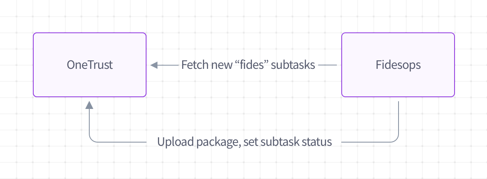

# Configure a OneTrust Integration

API docs for OneTrust are part of the [storage](../api/index.md#operations-tag-Storage) module.

## Overview

OneTrust is a DSAR automation provider that provides an interface to manage privacy requests.

Fides handles the integration to OneTrust to fulfill subject requests, and returns the data package back to OneTrust.

## How it works

The Fides integration with OneTrust looks like the follow:

1. Set up a new [storage destination](../getting-started/storage.md) of type `onetrust`
2. A new scheduled task kicks off that pings OneTrust for subtasks labeled for Fides
3. Fides processes those DSARs normally
4. Upon completion of DSAR processing, Fides will:
      1. Ping OneTrust to set the subtask status appropriately 
      2. If applicable, upload a data package back to OneTrust

## Configuration

### Fides
  
OneTrust request intake is configured as part of the possible Fides [storage locations](../getting-started/storage.md). To configure Fides to connect to OneTrust:

1. Add a new [storage location](../getting-started/storage.md) with a `onetrust` destination type
2. Use appropriate credentials to [authenticate](../getting-started/storage.md#authenticate-with-your-destination) with OneTrust
3. Decide what day of the week and hour of the day you wish to retrieve requests from OneTrust

### OneTrust
When the Fides scheduled task runs, it looks for subtasks with an exact string name of "fides task".  Be sure tasks you wish to pass through the Fides ecosystem are correctly labeled in the OneTrust interface.

## Testing
To test the OneTrust integration works correctly, you must:

1. Ensure that you have subtasks with a name of "fides task" in OneTrust
2. Set your OneTrust destination config in Fides such that day of week and hour of request intake is appropriate for testing
3. Confirm that the subtask status has been updated at that time, and any DSAR data packages have been uploaded at the request level in OneTrust
