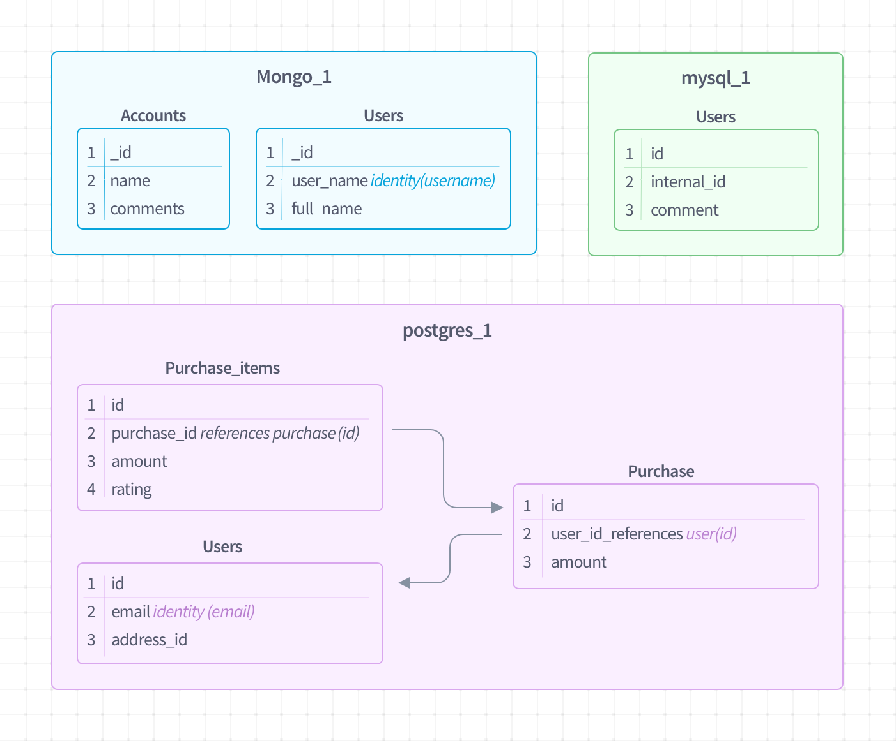
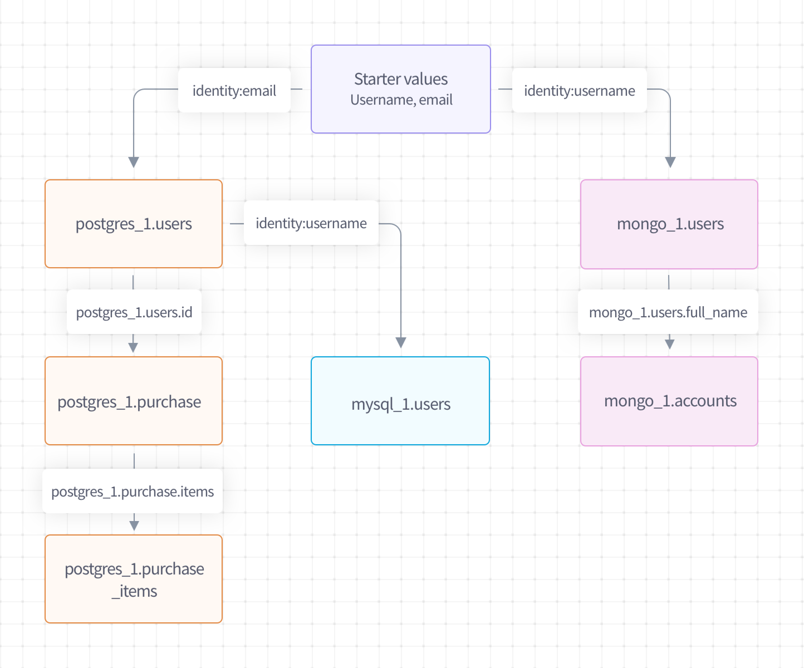

# Query Execution

## Graphs and Traversals

Fides uses your Datasets to generate a _graph_ of the resources. Based on the identity data you provide, Fides then generates a specific _traversal_, which is the order of steps that will be taken to fulfill a specific request.

The graph supports both directed and non-directed edges using the optional `direction` parameter on the relation (non-directional edges may be traversed in either direction). You can preview the queries that will be generated or manually control the order of operations by making relations explicitly directional and with the `after` Collection parameters. If you specify a Collection that can't be reached, Fides generates an error.

## An example graph

In this example there are three databases: a mysql database that stores users and their comments, a postgres DB that stores purchase information, and a mongoDB that stores user accounts. Each of them may have related data that we'd like to retrieve.



The Dataset specification looks like this:

``` yaml
dataset:
  - fides_key: mongo_1
    collections:
      - name: users
        fields:
          - name: _id
            fidesops_meta:
              primary_key: True
          - name: user_name
            fidesops_meta:
              identity: username
           - name: full_name

      - name: accounts
        fields:
          - name: _id
            fidesops_meta:
              primary_key: True
          - name: name
            fidesops_meta:
                references:
                    - dataset: mongo_1
                      name: users.full_name
                      direction: from
          - name: comments
```

``` yaml
dataset:
  - fides_key: mysql_1
    collections:
      - name: users
        fields:
          - name: id
            fidesops_meta:
              primary_key: True
              references:
                - dataset: postgres_1
                  field: users.id
                  direction: from
          - name: internal_id
          - name: comment
```

``` yaml
dataset:
  - fides_key: postgres_1
    collections:
      - name: purchase_items
        fields:
          - name: id
            fidesops_meta:
              primary_key: True
          - name: purchase_id
            fidesops_meta:
              references:
                - dataset: postgres_1
                  field: purchases.id
                  direction: from
          - name: amount
          - name: rating

      - name: purchases
        fields:
          - name: id
            fidesops_meta:
              primary_key: True
          - name: user_id
            fidesops_meta:
              references:
                - dataset: postgres_1
                  field: users.id
          - name: amount
      - name: users
        fields:
          - name: id
            fidesops_meta:
              primary_key: True
          - name: email
              fidesops_meta:
                identity: email
          - name: address_id
```

Fides triggers a retrieval with identity data, such as an email address or user ID, that's provided by the user, and will then:

1. Identify the collections that contain the identity data that belong to the user.
2. Find all related records.
3. Use the data to find all connected data.
4. Continue until we've found all related data.

For the first step, Fides uses the concept of an `identity`. In the Fides [Dataset](../getting-started/datasets.md) specification, any field may be marked with an `identity` notation:

``` yaml
collection:
  - name: foo
    fields:
    - name: bar
        fidesop_meta:
           identity: email 
```

Fides will initiate the data retrieval process with provided data that looks like `{"email": "user@example.com", "username": "someone"}` by looking for values in the collection `users` where `email == user@example.com`.  

Note that the names of the provided starter data do not need to match the field names Fides will use this data to search. In the above case, you can also choose to start a search using the **username** provided value. This would result in enough data to search in both `postgres_1.users.email` and `mongo_1.users.user_name` noted in the diagram.

## How does Fides execute queries?
The next step is to follow any links provided in field relationship information. In the abbreviated dataset declarations below, the `mongo_1.accounts` data contains data related to `mongo_1.users`. Data can be retrieved from `mongo_1.accounts` by generating this set of queries:

``` sql
# mongo_1
1. db.users.find({"user_name":"someone"},{"_id":1, "full_name":1}) 
2. db.accounts.find({"name":{"$in":[  <full_name value from (1) > ]}},{"_id":1, "comments":1})

# postgres_1
3. select id, address_id from users where email = 'user@example.com';
4. select id, amount from purchases where user_id in [ <id values from (3) >] 
5. select id, amount, rating from purchase_items where purchase_id in [ <id values from (4)> ]

# mysql_1
6. select internal_id, comment from users where id in [ <id values from (3) >]
```

Behind the scenes, Fides is creating linked graph using the connections you've specified between your collections to retrieve your data.



## Notes about Dataset traversals

* You can define multiple links between collections, which will generate OR queries like `SELECT a,b,c from TABLE_1 where name in  (values from TABLE\_2)  OR email in (values from TABLE\_3)`.
 
* It's an error to specify a collection in your Dataset can't be reached through the relations you've specified.

* Fides uses your Datasets and your input data to "solve" the graph of your collections and how it is traversed. If your Dataset has multiple identity values, you can create a situation where the query behavior depends on the values you provide. In the example above, starting the graph traversal with `{"email": "value1", "username":" value2"}` is valid, but starting with  `{"email": "value1"}` fails because `mongo_1.users` is no longer reachable.
 
* As shown in the example, you can create queries between Datasets.
