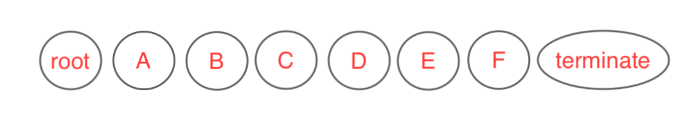
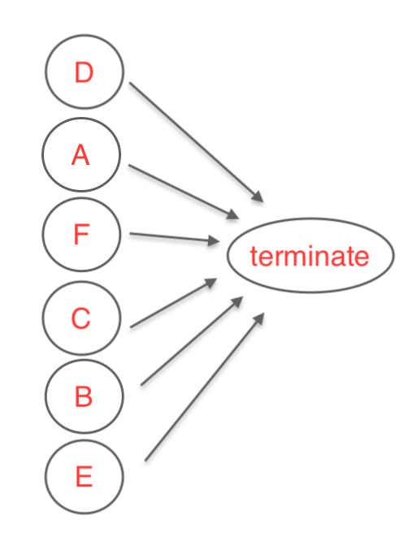

# Privacy Request Execution

Fully configured, Fides provides end-to-end [privacy request](../getting-started//privacy_requests.md) execution. The following outline summarizes the steps Fides takes to fulfill privacy requests, including optional configurations and manual data retrieval. 

## Privacy request submission

Once a privacy request has been submitted via the [Privacy Center](../ui/privacy_center.md), Fides first creates temporary records to store any relevant submission information.

Based on your [configuration](../installation/configuration.md), Fides can perform a number of other actions: 

| Step | Description |
| --- | --- |
| **Persist** |  Fides creates a privacy request in long-term storage to capture high-level information (e.g. date created, current status). Fides saves the identity of the subject to both short- and long-term storage. |
| **Verify** | If configured, Fides sends an [email](../getting-started/privacy_requests.md#subject-identity-verification) to the user to verify their identity before proceeding. |
| **Notify** | If configured, the user will receive an [email](./email_communications.md) verifying that their request has been received. |
| **Approve** | If configured, Fides will require a system administrator to [approve](../installation/configuration.md) the request before proceeding. |

## Privacy request execution

When the required submission steps have been completed, the request status is updated to `in_processing`, and the privacy request is dispatched to a separate queue for processing. 

Request execution involves gathering data from multiple sources, and/or masking data in multiple locations. Fides will follow the steps below in order, skipping any that are not applicable for the given request (or not configured):

  1. Respond to manual webhooks
  2. Run policy pre-execution webhooks
  3. Access request automation
  4. Upload results
  5. Erasure request automation
  6. Send erasure request emails
  7. Run policy post-execution webhooks
  8. Send email notifications

### Respond to manual webhooks

Manual webhooks allow data pertaining a subject to be manually uploaded by a Fides admin. If manual webhooks are enabled, request execution will exit with a status of `requires_input` until a submission has been received for each manual webhook configured. The privacy request can then be resumed, and request execution will continue from this step.  See [Manual Webhooks](manual_webhooks.md) for more information on configuration options and resuming a `requires_input` request.

Data uploaded for manual webhooks will be returned to the data subject directly at the end of request execution. Data gathered here is not used to locate data from other sources.

### Run pre-execution webhooks
Policy pre-execution webhooks let your system take care of prerequisite tasks, or locate additional identities for the data subject. Examples include turning on a specific database in your infrastructure, or locating a phone number for a subject from a table for which you do not want to give Fides direct access. Configuration involves defining endpoint(s) for Fides to call in order. See [Policy Webhooks](policy_webhooks.md) for more details.

Fides sends a request to each pre-execution webhook with a [policy webhooks request format](policy_webhooks.md#policy-webhook-request-format), which your endpoints should be prepared to unpack. If you need more time to carry out an action, your webhook can instruct Fides to `halt`, which will cause execution to exit with a status of `paused`. Request execution can be continued when ready using a token supplied in the original request.

No data uploaded by policy webhooks is returned to the data subject, but identities discovered can be used to later locate data pertaining to the subject during access request automation.

If a request to a pre-execution webhook fails, request execution will exit with a status of `error`. Retrying the privacy request will resume from this step and attempt to re-run all pre-execution webhooks.

### Access request automation
Access request automation is performed regardless of whether there are access or erasure Rules defined, as both Rules require this data.  See how to [configure policies, rules, and rule targets](policies.md) for additional information.

This step visits all Collections and retrieves all Fields that you've defined in your [Datasets](../getting-started/datasets.md). Fides builds a graph in accordance with how you've designated your Collections are related, visits each Collection in turn, and gathers all the results together.

#### Graph building
Fides builds a Directed Acyclic Graph, or DAG, where each location or node corresponds to a Collection in one of your Datasets. The graph helps determine the order in which nodes will be visited. Fides begins with any Collections that can be queried using the supplied identity data, and then points those Collections toward dependent Collections, etc. If Fides can't determine how to reach a Collection, it will exit early with a status of `error`.  To remedy an errored access request, you update how your Collections are related to each other in your Datasets, and resubmit the privacy request.

#### Graph Execution
After the graph is built, Fides passes the result to [Dask](https://www.dask.org/) to execute sequentially. Fides visits one Collection at a time, following the graph created, and uses Dask to determine ordering for ties.

For the first Collections in the graph connected to the root, Fides uses the customers' provided identity to locate subject data, by either making database queries or HTTP requests to a configured API endpoint. The details on how to access your data are determined by the [Connection](connection_types.md) type. Fides retrieves all Fields that have been configured on the Collection, and caches the results in temporary storage for usage later. Fides then passes the results of that Collection to downstream Collections that similarly make queries, temporarily cache the results, and return their results to their own downstream Collections.

A Collection isn't visited until Fides has searched for data across all of its upstream Collections. This continues until all Collections have been visited. See [Query Execution](query_execution.md) for more information.

If there is a failure trying to retrieve data on any Collections, the request is retried the number of times [configured](../installation/configuration.md) by `task_retry_count` until the request exits with status `error`.  Both the `access` step and errored Collection are cached in temporary storage.
Restarting the privacy request will restart from this step and failed Collection.  Collections that have already been visited will not be visited again.

#### Final result retrieval
The final step of an automated access request gathers all the results for each Collection from temporary storage.

### Upload results
If configured, Fides uploads the results retrieved from access automation for the data subject.

For each configured access Rule, Fides filter the graph results to match targeted Data Categories. See [Datasets](../getting-started/datasets.md) for more details.
Fides also supplements the results with any data manually uploaded from [manual webhooks](#respond-to-manual-webhooks). Each data package is uploaded in JSON
or CSV format to a specified storage location like Amazon S3. See [Storage](../getting-started/storage.md) for more information.

### Erasure request automation
If applicable, (erasure [Rules](policies.md#Rule-attributes) are configured on your execution policy), Fides builds a simpler version of the access request graph, and visits each Collection in turn, performing masking requests as necessary.

#### Graph building
The "graph" for an erasure runs on the data from the access request, which is kept in temporary storage, and can be used to locate data for each Collection individually. Because the data has already been found, each Collection could be visited in any order or run in parallel. The graph is configured so each Collection has its previous access request results passed in as inputs, and each Collection returns a count of records masked when complete.

#### Graph execution
Fides visits each Collection sequentially, using a deterministic order set by Dask. For each row of data retrieved in the access request step, Fides attempts to mask the data targeting the fields specified on your execution policy, using the [masking strategies](masking_strategies.md) you've defined. If no rows exist from the access request, or no Fields on that Collection match the targeted Data Categories, no masking occurs. Fides caches a count of the records
that had fields masked in temporary storage.

The masking request might involve an `update` database query or an `update` or `delete` HTTP request depending on the [Connection Type](connection_types.md). The Email Connector type doesn't mask any data itself, but instead persists how to locate and mask that Collection in temporary storage for use later.

If masking fails on a given Collection, Fides retries the requests for a configured number of times, and then request execution will exit with a status of `error`. Fides will cache both the failed Collection and that the failure occurred on the `erasure` step. Retrying the privacy request will resume from the `erasure` step at the failed Collection. Previously masked Collections will not be masked again.

### Send erasure request emails
After the access and erasure steps have both executed, Fides checks if there are any third parties that need to be additionally emailed to complete erasure requests on your behalf. See [emailing third party services to mask data](email_communications.md#Email-third-party-services-to-mask-data) for more information.

Fides retrieves any masking instructions cached by Email Connectors in the erasure request step, and combines them into a single email per Dataset.

This step is only performed if you have Email Connectors configured. If the email send fails for any reason, the request will exit with status `error`.  Fides will cache this step in temporary storage, so retrying the request will resume from this point.

### Run policy post-execution webhooks
After automated access and erasures have completed, post-execution webhooks can be used to perform any cleanup steps in your system.  Examples include setting up a webhook to shut down a database, or to delete user data from a source you don't want Fides to access directly.  Post-execution webhooks are more limited than Pre-execution webhooks. They currently cannot pause the graph, and should be configured as a series of API endpoints you would like Fides to call. See [policy webhooks](policy_webhooks.md) for more details on configuration.

If a request to a post-execution webhook fails, request execution will exit with a status of `error`. Retrying the privacy request will resume from this step and attempt to re-run all the post-execution webhooks.

### Send email notifications
If configured, Fides will send a followup email to the data subject to let them know their request has finished processing.  For access Rules, the emails will contain links to where the data subject can retrieve data. For erasure Rules, the emails will simplify notify them that their request is complete.

Request execution will then exit with the status `complete`.

## Additional notes
- Fides uses Redis as temporary storage to support executing your request.  Data automatically retrieved from each Collection, manually uploaded data, and details about where the Privacy Request may be paused or where it failed may all be temporarily stored.  This information will expire in accordance with the `FIDES__REDIS__DEFAULT_TTL_SECONDS` [setting](../installation/configuration.md).
- The current Fides execution strategy prioritizes being able to erase as many of the original Collections requested as possible. If Fides masks some Collections and then registers a failure, the current logic will mask the original remaining Collections using the temporarily saved data retrieved in the original access step instead of re-querying the Collections. Once data is masked in one Collection, it could potentially prevent us from being able to locate data in downstream Collections, and so will use temporarily stored data.
    - Data added in the interim, or data related to newly added Collections, can be missed.
    - If the automated access step fails part of the way through, a new Collection is added, and then the request is restarted from failure,
      Fides may miss data from already completed Collections downstream, and any Collections further downstream of that set.
    - If the erasure step fails, a new Collection is added, and the request is restarted from failure, Fides may miss masking data from the new
      Collection and data downstream of the new Collection.
- Nodes on the graph correspond to individual Collections within Datasets, not Datasets.  The graph built may result in Fides
visiting a Collection in one Dataset to be able to find data on a Collection in a separate Dataset, which is used to find data on a Collection in the original Dataset.
- Automated access requests often select more Fields than may be returned specifically to the user because this data has multiple uses. Fides selects all Fields defined to be able to potentially query downstream Collections, filter data according to multiple access Rules, and mask data in accordance with multiple erasure Rules.
