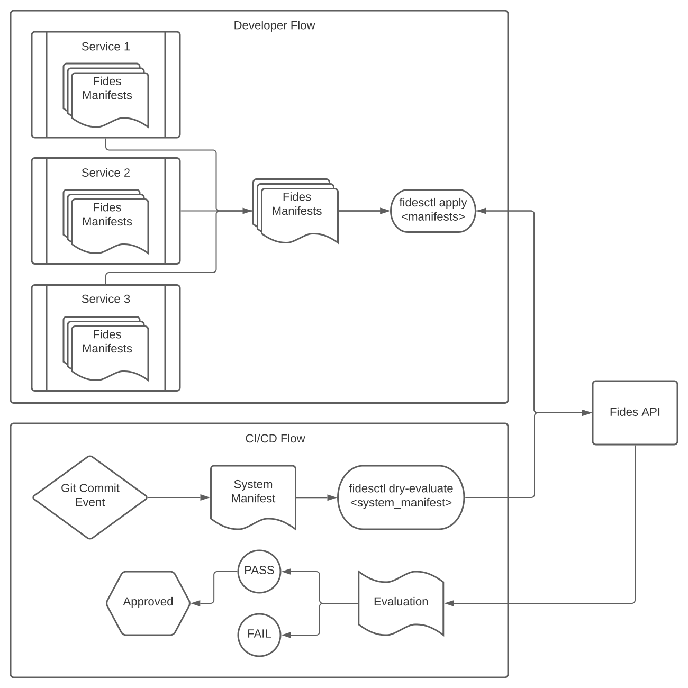

# Fides Documentation

Fides is a platform to declaratively enforce data privacy requirements within the Software Development Life-Cycle.

It is designed to help companies stay compliant by briding the gap between compliance officers and engineers. By describing the uses of data as Fides manifests, Fides is able to continually evaluate compliance and warn users of unsafe changes _before_ they make it into production.

When data governance is declared and colocated with the source code by engineers, it makes it possible for organizations to handle data privacy in a proactive manner.

## Principles

* Data Lineage as YAML
* Compliance controls at the CI layer
* Synergy between engineers and lawyers

---

## Fides Workflow Diagram



## Quick Example

To make things more concrete, the following is a realistic set of Fides manifests.

Policy:

```yaml
policy:
  organizationId: 1
  fidesKey: "primaryPrivacyPolicy"
  rules:
    - organizationId: 1
      fidesKey: "rejectTargetedMarketing"
      dataCategories:
        inclusion: "ANY"
        values:
          - profiling_data
          - account_data
          - derived_data
          - cloud_service_provider_data
      dataUses:
        inclusion: ANY
        values:
          - market_advertise_or_promote
          - offer_upgrades_or_upsell
      dataSubjectCategories:
        inclusion: ANY
        values:
          - trainee
          - commuter
      dataQualifier: pseudonymized_data
      action: REJECT
    - organizationId: 1
      fidesKey: rejectSome
      dataCategories:
        inclusion: ANY
        values:
          - user_location
          - personal_health_data_and_medical_records
          - connectivity_data
          - credentials
      dataUses:
        inclusion: ALL
        values:
          - improvement_of_business_support_for_contracted_service
          - personalize
          - share_when_required_to_provide_the_service
      dataSubjectCategories:
        inclusion: NONE
        values:
          - trainee
          - commuter
          - patient
      dataQualifier: pseudonymized_data
      action: REJECT
```

Dataset:

```yaml
dataset:
  - organizationId: 1
    fidesKey: "sample_db_dataset"
    name: "Sample DB Dataset"
    description: "This is a Sample Database Dataset"
    datasetType: "MySQL"
    location: "US East" # Geographic location of the dataset
    tables:
      - name: "sample_db_table_1"
        description: "Sample DB Table Description"
        fields:
          - name: "first_name"
            description: "A First Name Field"
            dataCategories:
              - "derived_data"
            dataQualifier: "identified_data"
          - name: "email"
            description: "User's Email"
            dataCategories:
              - "account_data"
            dataQualifier: "identified_data"
          - name: "Food Preference"
            description: "User's favorite food"
```

System:

```yaml
system:
  - organizationId: 1
    fidesOrganizationKey: "Ethyca"
    registryId: 1
    fidesKey: "demoSystem"
    fidesSystemType: "SYSTEM"
    name: "Demo System"
    description: "A system used for demos."
    declarations:
      - dataCategories:
          - "customer_content_data"
        dataUse: "provide"
        dataQualifier: "anonymized_data"
        dataSubjectCategories:
          - "anonymous_user"
        dataSets:
          - "user_data"
    systemDependencies: []
    datasets: ["user_data"]
```

---

## Core Components

Conceptually, there are a few key parts to Fides privacy management. For more in-depth info on each object and their respective schemas, see the [Fides Object](fides_objects.md) page.

### Systems

A System is a standalone application, software project, service, etc. that has an independant lifecycle and potential usage of privacy data. As far as Fides is concerned, the important parts of a system are:

* Its declared usage of privacy data
* What other systems it depends on, since those other systems may also use privacy data

### Datasets

Similar to a system, a dataset represents the privacy exposure of a database, datastore, or any other kind of data repository. Datasets are intended to allow for the description of privacy data within said repository.

Datastore privacy declarations are more limited than system privacy declarations in that they only accept Data Categories and Data Qualifiers.

### Registries

A Registry is a collection of systems analyzed as a group. Since a registry also contains some information on how systems depend on each other, an analysis of a registry also includes checking on the validity of each system and their dependencies.

### Privacy Policies

Privacy policies describe what kinds of data are acceptable for what kinds of use. Fides compares the data usage you are declaring against the policies you are permitting to evaluate your state of compliance.

### Describing Data Privacy

Fides defines data privacy with four dimensions. Each of these dimensions can be defined on an organization-wide basis, and allow for hierarchical definition.

* data category: What kind of data is contained here?
(personal health data, account data, telemetry data...)
* data use: What is this data being used for?
(examples: promotion, operational support, business improvement...)
* data subject category: What kind of person does this data refer to?
(customer, job applicant, supplier...)
* data qualifier: How explicitly is this data being stored?
(anonymized, fully identified, aggregated...)

## Next Steps

For further context on how to setup and configure Fides, visit the [Getting Started](getting_started.md) and [Fides Objects](fides_objects.md) pages.
