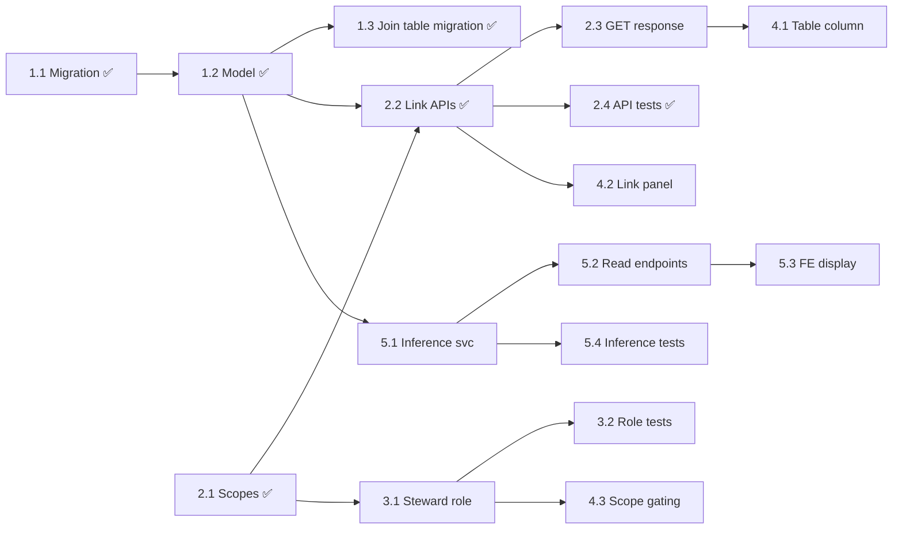

# Streamlined Stewarding -- Implementation Plan

## Guiding Principles

- Each slice is independently mergeable and testable.
- Slices are ordered by dependency: later slices build on earlier ones.
- Each task is labeled with its target repo (Fides OSS vs. Fidesplus) and layer (BE vs. FE).
- Estimates are rough shirt-sizes (S/M/L) reflecting complexity, not calendar time.

## Slice 1: Data Model -- System:Integration Relationship Evolution

**Goal:** Enable a System to have multiple ConnectionConfigs with a qualified relationship type, without breaking existing DSR behavior.

### Task 1.1 -- Alembic migration for the join table (Fides OSS, BE) [M] ✅

- Created `system_connection_config_link` table with columns: `id`, `system_id` (FK to `ctl_systems`), `connection_config_id` (FK to `connectionconfig`), `created_at`, `updated_at`, plus a unique constraint on `(system_id, connection_config_id)`.
- A second migration (`xx_2026_02_20_migrate_system_id_fk_to_link_table.py`) copies existing `ConnectionConfig.system_id` values into the join table, then drops the `system_id` column, its index, and its FK constraint from `connectionconfig`.

**Note:** The `link_type` concept was removed to simplify the initial migration. The unique constraint is on `(system_id, connection_config_id)` only.

**Status:** Complete.

### Task 1.2 -- SQLAlchemy model for the join table (Fides OSS, BE) [S] ✅

- New model `SystemConnectionConfigLink` colocated in `src/fides/system_integration_link/models.py`.
- Model includes a `create_or_update_link(db, system_id, connection_config_id)` classmethod for centralized link management.
- Model registered in `src/fides/api/db/base.py`.

**Status:** Complete.

### Task 1.3 -- Migrate relationships to use join table (Fides OSS, BE) [M] ✅

- Both `ConnectionConfig.system` and `System.connection_configs` relationships now use `secondary="system_connection_config_link"` with `uselist=False, viewonly=True`.
- All write paths that set `connection_config.system_id` migrated to use `SystemConnectionConfigLink.create_or_update_link()`.
- All read paths that queried `ConnectionConfig.system_id` migrated to join through `SystemConnectionConfigLink`.
- All test files updated to use the new pattern.
- Old `ConnectionConfig.system_id` column removed.

**Status:** Complete.

### Task 1.4 -- Backward-compat: keep system_id FK in sync with join table (Fides OSS, BE) [S]

**Status:** No longer needed. The FK has been fully removed; `ConnectionConfig.system` reads transparently through the join table via SQLAlchemy `secondary=`.

## Slice 2: System-Integration Link Management APIs

**Goal:** Provide dedicated, scope-guarded endpoints for managing system-integration associations.

### Task 2.1 -- Define new scopes (Fides OSS, BE) [S] ✅

- Added `SYSTEM_INTEGRATION_LINK` prefix and scopes to `scope_registry.py`:
  - `system_integration_link:create_or_update`
  - `system_integration_link:read`
  - `system_integration_link:delete`
- Registered in `SCOPE_REGISTRY` and `SCOPE_DOCS`.
- Added `SYSTEM_INTEGRATION_LINK_READ` to `viewer_scopes` in `roles.py`.

**Status:** Complete.

### Task 2.2 -- Link management endpoints (Fides OSS, BE) [M] ✅

All code lives in a self-contained service package at `src/fides/system_integration_link/`:

| Module | Purpose |
|--------|---------|
| `models.py` | SQLAlchemy model + `create_or_update_link` helper |
| `routes.py` | FastAPI route definitions (GET, PUT, DELETE) |
| `schemas.py` | Pydantic request/response schemas |
| `service.py` | Business logic, validation |
| `repository.py` | Data access layer (SQLAlchemy queries) |
| `entities.py` | Domain entity dataclass |
| `exceptions.py` | Domain-specific exceptions |

Routes are registered in `src/fides/api/api/v1/api.py` via `from fides.system_integration_link import routes`.

Session management uses the shared `@with_optional_sync_session` decorator from `src/fides/core/repository/session_management.py`. Routes do not inject a database session -- the service creates and owns its session, committing atomically.

**Current constraints:**
- Max 1 system link per integration (enforced in service, `MAX_LINKS_PER_CONNECTION = 1`).
- PUT is an idempotent full-replace: the provided list becomes the complete link set, existing links not in the list are removed.
- API accepts a list for forward compatibility.

**Status:** Complete (POC).

### Task 2.3 -- Extend GET /connection response to include system info (Fides OSS, BE) [S]

- Add a `linked_systems` field to the connection config response schema.

**Status:** Not started.

### Task 2.4 -- Tests for link management (Fides OSS, BE) [M] ✅

- 13 unit tests for the service layer (mock-based) in `tests/system_integration_link/test_service.py`.
- 13 integration tests for the repository (real DB) in `tests/system_integration_link/test_repository.py`.

**Status:** Core test coverage complete.

## Slice 3: Data Steward Role

**Goal:** A role that lets data stewards manage system-integration links and view monitor stewards without full admin access.

### Task 3.1 -- Define Data Steward role (Fides OSS + Fidesplus, BE) [S]

- Add `DATA_STEWARD` role with `viewer_scopes` + `system_integration_link:*` scopes.
- In fidesplus, extend with Plus viewer scopes + `MONITOR_STEWARD_READ` + `DISCOVERY_MONITOR_READ`.

**Status:** Not started.

### Task 3.2 -- Data Steward role tests (Fides OSS + Fidesplus, BE) [S]

**Status:** Not started.

## Slice 4: Integrations Page -- System Association UX

**Goal:** Let users see and manage system-integration links directly from the Integrations page.

### Task 4.1 -- Integrations overview table: "Linked Systems" column (Fides OSS, FE) [M]

**Status:** Not started.

### Task 4.2 -- Integration detail page: system link management panel (Fides OSS, FE) [L]

**Status:** Not started. BE APIs from Task 2.2 are available for FE development.

### Task 4.3 -- Scope-gated action visibility (Fides OSS, FE) [S]

**Status:** Not started.

## Slice 5: Inferred Monitor Stewardship

**Goal:** Monitor stewards can be derived from system stewards, reducing manual configuration.

### Task 5.1 -- Steward inference service (Fidesplus, BE) [M]

**Status:** Not started.

### Task 5.2 -- Update steward read endpoints to return effective stewards (Fidesplus, BE) [S]

**Status:** Not started.

### Task 5.3 -- Update steward display in FE (Fides OSS, FE) [S]

**Status:** Not started.

### Task 5.4 -- Tests for steward inference (Fidesplus, BE) [M]

**Status:** Not started.

## Dependency Graph

## Parallelization Notes

- Slices 1 and 2 (scopes definition only) can start in parallel.
- Slice 3 depends on Slice 2's scope definitions but not on the full API implementation.
- Slice 4 depends on Slices 2 and 3. **Task 4.2 (FE link panel) can begin now** since the BE APIs are available.
- Slice 5 depends on Slice 1's model (to traverse system links) but is otherwise independent of Slices 2-4.
