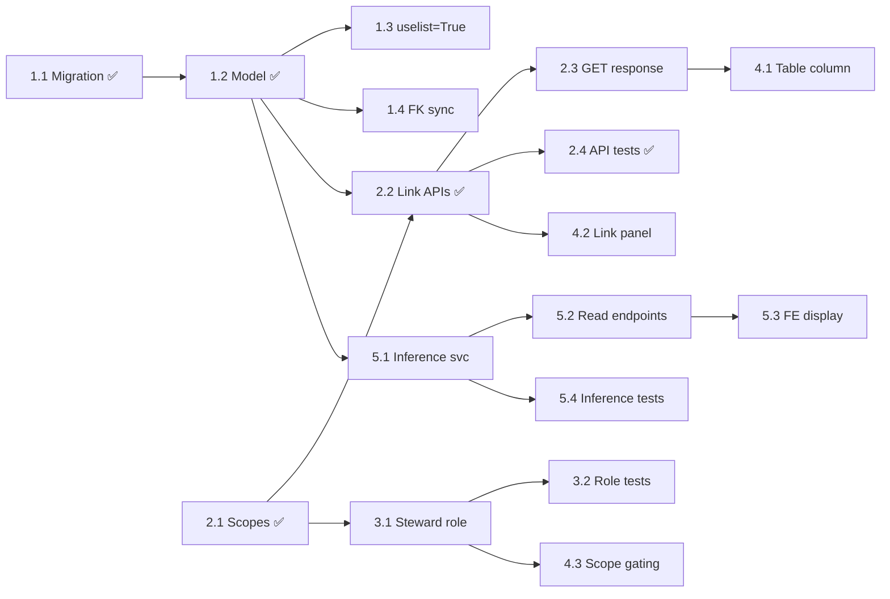

# Streamlined Stewarding -- Implementation Plan

## Guiding Principles

- Each slice is independently mergeable and testable.
- Slices are ordered by dependency: later slices build on earlier ones.
- Each task is labeled with its target repo (Fides OSS vs. Fidesplus) and layer (BE vs. FE).
- Estimates are rough shirt-sizes (S/M/L) reflecting complexity, not calendar time.

## Slice 1: Data Model -- System:Integration Relationship Evolution

**Goal:** Enable a System to have multiple ConnectionConfigs with a qualified relationship type, without breaking existing DSR behavior.

### Task 1.1 -- Alembic migration for the join table (Fides OSS, BE) [M] ✅

- Create a new `system_connection_config_link` table with columns: `id`, `system_id` (FK to `ctl_systems`), `connection_config_id` (FK to `connectionconfig`), `link_type` (enum: `dsr`, `monitoring`), `created_at`, `updated_at`, plus a unique constraint on `(system_id, connection_config_id, link_type)`.
- Write a data migration that populates the new join table from existing `ConnectionConfig.system_id` values, defaulting `link_type` to `dsr`. Also create a `monitoring` row for any ConnectionConfig that has associated monitors.
- Keep `ConnectionConfig.system_id` in place (do not remove it) to preserve backward compatibility during the transition period.

**Status:** Migration created at `src/fides/api/alembic/migrations/versions/xx_2026_02_18_1700_create_system_connection_config_link.py`. Data backfill migration is not yet written (table is created empty).

### Task 1.2 -- SQLAlchemy model for the join table (Fides OSS, BE) [S] ✅

- New model `SystemConnectionConfigLink` and enum `SystemConnectionLinkType` colocated in `src/fides/service/system_integration_link/models.py`.
- Model registered in `src/fides/api/db/base.py`.

**Status:** Complete.

### Task 1.3 -- Update System.connection_configs to uselist=True (Fides OSS, BE) [M]

- Change `uselist=False` to `uselist=True` on `System.connection_configs` and on `ConnectionConfig.system`.
- Audit and update all call sites that assume `system.connection_configs` is a scalar.

**Status:** Not started. Deferred -- not needed for the initial POC since the new link management APIs operate through the join table, not the FK relationship.

### Task 1.4 -- Backward-compat: keep system_id FK in sync with join table (Fides OSS, BE) [S]

- When a row is inserted/deleted in the join table with `link_type=dsr`, update `ConnectionConfig.system_id` accordingly.

**Status:** Not started.

## Slice 2: System-Integration Link Management APIs

**Goal:** Provide dedicated, scope-guarded endpoints for managing system-integration associations.

### Task 2.1 -- Define new scopes (Fides OSS, BE) [S] ✅

- Added `SYSTEM_INTEGRATION_LINK` prefix and scopes to `scope_registry.py`:
  - `system_integration_link:create_or_update`
  - `system_integration_link:read`
  - `system_integration_link:delete`
- Registered in `SCOPE_REGISTRY` and `SCOPE_DOCS`.
- Added `SYSTEM_INTEGRATION_LINK_READ` to `viewer_scopes` in `roles.py`.

**Status:** Complete.

### Task 2.2 -- Link management endpoints (Fides OSS, BE) [M] ✅

All code lives in a self-contained service package at `src/fides/service/system_integration_link/`:

| Module | Purpose |
|--------|---------|
| `models.py` | SQLAlchemy model + `SystemConnectionLinkType` enum |
| `routes.py` | FastAPI route definitions (GET, PUT, DELETE) |
| `schemas.py` | Pydantic request/response schemas |
| `service.py` | Business logic, validation |
| `repository.py` | Data access layer (SQLAlchemy queries) |
| `entities.py` | Domain entity dataclass |
| `exceptions.py` | Domain-specific exceptions |

Routes are registered in `src/fides/api/api/v1/api.py` via `from fides.service.system_integration_link import routes`.

Session management uses the shared `@with_optional_sync_session` decorator from `src/fides/core/repository/session_management.py`. Routes do not inject a database session -- the service creates and owns its session, committing atomically.

**Current constraints:**
- Max 1 system link per integration (enforced in service, `MAX_LINKS_PER_CONNECTION = 1`).
- PUT is an idempotent full-replace: the provided list becomes the complete link set, existing links not in the list are removed.
- API accepts a list for forward compatibility.

**Status:** Complete (POC).

### Task 2.3 -- Extend GET /connection response to include system info (Fides OSS, BE) [S]

- Add a `linked_systems` field to the connection config response schema.

**Status:** Not started.

### Task 2.4 -- Tests for link management (Fides OSS, BE) [M] ✅

- 14 unit tests for the service layer (mock-based) in `tests/service/system_integration_link/test_service.py`.
- 13 integration tests for the repository (real DB) in `tests/service/system_integration_link/test_repository.py`.

**Status:** Core test coverage complete.

## Slice 3: Data Steward Role

**Goal:** A role that lets data stewards manage system-integration links and view monitor stewards without full admin access.

### Task 3.1 -- Define Data Steward role (Fides OSS + Fidesplus, BE) [S]

- Add `DATA_STEWARD` role with `viewer_scopes` + `system_integration_link:*` scopes.
- In fidesplus, extend with Plus viewer scopes + `MONITOR_STEWARD_READ` + `DISCOVERY_MONITOR_READ`.

**Status:** Not started.

### Task 3.2 -- Data Steward role tests (Fides OSS + Fidesplus, BE) [S]

**Status:** Not started.

## Slice 4: Integrations Page -- System Association UX

**Goal:** Let users see and manage system-integration links directly from the Integrations page.

### Task 4.1 -- Integrations overview table: "Linked Systems" column (Fides OSS, FE) [M]

**Status:** Not started.

### Task 4.2 -- Integration detail page: system link management panel (Fides OSS, FE) [L]

**Status:** Not started. BE APIs from Task 2.2 are available for FE development.

### Task 4.3 -- Scope-gated action visibility (Fides OSS, FE) [S]

**Status:** Not started.

## Slice 5: Inferred Monitor Stewardship

**Goal:** Monitor stewards can be derived from system stewards, reducing manual configuration.

### Task 5.1 -- Steward inference service (Fidesplus, BE) [M]

**Status:** Not started.

### Task 5.2 -- Update steward read endpoints to return effective stewards (Fidesplus, BE) [S]

**Status:** Not started.

### Task 5.3 -- Update steward display in FE (Fides OSS, FE) [S]

**Status:** Not started.

### Task 5.4 -- Tests for steward inference (Fidesplus, BE) [M]

**Status:** Not started.

## Dependency Graph

## Parallelization Notes

- Slices 1 and 2 (scopes definition only) can start in parallel.
- Slice 3 depends on Slice 2's scope definitions but not on the full API implementation.
- Slice 4 depends on Slices 2 and 3. **Task 4.2 (FE link panel) can begin now** since the BE APIs are available.
- Slice 5 depends on Slice 1's model (to traverse system links) but is otherwise independent of Slices 2-4.
