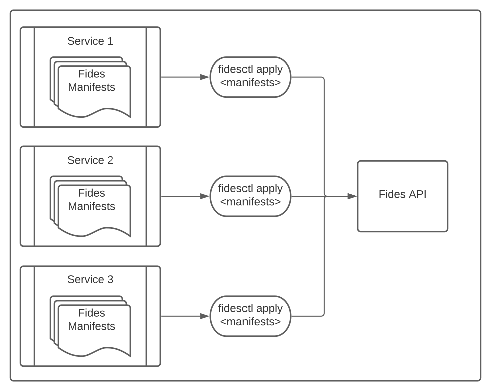
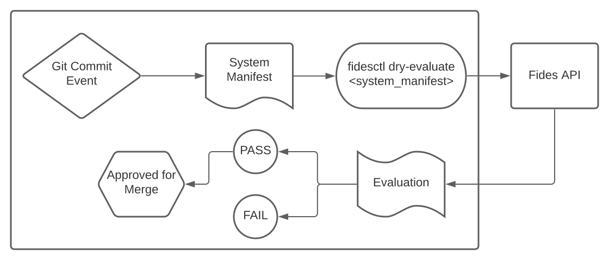

# Integrate your CI

_In this section, we'll reference a few examples and best practices for setting up your CI._

<!-- (TODO: rewrite) -->

Fides is meant to exist as a part of your CI pipeline, in order to enforce your organization's privacy policy before changes are released. We recommend setting up two events to trigger during each run of your CI pipeline.

## Repository Structure

Within your organization, you'll write manifest files and add these to version control with your source code, tests, etc. Each of these individual projects can then publish their manifests to the Fidesctl server via the API:



## Pull Requests



1. Set up a new CI workflow to trigger whenever a system or registry file is changed within a pull request.
2. Configure the new workflow to run the following command:

    ```bash
    fidesctl evaluate --dry fides_manifests/
    ```

3. The command will exit with a non-zero status if the evaluation fails.

Use the result of this job to determine whether or not a system change is safe to merge. If the command fails, check the error messages to see why.

## Merge Event

1. Set up a new CI workflow to trigger whenever a file in your manifests directory changes, and the branch gets merged in to the `main` branch.
1. Configure the new workflow to run two commands:
    1. `fidesctl apply fides_manifest/`
    1. `fidesctl evaluate system <fides_key>`

This will apply all of your manifests to the API and evaluate the current state of your system on the `main` branch.

## Additional Resources

We have compiled a few reference implementations for some popular CI tools, which you can find here.

<!-- (TODO: provide examples) -->
