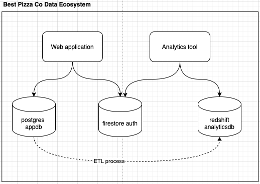
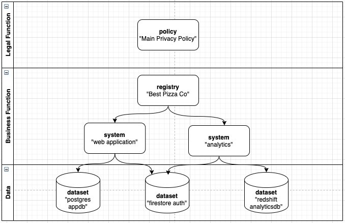

# Tutorial Overview

In this tutorial, we'll imagine that your business sells pizza online. "Best Pizza Co" has an ecommerce web application through which it sells pizza, and an analytics tool used to maintain a constant inventory of available pizzas to better understand the market. Your data ecosystem might look like this:

While looking to expand into international markets, you've decided to be intentional in the means of scaling your technology.  In this tutorial, you'll learn how to use Fides to:

1. Create Dataset Annotations, to declare the categories of PII stored in your three databases
2. Use System Privacy Declarations, to create business-function-related groupings for your applications
3. Build a set of rules dictating what Best Pizza Co. considers to be "allowed use of PII data", in accordance with your privacy policy

When you're done creating the Datasets, Systems, and Policy, your Fides data model might look like this:

## Next: Taxonomy

Using these basic principles, you'll begin building a practice of data privacy awareness throughout the software teams at your company. Start with the fundamentals, by understanding the Fides language [Taxonomy](taxonomy.md).
