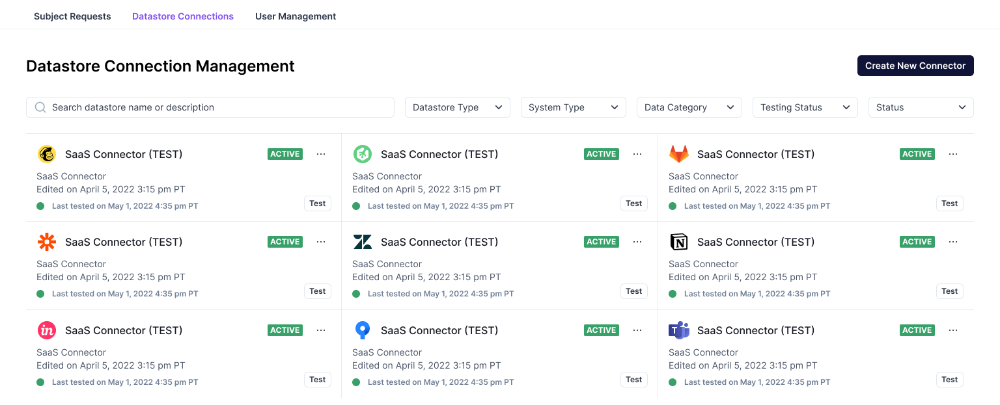
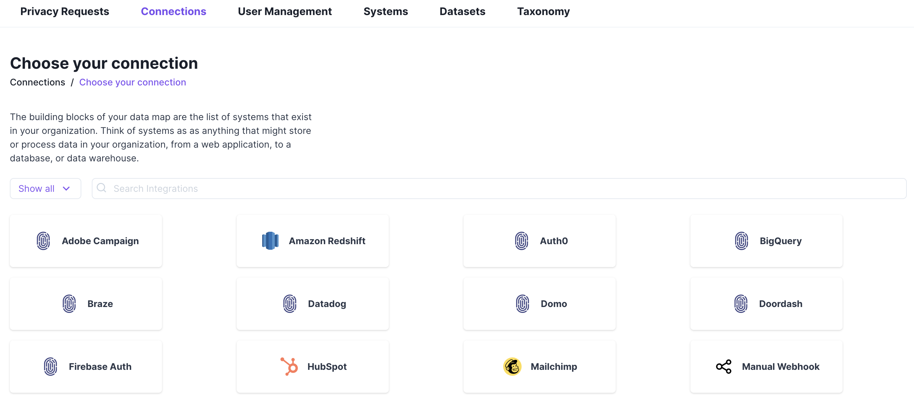
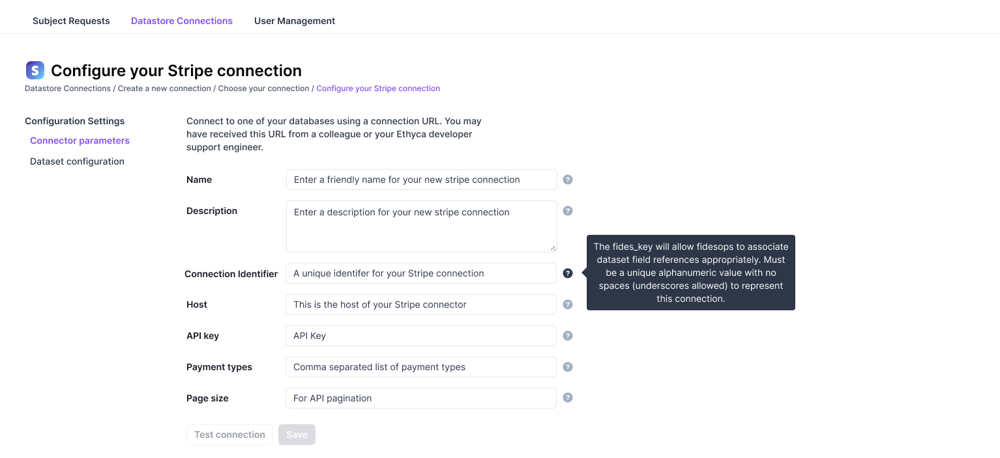
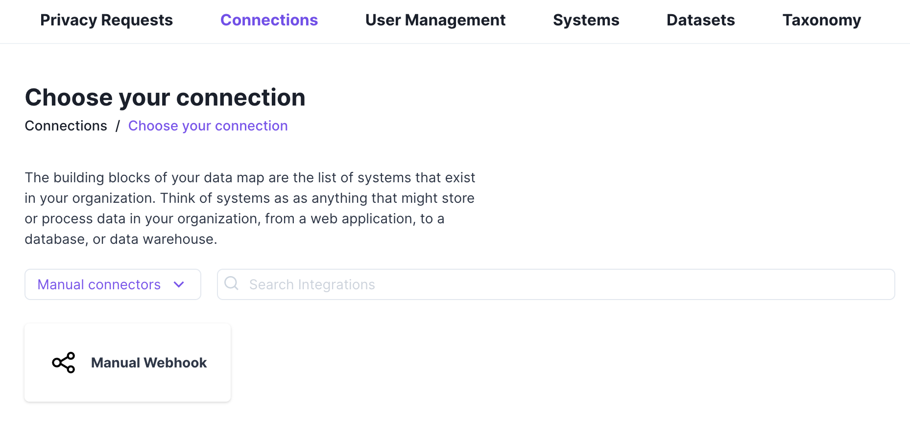
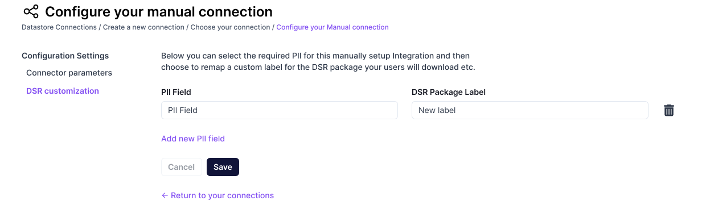
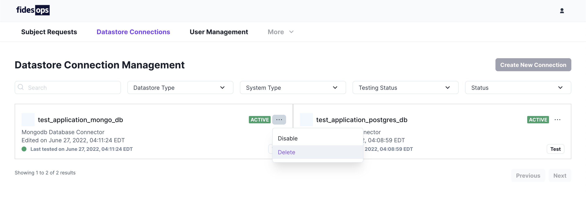
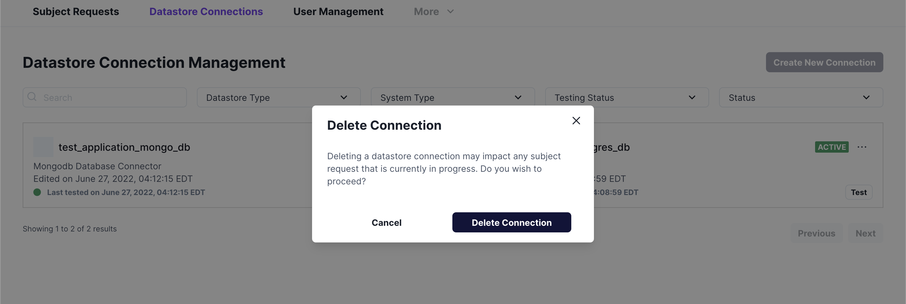

# Manage Datastores

Datastores represent connections to third party applications, databases and datasets, or manual storage locations.

## View Datastores

All currently configured datastores will appear in the paginated Datastore Connections panel. Search options are available to filter the datastore list.

`Active` datastores are included when fulfilling privacy requests.

`Disabled` datastores have their connection information saved, but are not included when privacy requests are executed.

### Panel Options

| Option | Description |
|----|----|
| Search | Retrieve a datastore by name. |
| Datastore Type | Filter datastores by type: SaaS, Postgres, Mongo, etc. |
| System Type | Filter datastores by system: SaaS, Database, or Manual. |
| Testing Status | Filter stores by the result of their last test: Passed, Failed, or Untested. |
| Status | Filter datastores by status: Active or Disabled. |

## Add a datastore

To add a new datastore connection, select "**Create New Connector**" from the Datastore Connections panel. You will be directed to a list of all available connection options, including adding [manual connectors](#manual-connections).

Search for and select your desired connector. The Datastores UI will assist in adding and configuring your new connection. 

### Automated connections

Fides automatically includes your SaaS connectors when processing [privacy requests](../getting-started/privacy_requests.md). Once you have selected a connection type, the UI allows you to describe your connection's configuration information, which includes any necessary fields for accessing and updating third-party data.

Once you have filled in the necessary information, select **Save**, and Fides will automatically attempt to test your connection.

### Manual connections

Manual connections are available for any data that cannot be processed automatically. Examples of manual connections might include physical storage locations, or third-party services without accessible APIs. Fides will pause processing a privacy request at any manual connection, and wait for administrator input before continuing.

To add a manual connection, select **Manual connection** in the "Show all connectors" dropdown. 

Once selected, Fides allows you to name and describe your manual connection, as well as provide a list of connection owners. These owners will be contacted by email when needed to respond to a privacy request with a manual component.

To continue, select **Save**.

You may now add any fields required by the manual connection. Connection owners will be required to supply this information when processing a manual request.

Additional fields may be added by selecting **Add new PII Fields**. 

One finished, select **Save.**
## Test a datastore

Each configured datastore includes an option to `Test` its connection. Fides will record the last tested time to the datastore's card, and update the current connection status.

`Green` connections have passed their most recent test.

`Red` connections have failed.

`Grey` connections have not been tested.

## Disable and delete datastores

Selecting the three dots menu `[...]` beside a datastore's connection status will bring up `Disable` and `Delete` options for that datastore.

Selecting either Disable or Delete will display a warning to confirm the action. Deleted datastores will have their connection information removed entirely from fides.api, while Disabled datastores may be enabled again from the same menu at a later date.

