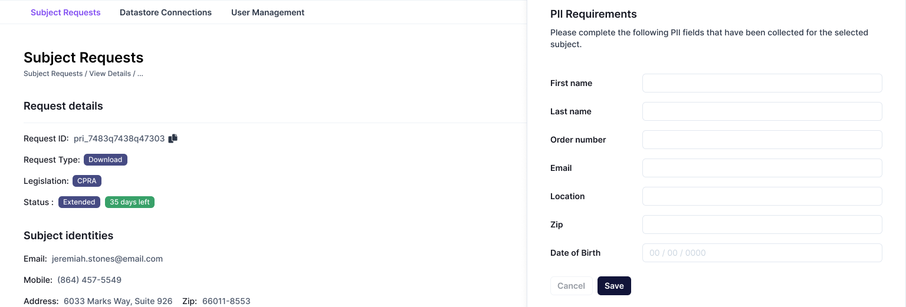

# Subject Requests

The Fides Admin UI is designed to provide at-a-glance access to submitted subject requests. The Subject Request panel provides search and sort capabilities, quick approve and deny functions, and in-depth details on individual request histories and statuses.

### Panel options

| Option | Description |
|----|----|
| Status | Requests can be filtered by their current status: **Error**, **Denied**, **In Progress**, **New**, **Canceled**, and **Complete**.|
| Search | The search bar filters on a given field: status, reviewer, etc. |
| Date Filter | Retrieve requests received within a certain date window. |
| Reveal PII | Toggling **Reveal PII** will display all personal information for the shown requests. |
| Download | Download a `.csv` of the shown requests. |
| Clear | Remove all search options and filters. |

### Request information
| Option | Description |
|----|----|
| Status | The request's current status. |
| Days Left | The number of days remaining to fullfil the subject request, according to compliance policies and regulations. |
| Policy Name | The name of the [execution policy](../getting-started/execution_policies.md) used for this request. |
| Subject Identity | Subject information. Hidden if **Reveal PII** is not selected. |
| Time Received | The time the request was first received. |
| Reviewed By | The system user that reviewed the request. |
| Options [...] | Approve and Deny options for the request. |

## Approve or deny requests

Hovering over a request row will provide access to the **approve** and **deny** options for that request.

**Approving** a request will log the action, the approver's account, and begin the process of executing the request based on the associated [policy](../guides/policies.md).

**Denying** a request allows the user to input a denial reason before confirming the action.

## View request details

Double-clicking a request row will display the request detail page, which allows access to additional information about the request, including the request ID, request type, and current status.

Requests with a status of **Error** can also be retried from this panel by selecting the **Retry** button.

The bottom of the Request Details panel displays the selected request's full event history. Selecting **View Details** on any event displays a summary of the event. **View Log** displays a detailed event log, which includes Fides' traversal through third-party connections and collections.

## Respond to manual requests
When [manual connections](./datastores.md#manual-connections) are configured, Fides will pause processing a privacy request until the required information has been retrieved.

Manual requests will be displayed in your Subject Request panel with a type of **Manual**.

To respond to a manual request, double-click the request row to review additional details. In the Subject Request Details panel, manual connections will have an additional **Begin manual input** button.

From here, you may add the data required by the fields specified during connection creation. Once finished, select **Save**, and Fides will continue processing the request.

