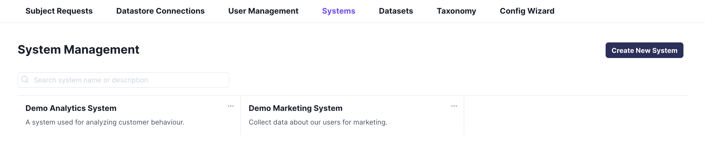
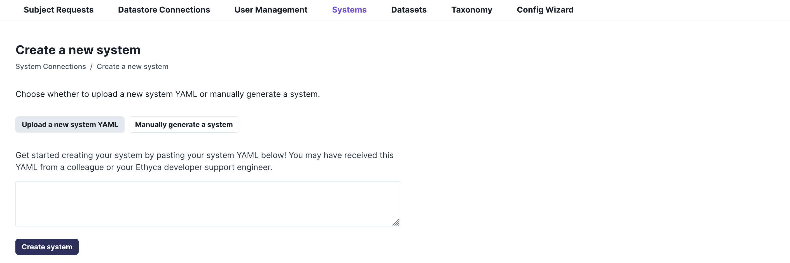
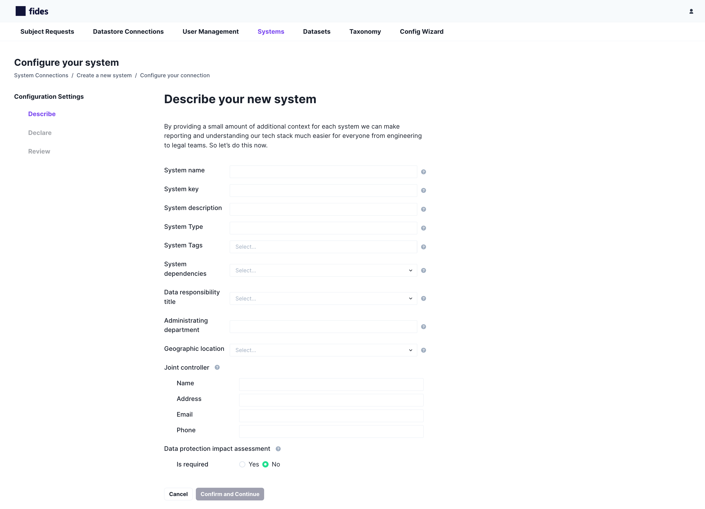
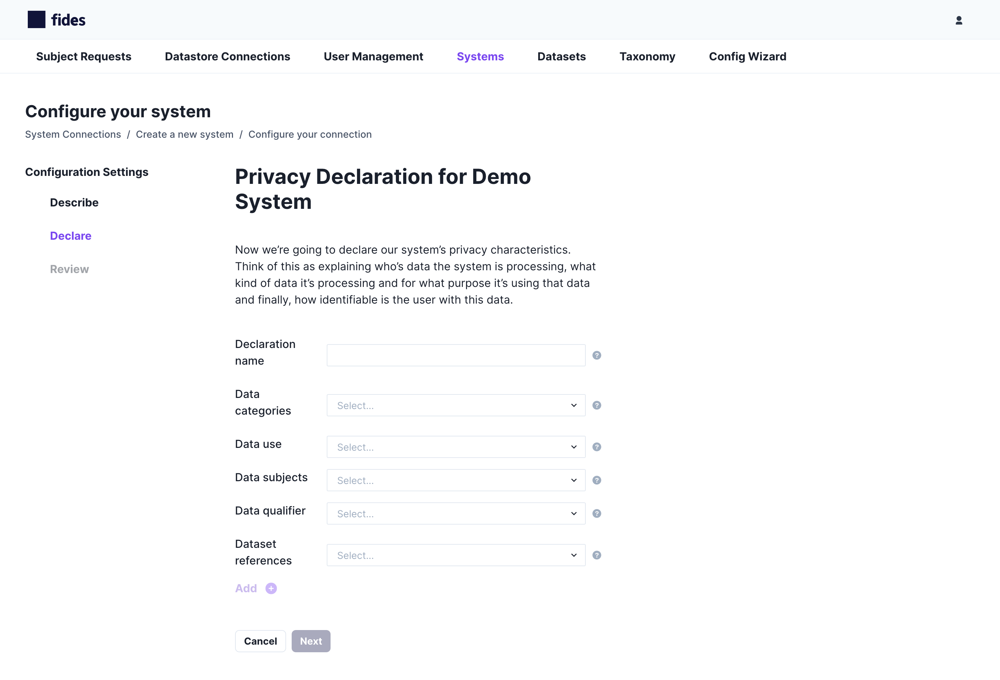
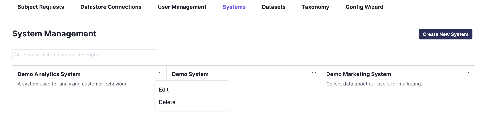
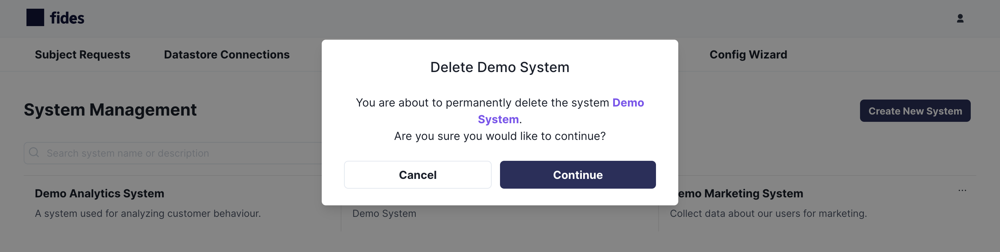

# System Management

Fides [Systems](https://ethyca.github.io/fideslang/resources/system/) describe any services that store or process data for your organization, including third-party APIs and services. Systems differ from [datastores](./datastores.md) in that they do not represent a third-party connection, but instead allow you to define your tech stack and infrastructure for reporting and data mapping.

## Add a System
Systems may be added in two ways: by pasting a System YAML declaration provided by a support engineer or generated by the [command line interface](../getting-started/generate_resources.md), or by walking through the step-by-step manual generation process.

To begin adding a new System, select **Create New System** from the System Management panel.

### Via a System YAML
To add a System via YAML, select **Upload a new system YAML**.

You will be provided a text box to paste your YAML file into. Once, done, select **Create system**, and your System will be added to the Management panel.

### Via manual generation
To add a System via manual generation, select **Manually generate a system**.

#### Describe your system
You will be asked to describe certain characteristics about your system. To learn more information about any field, hover over the question mark (**?**). 

#### Declare your system
System declarations represent classifications and descriptions defined by the [Fides Language](https://ethyca.github.io/fideslang/). 

#### Review your system
Once finished, you will be asked to confirm your system's declarations before registering it. To change any information, click on the **Describe** or **Declare** links on the left-hand column to return to each section.

Select **Confirm and Register** to save your completed system.

## Edit your Systems 

To edit existing information about any system, select the options menu (**...**) for a given system, and select **Edit**.

You will be prompted to review the Describe and Declare sections of system generation, and edit or update any information pertaining to your system.

## Delete your Systems 

To edit existing information about any system, select the options menu (**...**) for a given system, and select **Delete**.

