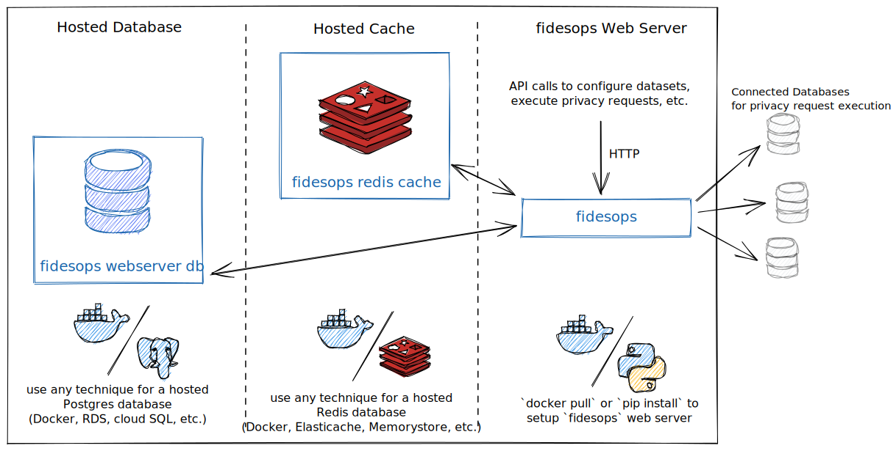

# Deployment Guide

To quickly experiment with `fidesops`, it's easiest to clone the source repo and use the built-in docker compose configuration to get a fully working demo environment up and running. However, when you want to use `fidesops` in production, you'll want to deploy it in parts, leveraging whatever cloud infrastructure your organization is most familiar with.

Fully deployed, `fidesops` has three individual systems you'll need to run:

1. [**Hosted Database**](#step-1-setup-hosted-database): PostgreSQL database server used for permanent storage of configuration data for the web server
1. [**Hosted Cache**](#step-2-setup-hosted-cache): Redis database server used as a temporary cache during execution and scheduling of tasks
1. [**fidesops Web Server**](#step-3-setup-fidesops-web-server): Main application with API endpoints to configure, execute, and report on privacy requests



Let's review each individually.

## Step 1: Setup Hosted Database

Like most web applications, `fidesops` uses an application database for persistent storage. Any hosted PostgreSQL database solution will work (PostgreSQL version 12+), as long as it's accessible. Good options include:

* Managed PostgreSQL database services (e.g. AWS RDS, GCP Cloud SQL, Azure Database)
* Self-hosted PostgreSQL Docker container with a persistent volume mount (e.g. on a Kubernetes cluster)
* Self-hosted PostgreSQL server (e.g. on an EC2 server)

NOTE: there *is no reason to expose this database to the public Internet* as long as it is will be accessible by your `fidesops` web server!

Setting up a production-grade PostgreSQL database is likely something your team is already familiar with, so we won't revisit that here. Once it's up and running, make sure you create a unique user and database to use for `fidesops` (we recommended calling these both `fidesops`) and assign a secure password, then keep track of all those credentials. You'll need those values later to populate these configuration variables for `fidesops`:

| Config Variable | Example | Description |
|---|---|---|
| `FIDESOPS__DATABASE__SERVER` | postgres.internal | hostname for your database server |
| `FIDESOPS__DATABASE__USER` | fidesops | username `fidesops` should use to access the database |
| `FIDESOPS__DATABASE__PASSWORD` | fidesopssecret | password `fidesops` should use to access the database |
| `FIDESOPS__DATABASE__DB` | fidesops | database name |

## Step 2: Setup Hosted Cache

During privacy request execution, `fidesops` collects result data in a temporary Redis cache that automatically expires to ensure personal data is never retained erroneously. Any hosted Redis database will work for this purpose (Redis version 6.2.0+), from a simple Docker [redis](https://hub.docker.com/_/redis) container to a managed service (e.g. AWS ElastiCache, GCP Memorystore, Azure Cache, Redis Cloud).

NOTE: Similar to PostgreSQL, there *is no reason to expose this cache to the public Internet* as long as it is will be accessible by your `fidesops` web server!

As with the PostgreSQL deployment, setting up a production-grade Redis cache is outside the scope of these docs. Once your Redis cache is available, ensure you enable a password (via Redis [`AUTH`](https://redis.io/commands/auth)) to provide additional security, and then keep track of all the connection credentials as you'll need these to configure `fidesops` in the next step with the following variables:

| Config Variable | Example | Description |
|---|---|---|
| `FIDESOPS__REDIS__HOST` | redis.internal | hostname for your Redis server |
| `FIDESOPS__REDIS__PORT` | 6379 | port for your Redis server |
| `FIDESOPS__REDIS__PASSWORD` | fidesopssecret | password `fidesops` should use to access Redis |

## Step 3: Setup fidesops Web Server

The `fidesops` web server is a [FastAPI](https://fastapi.tiangolo.com/) application with a [Uvicorn](https://www.uvicorn.org/) server to handle requests. The host requirements for the `fidesops` web server are pretty minimal:

* A general purpose web server (e.g. for AWS EC2, a `t2.small` should be plenty)
* No persistent storage requirements (this is handled by the hosted database)
* Docker version 20.10.8 or newer (if installing via Docker)
* OR Python 3.8 or newer (if installing via Python)

Depending on your preferences, you can install `fidesops` in one of two ways: *Docker* or *Python*.

### Option 1: Install fidesops via Docker

If you typically run your applications via Docker, you'll probably be familiar with pulling images and configuring them with environment variables. Setting up a `fidesops` container should contain no surprises.

First, ensure that Docker is running on your host, with a minimum version of `20.10.8`.

You can `docker pull ethyca/fidesops` to get the latest image from Ethyca's Docker Hub here: [ethyca/fidesops](https://hub.docker.com/r/ethyca/fidesops).

```
docker pull ethyca/fidesops
```

Once pulled, you can run `docker run ethyca/fidesops` to start the server.

To configure `fidesops` for your environment, however, you'll need to provide a number of required environment variables through `docker run`. You can accomplish this either by creating a `.env` file and passing it in via the [`--env-file {file}` option](https://docs.docker.com/engine/reference/commandline/run/#set-environment-variables--e---env---env-file) or by providing individual variables with the `--env {VAR}` option. At a minimum, you'll need to provide the following as env variables:

| Config Variable | Example | Description |
|---|---|---|
| `FIDESOPS__SECURITY__APP_ENCRYPTION_KEY` | averyveryverysecretencryptionkey | AES256 encryption key used for DB & JWE encryption, must be exactly 32 characters (256bits) |
| `FIDESOPS__SECURITY__OAUTH_ROOT_CLIENT_ID` | fidesopsadmin | client ID used for the "root" OAuth client |
| `FIDESOPS__SECURITY__OAUTH_ROOT_CLIENT_SECRET` | fidesopsadminsecret | client secret used for the "root" OAuth client |
| `FIDESOPS__DATABASE__SERVER` | postgres.internal | hostname for your database server |
| `FIDESOPS__DATABASE__PORT` | 5432 |port for your database server |
| `FIDESOPS__DATABASE__USER` | fidesops | username `fidesops` should use to access the database |
| `FIDESOPS__DATABASE__PASSWORD` | fidesopssecret | password `fidesops` should use to access the database |
| `FIDESOPS__DATABASE__DB` | fidesops | database name |
| `FIDESOPS__REDIS__HOST` | redis.internal | hostname for your Redis server |
| `FIDESOPS__REDIS__PORT` | 6379 | port for your Redis server |
| `FIDESOPS__REDIS__PASSWORD` | fidesopssecret | password `fidesops` should use to access Redis |

Lastly, you'll also want to ensure you use the `-p 8080:8080` option to `docker run` to bind port 8080 (the web server) to port 8080 on the host, so you can connect from the outside.

Putting this together:

```
docker run \
  -p 8080:8080 \
  --env FIDESOPS__SECURITY__APP_ENCRYPTION_KEY="averyveryverysecretencryptionkey" \
  --env FIDESOPS__SECURITY__OAUTH_ROOT_CLIENT_ID="fidesopsadmin" \
  --env FIDESOPS__SECURITY__OAUTH_ROOT_CLIENT_SECRET="fidesopsadminsecret" \
  --env FIDESOPS__DATABASE__SERVER="postgres.internal" \
  --env FIDESOPS__DATABASE__PORT="5432" \
  --env FIDESOPS__DATABASE__USER="fidesops" \
  --env FIDESOPS__DATABASE__PASSWORD="fidesopssecret" \
  --env FIDESOPS__DATABASE__DB="fidesops" \
  --env FIDESOPS__REDIS__HOST="redis.internal" \
  --env FIDESOPS__REDIS__PORT=6379 \
  --env FIDESOPS__REDIS__PASSWORD="fidesopssecret" \
  ethyca/fidesops

INFO:fidesops.main:****************fidesops****************
INFO:fidesops.main:Running any pending DB migrations...
INFO:alembic.runtime.migration:Context impl PostgresqlImpl.
INFO:alembic.runtime.migration:Will assume transactional DDL.
INFO:fidesops.main:Starting scheduled request intake...
INFO:apscheduler.scheduler:Scheduler started
INFO:fidesops.main:Starting web server...
INFO:uvicorn.error:Started server process [1]
INFO:uvicorn.error:Waiting for application startup.
INFO:uvicorn.error:Application startup complete.
INFO:uvicorn.error:Uvicorn running on http://0.0.0.0:8080 (Press CTRL+C to quit)
```

Or if you prefer to create your .env file and pass an `--env-file` variable, you can use the following: 

```
docker run \
  -p 8080:8080 \
  --env-file=<ENV FILE NAME>.env \
  ethyca/fidesops
```


Now, for most Docker hosts, you won't be calling `docker run` directly, and instead will be providing configuration variables to Kubernetes/Swarm/ECS/etc. As you can see in the `docker run` example above, this config is quite minimal and should just involve specifying (1) the image, (2) the port mapping, (3) all the various environment variables for configuration.

Note that there's no need for a persistent volume mount for the web server, it's fully ephemeral and relies on the database for all it's permanent state.

### Option 2: Install fidesops via Python

Releases of `fidesops` are published to PyPI here: [fidesops](https://pypi.org/project/fidesops/). Typically you'll setup a virtual environment and then run `pip install`:

```
pip install fidesops
```

Once installed, you'll need a minimial config TOML file to specify the required config variables to run the server. Create a file called `fidesops.toml` in the working directory you'll run `fidesops` from using the following template, replacing the values as needed. For details on these config variables, refer to the table in [Option 1](#option-1-install-fidesops-via-docker) above.
```toml
[database]
SERVER="postgres.internal"
PORT="5432"
USER="fidesops"
PASSWORD="fidesopssecret"
DB="fidesops"

[redis]
HOST="redis.internal"
PORT="6379"
PASSWORD="fidesopssecret"

[security]
APP_ENCRYPTION_KEY="averyveryverysecretencryptionkey"
OAUTH_ROOT_CLIENT_ID="fidesopsadmin"
OAUTH_ROOT_CLIENT_SECRET="fidesopsadminsecret"
```

Once installed, you can run `fidesops webserver` to start the server:

```
fidesops webserver
INFO:fidesops.main:****************fidesops****************
INFO:fidesops.main:Running any pending DB migrations...
INFO:alembic.runtime.migration:Context impl PostgresqlImpl.
INFO:alembic.runtime.migration:Will assume transactional DDL.
INFO:fidesops.main:Starting scheduled request intake...
INFO:apscheduler.scheduler:Scheduler started
INFO:fidesops.main:Starting web server...
INFO:uvicorn.error:Started server process [37]
INFO:uvicorn.error:Waiting for application startup.
INFO:uvicorn.error:Application startup complete.
INFO:uvicorn.error:Uvicorn running on http://0.0.0.0:8080 (Press CTRL+C to quit)
```

Ensure that you set up your web server to run this command on startup and map port 8080 as necessary in your firewall rules, etc. and you should be good to go!

### Test the Web Server

To test that your server is running, visit `http://{server_url}/health` in your browser (e.g. http://0.0.0.0:8080/health) and you should see `{ "healthy": true }`.

You now have a functional `fidesops` server running! Now you can use the API to setup your OAuth clients, connect to databases, configure policies, execute privacy requests, etc. To learn more, head to the [How-To Guides](guides/oauth.md) for details.