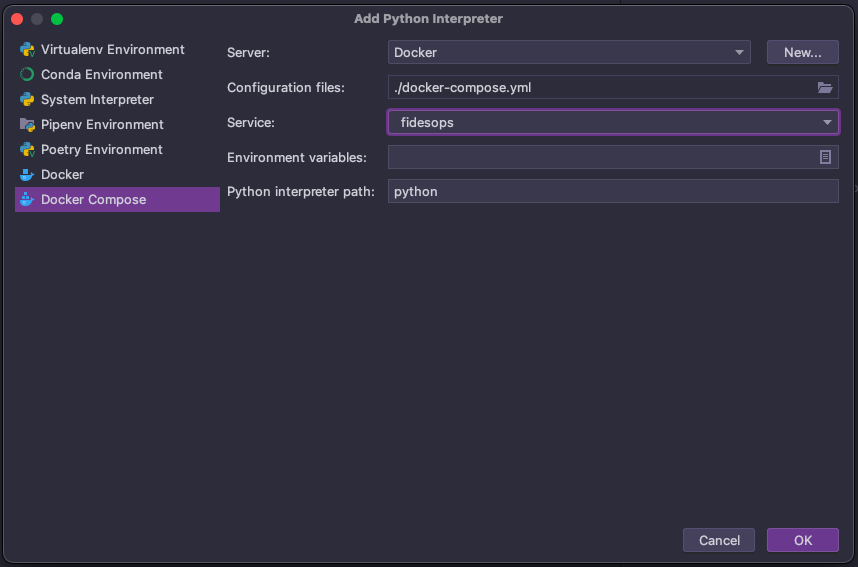

# Debugging Fidesops in IntelliJ IDEA Ultimate
This guide will show how to use the IntelliJ debugger with Fidesops running in Docker. 
The setup for PyCharm Professional should be very similar.

## Prerequisites
- [Intellij IDEA Ultimate](https://www.jetbrains.com/idea/buy/#commercial) or [PyCharm Professional](https://www.jetbrains.com/pycharm/buy/#commercial)
- [Docker plugin](https://plugins.jetbrains.com/plugin/7724-docker)
- [Python plugin](https://plugins.jetbrains.com/plugin/631-python) *(this is needed for Intellij)*
- [Docker Desktop](https://www.docker.com/products/docker-desktop)
- [Fidesops](https://ethyca.github.io/fidesops/tutorial/installation/)

## Setup
### Connect to Docker daemon

This step will allow the IDE to connect to Docker Desktop.

Go to: **Settings/Preferences** -> **Docker** -> **+**

* Select **Docker for "your operating system"** 

See the screenshot below:

### Configure Python Remote Interpreter

Define a Docker-based remote interpreter.

Go to: **File** -> **Project Structure...** -> **Platform Settings** -> **SDKs** -> **+**

* Set **Server** to `Docker`
* Set **Configuration files** to `.docker-compose.yml`
* Set **Python interpreter path** to `python`

After clicking **OK** the Remote Python Docker Compose should be listed as an SDK.

See screenshots below:

### Run/Debug Configuration

Set up a Run/Debug Configuration so that breakpoints can be hit in the Fidesops sourcecode. 

Go to: **Run/Debug Configurations** -> **+** -> **Python**

- To debug Fidesops, debug the `<path on your machine>/src/fidesops/main.py` script
- Make sure to select **Use specified interpreter** set the Remote Python Docker Compose *(created in the previous section)*
- Add `FIDESOPS__CONFIG_PATH=/fidesops` to **Environment variables**

See screenshot below:

## Hit a Breakpoint

Now the IDE is ready to debug the source code. Click the debug button for **main** *(setup in the previous section)*.

Try firing a http request to Fidesops from Postman or Curl and hit a break point. 

There is a postman collection in this repo: `docs/fidesops/docs/postman/Fidesops.postman_collection.json`

Screenshot of hit breakpoint below:

## Links

The information is this guide is largely based on these docs

- https://www.jetbrains.com/help/pycharm/using-docker-as-a-remote-interpreter.html
- https://www.jetbrains.com/help/idea/configuring-local-python-interpreters.html