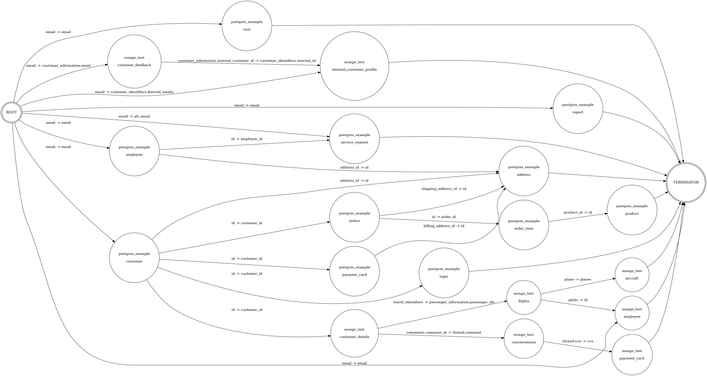

# Complex Fields

Fidesops can retrieve data from complex objects and arrays in MongoDB (*access* requests only; erasure support coming soon), although
this involves annotating your dataset files to let fidesops know about your complex data.

In this section we'll cover:

- How to annotate your dataset to describe object fields
- How to reference a nested object 
- How to annotate array fields
- How to reference resources in arrays
- Assumptions made with array queries
- Example query traversal referencing complex fields

## How do I annotate an object field?

To declare an `object` field, you should define nested fields underneath that field. You can optionally
add the `data_type: object` annotation, but the object type will be inferred by the presence of the nested fields. In the example below, 
`workplace_info` is an object field with two nested fields: `employer` and `position`.

Data categories cannot be specified at the `object` level due to potential conflicts with nested fields. Instead,
annotate the scalar fields within the object field.  Here, the `workplace_info.position` field has `data_category`
`user.provided.identifiable.job_title`.


```yaml
dataset:
  - fides_key: mongo_nested_object_example
    name: Mongo Example with Nested Objects
    description: Example of a Mongo dataset that contains 'details' about customers defined in the 'postgres_example_test_dataset'
    collections:
      - name: customer_details
        fields:
          - ...
          - name: workplace_info
            fidesops_meta:
                data_type: object
            fields:
              - name: employer
                fidesops_meta:
                  data_type: string
              - name: position
                data_categories: [ user.provided.identifiable.job_title ]
                fidesops_meta:
                  data_type: string
              - name: id
```

## How do I reference a nested field?

To define a relationship between a field on one collection and a nested field on another collection, use dot notation
in the `fidesops_meta` references for as many levels are necessary.

In the example below, we might add a separate `customer` collection that references
the nested field `workplace_info.id` field in the `customer_details` collection. 
Under references, this field is denoted by `<collection_name>.<field_name>.<sub_field>` name, or
`customer_details.workplace_info.id`.

If we preferred, we could instead define this relationship on the `customer_details.workplace_info.id` field itself,
with a direction of `from`, with field `mydatabase.customer.workplace_id`, and dataset `mydatabase`.

```yaml
dataset:
  - fides_key: mydatabase
    name: internal database
    description: our internal database of customer data
    collections:
      - name: customer
        fields:
          - name: workplace_id
            data_categories: [system.operations]
            fidesops_meta:
              references:
                - dataset: mongo_nested_object_example
                  field: customer_details.workplace_info.id
                  direction: to
          ...

```

## How do I denote an Array Field?

There is not an official `array` type per se, since arrays can store scalar values or objects. Instead,  an array is represented
by a `[]` flag on a field.

### What if I have an array of scalar values?

In this example, our `mydatabase:customer` collection has a `travel_identifiers` field that is an array of strings,
described by `data_type: string[]`.  An array of integers would be described by `data_type: integer[]`.
```yaml
dataset:
  - fides_key: mydatabase
    name: internal database
    description: our internal database of customer data
    collections:
      - name: customer
        fields:
          - ...
          - name: travel_identifiers
            fidesops_meta:
              data_type: string[]
              data_categories: [system.operations]
```

### How do I describe a nested array?

In this example, our `mydatabase:customer` collection has a nested `workplace_info.direct_reports` array, that is an
array of strings. In other words, we have a `workplace_info` object field, with sub-fields `employer`, `postion`, and `direct_reports`,
where `direct_reports` is an array.  

We define `direct_reports` as a subfield under `workplace_info`, as well as add the data_type `string[]` to `direct_reports`.

```yaml
dataset:
  - fides_key: mydatabase
    name: internal database
    description: our internal database of customer data
    collections:
      - name: customer
        fields:
          - name: workplace_info
            fidesops_meta:
              data_type: object
            fields:
              - name: employer
                fidesops_meta:
                  data_type: string
              - name: position
                data_categories: [ user.provided.identifiable.job_title ]
                fidesops_meta:
                  data_type: string
              - name: direct_reports
                data_categories: [ user.provided.identifiable.name ]
                fidesops_meta:
                  data_type: string[]
```

### What if my collection contains an array of objects?

In this example, our `mydatabase:customer` collection has an `emergency_contacts` field which is an array of objects, or
embedded documents, denoted by `data_type: object[]`.   Each object in the `emergency_contacts` array can contain a 
`name`, `relationship`, and `phone` field.

```yaml
dataset:
  - fides_key: mydatabase
    name: internal database
    description: our internal database of customer data
    collections:
      - name: customer
        fields:
          - name: emergency_contacts
            fidesops_meta:
              data_type: object[]
            fields:
              - name: name
                data_categories: [ user.provided.identifiable.name ]
                fidesops_meta:
                  data_type: string
              - name: relationship
                fidesops_meta:
                  data_type: string
              - name: phone
                data_categories: [ user.provided.identifiable.contact.phone_number ]
                fidesops_meta:
                  data_type: string
```

### How do I reference an array field?

Generally, reference an array field as if it is any other field. You cannot currently reference a specific index in an array field, 
but you can point a field to an array field, and we would search for matches within that array.

In this example, `mydatabase:flights.plane` is an integer field that will be used to lookup records that match an integer
in the `mydatabase:aircraft.planes` array.

```yaml
dataset:
  - fides_key: mydatabase
    name: internal database
    description: our internal database of customer data
    collections:
     - name: flights
        fields:
          - ...
          - name: passenger_information
            fields:
              - name: passenger_ids
                fidesops_meta:
                  data_type: string[]
          - name: plane
            data_categories: [ system.operations ]
            fidesops_meta:
              data_type: integer
      - name: aircraft
        fields:
          - name: _id
            data_categories: [ system.operations ]
            fidesops_meta:
              primary_key: True
              data_type: object_id
          - name: planes
            data_categories: [ system.operations ]
            fidesops_meta:
              data_type: integer[]
              references:
                - dataset: mydatabase
                  field: flights.plane
                  direction: from
          - name: model
            data_categories: [ system.operations ]
            fidesops_meta:
              data_type: string
```

In this more complicated example, a field in an array of objects is used to look up a different field in an array of 
objects in another collection. Potentially multiple values from `mydatabase:customer.comments.comment_id` can be used 
to query for corresponding values in `mydatabase:conversations.thread.comment`. Because this field is in an array of objects, 
multiple matches may be found.

```yaml
dataset:
  - fides_key: mydatabase
    name: internal database
    description: our internal database of customer data
    collections:
      - name: customer
        fields:
          - name: comments
            fidesops_meta:
              data_type: object[]
            fields:
              - name: comment_id
                fidesops_meta:
                  data_type: string
                  references:
                    - dataset: mydatabase
                      field: conversations.thread.comment
                      direction: to
      - name: conversations
        fidesops_meta:
          data_type: object[]
        fields:
          - name: thread
            fields:
              - name: comment
                fidesops_meta:
                  data_type: string
              - name: message
                fidesops_meta:
                  data_type: string
              - name: chat_name
                data_categories: [ user.provided.identifiable.name ]
                fidesops_meta:
                  data_type: string
```

## How does array querying work?

There are some assumptions made with array querying that may or may not fit with how your data is structured.  If an array
is an entrypoint into a collection (in other words, one collection references its array field), there is ambiguity around how
the queries should be built - for example, AND versus OR, and whether only the matched indices or matched embedded documents within
arrays should be considered.

### Assumptions

1) If an array is the entry point into a node, we will search for corresponding matches across the entire array. You cannot specify a certain index.
2) Everything is basically an "OR" query. Data returned from multiple array fields will be flattened before being passed into the next collection.
   1) For example, say Collection A returned values [1, 2, 3] and Collection B returned values [4, 5, 6].  Collection C has an array field that depends on both Collection A and Collection B. We search Collection C's array field to return any record that contains one of the values [1, 2, 3, 4, 5, 6] in the array.
3. If an array field is an entry point to a node, only matching indices in that array are considered, both for access/(and eventually erasures), as well as for subsequent queries on dependent collections where applicable.
   1. For example, a query on Collection A only matched indices 0 and 1 in an array.  Only the data located at indices 0 and 1 are used to query data on dependent collection C.


### Can I see a more detailed example of a query traversal with complex objects?

This is an example traversal created from our test `postgres_example` and `mongo_test` datasets.
Multiple collections are point to or from complex objects and arrays.  See the `mongo_example_test_dataset.yml` for more information.

