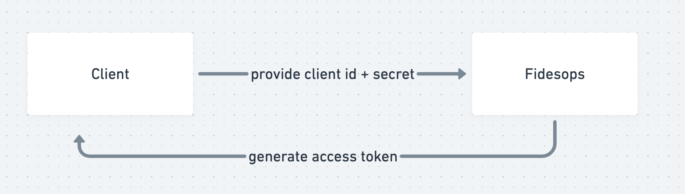

# How-To: Authenticate with OAuth

In this section we'll cover:

- An overview of the Fidesops Oauth flow
- How to configure root client credentials
- How to create additional oauth clients
- Authorization scopes
- How to create oauth tokens
- Example auth flow

Take me directly to [api docs](http://0.0.0.0:8080/docs#/OAuth) (you'll need to `make server` first)

## Overview

Authorization is the process of ensuring that only clients with proper permissions are able to perform specific actions.

Fidesops supports Oauth authentication. Here's how that works:

1. A client pings Fidesops with its unique client id and secret
2. If both the client id and secret are valid, Fidesops responds with an access token 
3. The client provides that access token on each subsequent request for purposes of authorization



## Configuration

### Root Client

A root client is provided with each installation of Fides, with credentials that are specified as `env` variables.

The root client has access to all scopes in the system, thus has the ability to perform any action in the system.

To specify your root client, include the following environment variables:

- `OAUTH_ROOT_CLIENT_ID` - This is the client id for root.

- `OAUTH_ROOT_CLIENT_SECRET` - This is the client secret for root.

Read more about this configuration process in our [deployment guide](../deployment.md)

### Additional Clients

A client is generated by another client. In order for a client to generate a new client, they must be equipped with the `CLIENT:CREATE` scope. For example, the root client can always create a new client, since it has access to all scopes.

A properly equipped client can go about generating a new client by posting to the [`/oauth/client`](http://0.0.0.0:8080/docs#/OAuth/create_client_api_v1_oauth_client_post) endpoint. The endpoint will respond with the client id / client secret pair associated with the newly created client. This pair will be used by the new client to gain access to the system.

> Word of warning - do note these credentials immediately as they will not be accessible afterwards. Particularly, the client secret is not stored directly on the system and so once it is gone it cannot be recovered.

Upon creation, the newly generated client does not have any scopes, and cannot perform any meaningful interaction with the system.

Let's learn more about scopes and how to assign scopes to a client.

## Scopes

Each Fidesops endpoint requires a client to have the appropriate scope for that endpoint.

For example, in order to use the following endpoint, the client must have the scope `CLIENT_CREATE` associated with it:

```bash
    @router.post(CLIENT, dependencies=[Security(scope_verifier, scopes=[CLIENT_CREATE])])
    def create_client(db: Session = Depends(get_db)) -> ClientCreated:
    """Creates a new client and returns the credentials"""
    return client_management_service.create_client(db)
```

A client is associated with scopes. We've seen, above, that scopes are what give the client the ability to perform actions against the system. Without scopes, the client cannot do anything.

In order to modify the scopes associated with the client, the calling client must have the `CLIENT:UPDATE` scope.

To modify a client’s scope, perform a `PUT` against the [`/oauth/client/{client_id}/scope`](http://0.0.0.0:8080/docs#/OAuth/set_client_scopes_api_v1_oauth_client__client_id__scope_put) endpoint with a list of client scopes as the request body. The client will now be associated with that set of scopes. This will replace existing scopes with the set of scopes provided, so use caution.

To get a list of scopes available to a specific client, perform a GET against the [`/oauth/scope`](http://0.0.0.0:8080/docs#/OAuth/read_scopes_api_v1_oauth_scope_get) endpoint.

A full list of all available scopes within Fidesops can be found in [`src/fidesops/api/v1/scope_registry.py`](https://github.com/ethyca/solon/blob/main/src/fidesops/api/v1/scope_registry.py).


## Access Tokens 

After a client has been given specific scopes, they should request an access token.

To specify the time that the access token will be alive in minutes, set the following environment variable:

- `OAUTH_ACCESS_TOKEN_EXPIRE_MINUTES`

The default value is 11520 minutes or 8 days.

To create an access token for a client, perform a `POST` against the [`/oauth/token`](http://0.0.0.0:8080/docs#/OAuth/acquire_access_token_api_v1_oauth_token_post),
with the client_id and client_secret as form-encoded data.

Set this bearer token to create other resources in fidesops, by including an `Authorization: Bearer <ACCESS_TOKEN>` header. 


## Example Auth Flow

After having configured the root client id and secret, I wish to use the root client to create an additional client.

First, I'll need to obtain my root access token:

```bash
curl -X 'POST' \
  'http://0.0.0.0:8080/api/v1/oauth/token' \
  -H 'accept: application/json' \
  -H 'Content-Type: application/x-www-form-urlencoded' \
  -d 'grant_type=&scope=&client_id=<CLIENT_ID>&client_secret=<CLIENT_SECRET>'
```

The response will look something like this:
```bash
{
  "access_token": "eyJhbGciOiJkaXIiLCJlbmMiOiJBMjU2R0NNIn0..5e3CF5Y5QglasdhNMiadshFAQ.OQF47Y_IuPoSH3HD5_Ybnd5rAx8uoj3zbKGRu-mfiPrJOzUocpJh64AXKIGLinrSxv_a2Jtr6sMkD5w6kGAbHUu1ytD17Z2V66uC5WA5TJZoI8fEcsFeq6NHt-PDIXnokJkwgDuXD4nsUDH1DyP6xN4iJcBE2yF_cNvJi00WMO39Mk5gS3JhDCgydkErYjiGy3uafZNawxgyBjBttigJRimgkC3J12Sy7luPLjM9gEFS0jmg0KuwZ9f-ebYSHPy7gfyMn03CP90l_W9zAQuNUXC4EfJoMdbe4iaqjic83UXxznKTFvN8CWuzEM32Kz4O9sSUOZBKRPgZ6gwfD3Lr0VOYpuMGWNX4l6lAqUa8xM-dygVOZ1Yt-_pGmsEgQrYInQmFnDj2uij-7gcUyP_HLww0_Mi0U_yzQ67FwntFIn3vNZLO3NSf7ydWQ3aLadQNuJppj-5Q_4xewfYOPiOEBzLI3Jd4LG1poK91yWYRbfV7M6AtSBPlnToCfs58_APU7ngqLyIlrWSQxuNx-FbHKAb5pi1YRfZpUgFeKMQZeVIvbEstaHX3c9j_pQbs255VJSHG22nCP2zoKYtt5C1Mg5o617Z92uhsReapBYbponwWN7Dqiy4-3WyZ6dfhk8euJOZ0ZFlHiey48NZxe4oNBk2tmsBvFrhdLIjKeNwVXhKwS3LPnAdq3Resu6yIHl3KEHp5zuErruOCzmQxZhQcuXPJq7onpA.EcAX36Pmi2lbEM4Xhd9Xlg"
}
```

Next, I can use that access token to create the new client:

```bash
curl -X 'POST' \
  'http://0.0.0.0:8080/api/v1/oauth/client' \
  -H 'accept: application/json' \
  -H "Authorization: Bearer <ACCESS_TOKEN>"
  -d ''
```

This client needs scopes added. I'll use the root client to add scopes to the new client, in this example I'll be adding the `storage:create` and `privacy-request:create` scopes:

```bash
curl -X 'PUT' \
  'http://0.0.0.0:8080/api/v1/oauth/client/<client_id>/scope' \
  -H 'accept: application/json' \
  -H 'Content-Type: application/json' \
  -H "Authorization: Bearer <ACCESS_TOKEN>"
  -d '['storage:create', 'privacy-request:create']'
```

Now the client should create an access token which will allow them to perform actions with their allowed scopes.

```bash
curl -X 'POST' \
  'http://0.0.0.0:8080/api/v1/oauth/token' \
  -H 'accept: application/json' \
  -H 'Content-Type: application/x-www-form-urlencoded' \
  -d 'grant_type=&scope=&client_id=<CLIENT_ID>&client_secret=<CLIENT_SECRET>'
```


That's it! Now this new client can use their token to create storage destinations and privacy requests in Fidesops.

