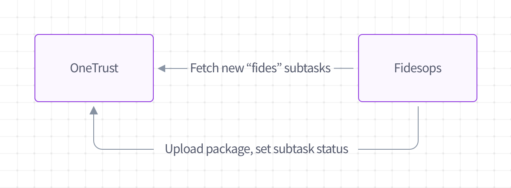

# Configure a OneTrust Integration

API docs for OneTrust are part of the [storage](/fidesops/api#operations-tag-Storage) module.

## Overview

OneTrust is a DSAR automation provider that provides an interface to manage privacy requests.

Fidesops handles the integration to OneTrust to fulfill Data Subject Requests and returns the data package back to OneTrust.

## How it works

Here's how our OneTrust integration works:

1. You set up a new [storage destination](./storage.md) of type `onetrust`
2. A new scheduled task kicks off that pings OneTrust for subtasks labeled for fidesops
3. Fidesops processes those DSARs normally
4. Upon completion of DSAR processing, we do 2 things:
      1. Ping OneTrust to set the subtask status appropriately 
      2. If applicable, upload a data package back to OneTrust

## Configuration

### Fidesops
  
OneTrust request intake is configured as part of the `StorageConfig` in the storage module. To configure fidesops to connect to OneTrust:

1. Add Destination: Add a `StorageConfig` that includes a `onetrust` destination type.
2. Authenticate: Use appropriate credentials to authenticate with OneTrust.
3. Determine polling interval: Decide what day of the week and hour of the day you wish to retrieve requests from OneTrust.

More information on storage destinations can be found [here](./storage.md).

### OneTrust

When the fidesops scheduled task runs, it looks for subtasks with an exact string name of "fides task".  So, you'll need to be sure tasks you wish to pass through the Fides ecosystem are correctly labeled in the OneTrust interface.

## Testing

To test the OneTrust integration works correctly, you'll need to do the following:

1. Ensure that you have subtasks with a name of "fides task" in OneTrust
2. Set your OneTrust destination config in Fides such that day of week and hour of request intake is appropriate for testing
3. Confirm that the subtask status has been updated at that time, and any DSAR data packages have been uploaded at the request level in OneTrust
