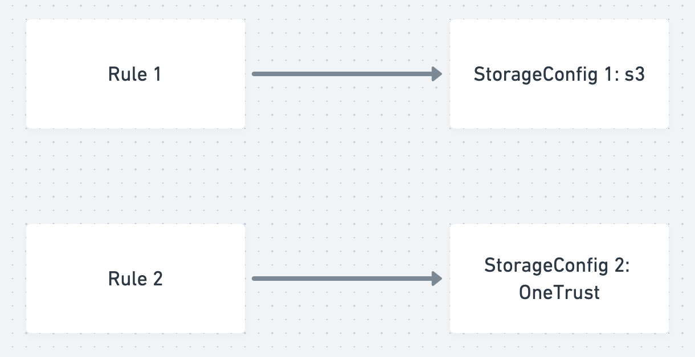

# Configure Storage Destinations

## Overview

Access requests will produce a data package upon completion. This data will need to be uploaded to a storage destination (e.g. an S3 bucket). 

Fidesops never stores privacy request results locally, so you’ll need to configure at least one storage destination if you wish to process Access requests.

Storage destinations are configured on Rules. 



Multiple destinations can be configured, each of which might be used by different rules. Read more about configuring rules [here](./policies.md)

Each unique destination is configured using a "StorageConfig", which you can create and manage via the API.

To configure a StorageConfig, you'll first need to choose a storage destination type. fidesops currently supports the following types:

- **local** - This saves upload packages locally, generating a `fides_uploads` directory at the root of this project. This destination type should be used only for testing purposes, never to process real-world access requests.
- **S3** - S3 upload is straightforward, in which files are uploaded in an S3 bucket of your choosing upon completion of access requests. Use S3 if you simply need a place to store those files.
- **OneTrust** - A OneTrust storage destination should be configured if you wish to use fidesops to process requests from an existing OneTrust integration. Read more about how our OneTrust integration works [here](./onetrust.md)

## Configuration

Let's get started. To create a new StorageConfig, use the following endpoint ([API docs here](/fidesops/api#operations-Storage-put_config_api_v1_storage_config_put)):

```json title="<code>PATCH {host}/api/v1/storage/config</code>" 
  {
    "destinations": [
      {
        "name": str,
        "key": FidesOpsKey (optional),
        "type": str,
        "format": str
        "details": {
          # s3
          "bucket": str,
          "naming": str,
          # onetrust
          "service_name": str,
          "onetrust_polling_hr": int,
          "onetrust_polling_day_of_week": int
        }
      }
    ]
  }

```
Params:

- `name`: A unique user-friendly name for your storage destination.
- `key`: A unique key used to manage your storage destination. This is auto-generated from `name` if left blank. Accepted values are alphanumeric, `_`, and `.`.
- `type`: Type of storage destination. Supported types include `s3`, `onetrust`, and `local`. You may configure multiple destinations of the same type.
- `format`: Format of uploaded data. Supported formats include `json` and `csv`. For OneTrust and local destination types, use `json`.

Additional params needed for S3:

- `bucket`: Name of bucket in S3.
- `naming`: This defines how the uploaded files will be named. Currently, fidesops only supports upload file naming by `request_id`. Use this value for all your storage destinations. 

Additional params needed for OneTrust:

- `service_name`: Name of your service / company. This informs OneTrust from where the data obtained from a given access request originated.
- `onetrust_polling_hr`: Hour, in UTC timezone, at which to poll OneTrust for new requests. Accepts an int from 0-23, where 0 is midnight. E.g. `7` is 7am UTC.
- `onetrust_polling_day_of_week`: Day on which to poll OneTrust for new requests. Accepts an int from 0-6 where 0 is Sunday. E.g. `1` is Monday.

Additional params needed for local:

- `naming`: This defines how the uploaded files will be named. Currently, fidesops only supports upload file naming by `request_id`. Use this value for all your storage destinations.

On success, the response from the above endpoint will include a `storage_key` for each destination. 


```json title="Example response"
{
    "items": [
        {
            "id": "sto_fe4e4dc0-b5d3-4ac1-bfcd-86e60e9891b9",
            "name": "s3 storage 2",
            "type": "s3",
            "details": {
                "bucket": "my-bucket",
                "naming": "request_id",
                "object_name": "requests"
            },
            "key": "s3_storage_2"
        }
    ],
    "total": 1,
    "page": 1,
    "size": 1
}
```

## Authentication

Next, you'll need to authenticate secrets with the specific storage destination.

Authentication is not needed for the `local` destination type.

Use the `storage_key` obtained from above in the following endpoint ([API docs here](/fidesops/api#operations-Storage-put_config_secrets_api_v1_storage_config__config_key__secret_put)): 

```json title="<code>PUT {host}/api/v1/storage/config/{storage_key}/secret</code>"
  {
    # s3
    "aws_access_key_id": str,
    "aws_secret_access_key": str
    # onetrust
    "onetrust_hostname": str
    "onetrust_client_id": str
    "onetrust_client_secret": str
  }

```

Params needed for S3:

  - `aws_access_key_id`: AWS access key id, obtained from AWS console.
  - `aws_secret_access_key`: AWS secret access key, obtained from AWS console.

Params needed for OneTrust:

  - `onetrust_hostname`: Your unique OneTrust hostname, used to call OneTrust REST APIs, e.g. `my-company.onetrust`
  - `onetrust_client_id`: OneTrust client id, obtained from OneTrust portal.
  - `onetrust_client_secret`: OneTrust client id, obtained from OneTrust portal.

Currently, we do not save the secrets if credentials fail authentication with the given storage destination.

## Testing

To test that your storage destination works correctly, you may hit the upload endpoint directly, where `request_id` in the path is an arbitrary string.

Keep in mind that OneTrust destinations will need to be tested end-to-end, using the OneTrust interface to approve a test privacy request. 

To upload data to a storage destination of choice ([api docs here](/fidesops/api#operations-Storage-upload_data_api_v1_storage__request_id__post)):

```json title="<code>PUT {host}/api/v1/storage/{request_id}</code>"
  {
    "storage_key": {storage_key},
    "data": {
      # data here
    }
  }

```

Params:

- `storage_key`: key associated with the storage destination
- `data`: dict of arbitrary data you wish to upload to storage destination.


## Extensibility

Need a different storage destination? Fidesops can be extended to support additional storage destinations by:
 
1. Add destination-specific enums in `src/fidesops/schemas/storage/storage.py`
2. Implement an authenticator in `src/fidesops/service/storage/storage_authenticator_service.py`
3. Implement the uploader in `src/fidesops/service/storage/storage_uploader_service.py`
