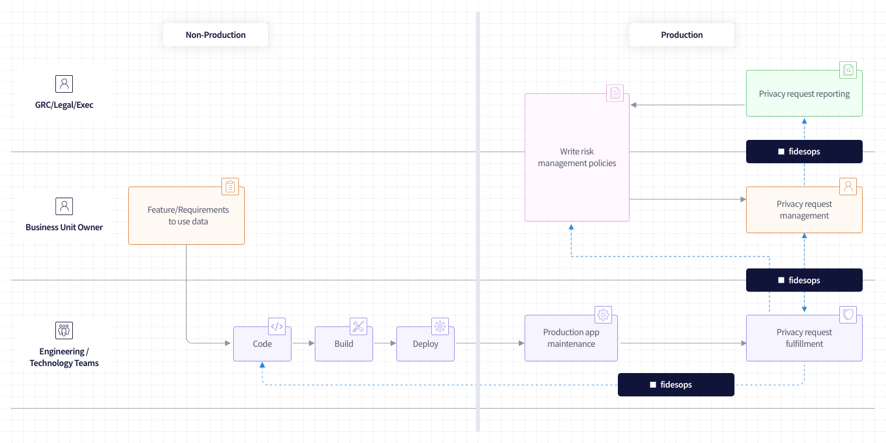
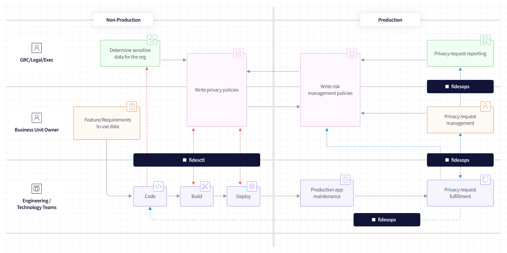

# What is Fidesops?

Fidesops (fee-dez-äps, combination of the Latin term "Fidēs" + "operations") is an open-source, extensible, deployed engine that fulfills any privacy request (e.g. access request, erasure request) by connecting directly to your disparate databases.

<iframe width="560" height="315" src="https://www.youtube.com/embed/1Sw4VlcbZ6I" title="Introduction to Fides Ops with Cillian Kieran" frameborder="0" allow="accelerometer; autoplay; clipboard-write; encrypted-media; gyroscope; picture-in-picture" allowfullscreen></iframe>
## Key Features
---

### Programmable Data Privacy
Fidesops connects and orchestrates calls to all of your databases in order to access, update and delete sensitive data per your policy configuration written in [Fideslang](https://github.com/ethyca/privacy-taxonomy).

### Handle Dependencies Between Datastores
Fidesops works by integrating all your datasets into a unified graph and automatically traversing them in order. We know that sensitive data is stored all around your dynamic ecosystem, so Fidesops builds these dependencies automatically for each request.

### Integrate with Compliance Tools
Fidesops is open & extensible, meaning it can easily be integrated into your existing privacy compliance management tools like OneTrust to fulfill data subject requests and return results, automatically.

### Built to Scale
Lots of databases? Tons of microservices? Connect as many databases and services as you'd like, and let Fidesops do the heavy lifting.

## How does Fidesops work with Fidesctl and Fideslang?
In a software organization, the team that writes and delivers software is normally the same team responsible for executing a privacy request when it comes in from customer support or legal . When your organization receives a privacy request, Fidesops will automatically fulfill it per the execution policies your legal and business owners have created by querying your databases directly. 

Your policies and database annotations are written in [**Fideslang**](https://github.com/ethyca/fideslang): the syntax that describes the attributes of your data and its allowed purposes of use. 

But after identifying what types of data are in your databases using Fideslang, how will your organization know what data is deemed sensitive? And how will your organization prevent inappropriate uses of that data? That's where [**Fidesctl**](https://github.com/ethyca/fides) comes in. Fidesctl is a CLI tool that continuously verifies Fideslang database annotations against acceptable use privacy policies.

## Next Steps

To start automating requests with Fidesops, visit the [Tutorial](tutorial/index.md) for a step-by-step walk through!