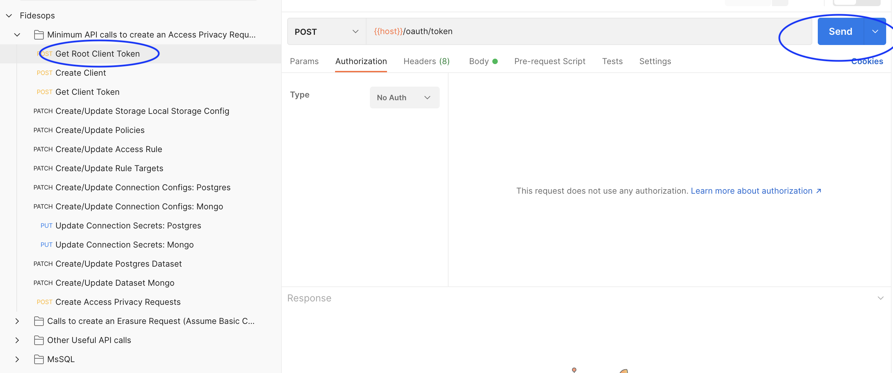
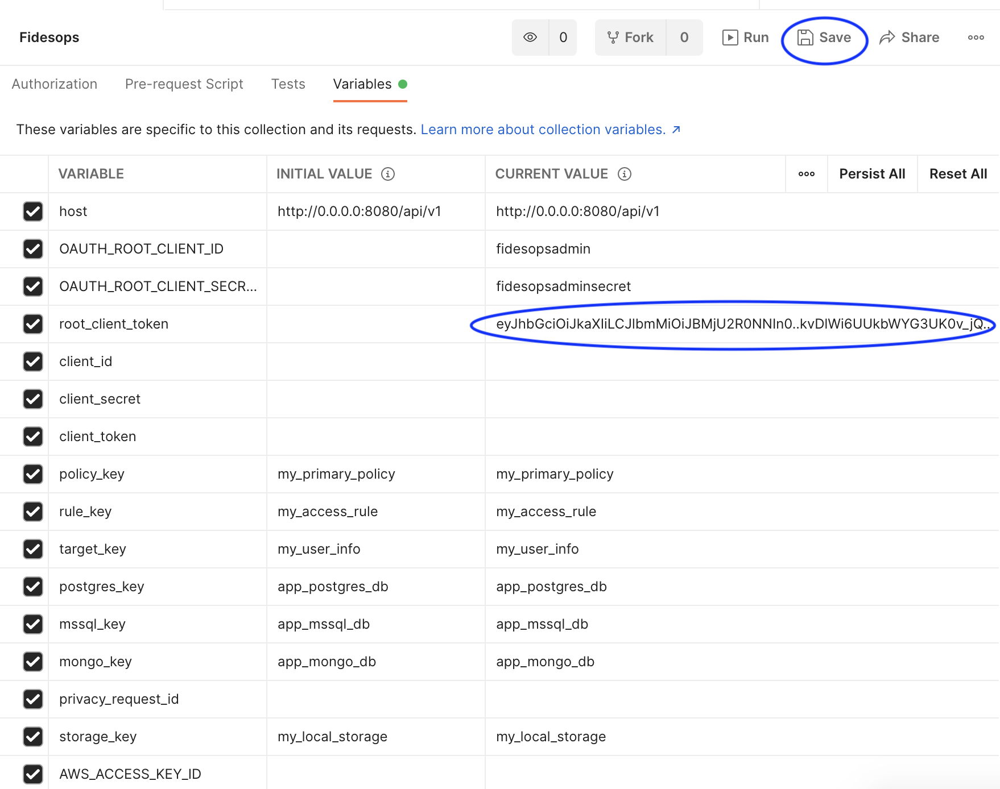

# Using the fidesops postman collection

We include a minimal fidesops collection for executing example `access` and `erasure` privacy requests against
mock external databases, and setting up the required prerequisite configuration.

## Loading the collection
1. Get [Postman](https://www.postman.com/)
2. Postman > File > Import

3. Upload the Fidesops collection found in `docs/fidesops/docs/postman/Fidesops.postman_collection.json`

4. Click on the imported `Fidesops` collection in the left pane and then find `Variables` to edit `Fidesops` collection variables.
   1. Some variables are populated for you - the authentication variables you will have to add yourself below.

5. Add your `OAUTH_ROOT_CLIENT_ID` and `OAUTH_ROOT_CLIENT_SECRET` under `CURRENT VALUE`.  I'm adding `fidesopsadmin` and `fidesopsadmin` secret, but you should add the appropriate values for your instance.
   1. Important: Click `Save`

## Bring up local servers and mock databases
1. Run `make integration-env` in your terminal to bring up the `fidesops` server, `redis`, the `fidesops` postgres database, and some mock external databases like `mongodb_example` and `postgres_example` pre-populated with test data, to represent your datastores.
   1. Note: We'll be working through the list of requests in the `Minimum API calls to create an Access Privacy Request` folder.  Some of the returned data will need to be saved as additional `Fidesops` variables for use in other steps.

## Saving Authentication variables
1. Click on the `Get Root Client Token` request and then click `Send` to send a `POST` request to fidesops to create a root token.

2. Copy the returned access token in the response body and paste it as the `Current Value` of `root_client_token` in Fidesops variables and click "Save".

3. Similarly, click on the next `Create Client` request and click `Send` to send `POST` request fo fidesops to create a client.
   1. Copy the `client_id` and `client_secret` and paste into `Current Value` slots in Fidesops variables and click "Save".
4. Finally, click on the `Get Client Token` request, and then click `Send` to send a `POST` request to create a token for the client we created in the previous step.
   1. Note: If you click on "Body" you can see that the client_id and client_secret have been added as form data for you.

   2. Save the returned token under `client_token` Current Value in the Fidesops variables.  The client_token will be automatically passed into the rest of your requests as the Bearer Token.

## Building out remaining privacy request configuration
Run through the remaining requests in the `Minimum API calls to create an Access Privacy Request` folder. Because
variables are automatically being populated for you, you should be able to click on each request, clicking "Send" for each one.
Inspect the `Body` of each request to see what we're sending to fidesops:

1. Specify where your data is going
   1. SEND `Create/Update Storage` - Local Storage Config - Sets up a local folder which we'll upload your privacy request results (for local testing only)
2. Configure what data we care about and what we'll do with it
   1. SEND `Create/Update Policies` - Creates a Policy where we'll start to spell out how to handle Privacy Requests
   2. SEND `Create/Update Access Rule` - Define an `access` Rule on that Policy that specifies results will be uploaded to our local storage
   3. SEND `Create/Update Rule Targets` - Specify a RuleTarget that says we will return data that has been marked as having a `user.provided.identifiable` data category
3. Create ConnectionConfigs and add connection secrets for our `postgres_example` and `mongodb_example` mock databases:
   1. SEND `Create/Update Connection Configs: Postgres`
   2. SEND `Create/Update Connection Configs: Mongo`
   3. SEND `Update Connection Secrets: Postgres`
   4. SEND `Update Connection Secrets: Mongo`
4. Add our annotations of the Postgres and Mongo datastores
   1. SEND `Create/Update Postgres Dataset`
   2. SEND `Create/Update Dataset Mongo`

Note: API calls to additional supported datastores (MsSQL, MySQL) are in separate folders within the collection. 

## Run a privacy request
Now, we should have all the basic pieces needed to create an Access request.
1. SEND `Create Access Privacy Requests` - If "succeeded", note the "id" that is returned. Note that succeeded means the privacy request has been created, and is pending, not that its execution is complete.

2. Check your local `fides_uploads` folder that we configured earlier to see access request results.
   1. This is run asynchronously, so it may take a few moments to complete.  This particular request should have retrieved data from both the `postgres_example` and `mongodb_example` databases with the `user.provided.identifiable` data_category

3. Check out other requests in the collection - the `Calls to create an Erasure Request` folder, walks you through configuring a separate erasure policy and executing an erasure request.
   1. Note that these erasure requests will mask data in your connected datastores (`postgres_example` and `mongo_example` here). If you connect your own live databases, data may be deleted.

Happy experimenting!
