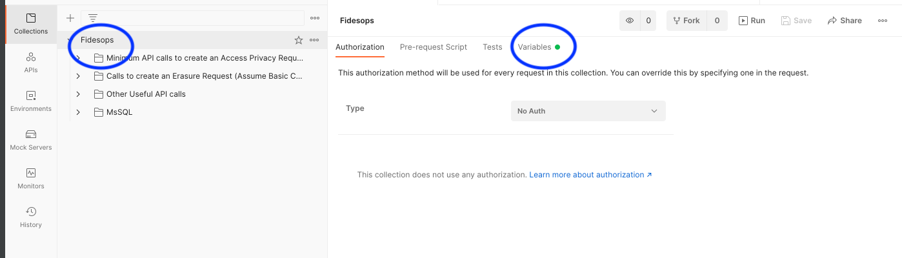
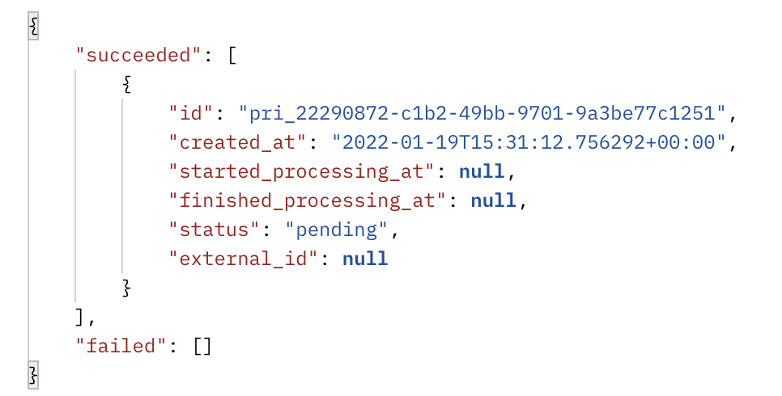

# Using the fidesops postman collection

A minimal Postman collection is included to assist in setting up your fidesops configurations, and in executing example `access` and `erasure` privacy requests against mock external databases.

## Loading the collection
1. Get [Postman](https://www.postman.com/)
2. Postman > File > Import

      

3. Upload the Fidesops collection found in `docs/fidesops/docs/postman/Fidesops.postman_collection.json`

      

4. Click on the imported `fidesops` collection in the left pane and then find `Variables` to edit `fidesops` collection variables.
      - Some variables are populated for you, and some will be added in this guide's next steps.

      

5. Add your `OAUTH_ROOT_CLIENT_ID` and `OAUTH_ROOT_CLIENT_SECRET` under `CURRENT VALUE`.  
      - `fidesopsadmin` and `fidesopsadmin` are default configurations for testing, found in your `fidesops.toml`. Add the appropriate values for your instance if they differ.
      - **Important:** Click `Save`!

      

## Bring up local servers and mock databases
1. Run `make integration-env` in your terminal.
      - This brings up the `fidesops` server, `redis`, the `fidesops` postgres database, and some mock external databases like `mongodb_example` and `postgres_example`. These mock databases are pre-populated with test data to represent your datastores.
  
!!! Note ""
      The following list of requests is kept in the `Minimum API calls to create an Access Privacy Request` folder. Some of the returned data will need to be saved as additional variables for use in other steps.
    
   

## Saving Authentication variables
1. Click on the `Get Root Client Token` request, and click `Send` to send a `POST` request to fidesops to create a root token.

      

2. Copy the `access_token` returned in the response body, and paste it as the `Current Value` of `root_client_token` in Fidesops variables.
       - **Important:** Click `Save`!

      
      

3. Similarly, click on `Create Client`, and click `Send` to send a `POST` request to fidesops to create a new client.
      - Copy the `client_id` and `client_secret` and paste into `Current Value` slots in Fidesops variables and click "Save".
  
4. Finally, click on the `Get Client Token` request, and click `Send` to send another `POST` request to fidesops. This will create a token for the client made in the previous step.

      

      - If you click on **Body**, you can see that the `client_id` and `client_secret` have been added as form data for you.

5. Save the returned token under `client_token` in the Fidesops variables.  The `client_token` will be automatically passed into the rest of your requests as the Bearer Token.

      

## Building out remaining privacy request configuration
Run through the remaining requests in the `Minimum API calls to create an Access Privacy Request` folder. Because variables are automatically being populated for you, you should be able to click on each request, clicking `Send` for each one.

Inspect the `Body` of each request to see what is sent to fidesops:

1. Specify where your data is going:
      1. SEND `Create/Update Storage` - Local Storage Config - Sets up a local folder for uploading your privacy request results (local testing only)
2. Configure what data you care about, and what to do with it:
      1. SEND `Create/Update Policies` - Creates a Policy to handle Privacy Requests
      2. SEND `Create/Update Access Rule` - Defines an `access` Rule on the previous Policy, which specifies results will be uploaded to the configured local storage
      3. SEND `Create/Update Rule Targets` - Specify a RuleTarget that says to will return data that has been marked as having a `user.provided.identifiable` data category
3. Create ConnectionConfigs, and add connection secrets for the `postgres_example` and `mongodb_example` mock databases:
      1. SEND `Create/Update Connection Configs: Postgres`
      2. SEND `Create/Update Connection Configs: Mongo`
      3. SEND `Update Connection Secrets: Postgres`
      4. SEND `Update Connection Secrets: Mongo`
4. Add annotations of the Postgres and Mongo datastores:
      1. SEND `Create/Update Postgres Dataset`
      2. SEND `Create/Update Dataset Mongo`

!!! Note ""
      API calls to additional supported datastores (MsSQL, MySQL) are in separate folders within the collection. 

## Run a privacy request
You have now completed the basic configuration required to create an Access Request.

1. SEND `Create Access Privacy Requests`
      - If "succeeded", note the "id" that is returned. Succeeded means the privacy request has been created and is *pending,* not that its execution is complete.

      

2. Check your local `fides_uploads` folder, configured earlier, to see access request results.
      - This is run asynchronously, so it may take a few moments to complete.  This particular request should have retrieved data from both the `postgres_example` and `mongodb_example` databases with the `user.provided.identifiable` data_category

      

## Next steps
1.  Check out other requests in the collection!
      - The `Calls to create an Erasure Request` folder walks you through configuring a separate erasure policy, and executing an erasure request.

!!! Note ""
      Note that these erasure requests will mask data in your connected datastores (`postgres_example` and `mongo_example` here. **If you connect your own live databases, data may be deleted.**

Happy experimenting!
