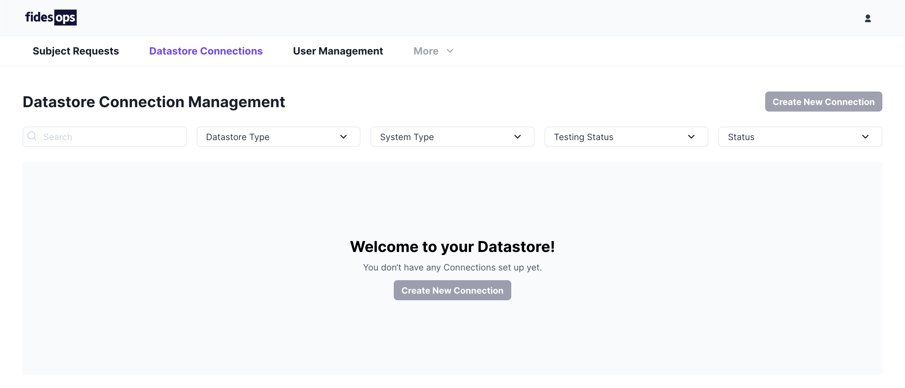

# Managing Datastores

Datastores represent connections to third party applications, databases, or manual storage. Configuring a datastore allows Fidesops to include these connections when fulfilling privacy requests.

