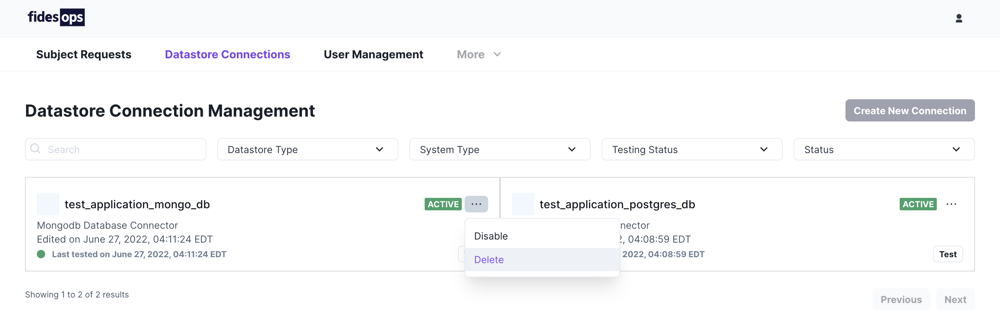

# Managing Datastores

Datastores represent connections to third party applications, databases and datasets, or manual storage locations.

## Viewing Datastores

All currently configured datastores will appear in the paginated Datastore Connections panel. Search options are available to filter the datastore list.

`Active` datastores are included when fulfilling privacy requests.

`Disabled` datastores have their connection information saved, but are not included when privacy requests are executed.
### Panel Options
| Option | Description |
|----|----|
| Search | Retrieve a datastore by name. |
| Datastore Type | Filter datastores by type: SaaS, Postgres, Mongo, etc. |
| System Type | Filter datastores by system: SaaS, Database, or Manual. |
| Testing Status | Filter stores by the result of their last test: Passed, Failed, or Untested. |
| Status | Filter datastores by status: Active or Disabled. |

## Testing datastores
Each configured datastore includes an option to `Test` its connection. Fidesops will record the last tested time to the datastore's card, and update the current connection status. 

`Green` connections have passed their most recent test. 

`Red` connections have failed.

`Grey` connections have not been tested.

## Disabling and deleting datastores

Selecting the three dots menu `[...]` beside a datastore's connection status will bring up `Disable` and `Delete` options for that datastore.

Selecting either Disable or Delete will display a warning to confirm the action. Deleted datastores will have their connection information removed entirely from fidesops, while Disabled datastores may be enabled again from the same menu at a later date.

