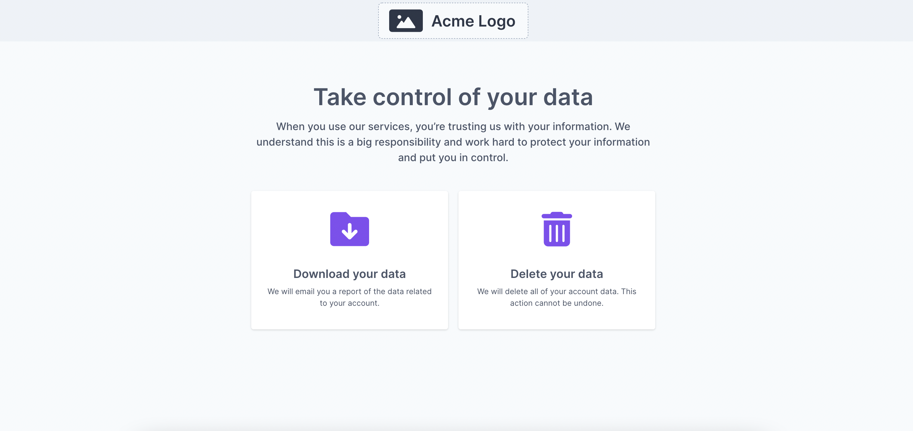

# Privacy Center

The fidesops [Privacy Center](privacy_center.md) is a configurable webpage where users can request to download or delete their data.



## Configuration
The fidesops Privacy Center's text and actions are managed by a `config.json` file in the fidesops `/privacy-center/config` directory.

```json title="<code>config.json</code>"
{
  "title": "Take control of your data",
  "description": "When you use our services, you’re trusting us with your information. We understand this is a big responsibility and work hard to protect your information and put you in control.",
  "fidesops_host_development": "http://localhost:8080/api/v1",
  "fidesops_host_production": "",
  "logo_path": "/logo.svg",
  "actions": [
    {
      "policy_key": "download",
      "icon_path": "/download.svg",
      "title": "Download your data",
      "description": "We will email you a report of the data related to your account.",
      "identity_inputs": {
        "name": "optional",
        "email": "required",
        "phone": "optional"
      }
    },
    {
      "policy_key": "delete",
      "icon_path": "/delete.svg",
      "title": "Delete your data",
      "description": "We will delete all of your account data. This action cannot be undone.",
      "identity_inputs": {
        "name": "optional",
        "email": "required",
        "phone": "optional"
      }
    }
  ]
}
```

| Key | Description |
|----|----|
| `title` and `dscription` | Text fields to override the default text of either the main portal, or the associated action. |
| `fidesops_host_development` | The URL to use for development deployments. |
| `fidesops_host_production` | The URL to use for production deployments. |
| `logo_path` | The relative path to a brand or site logo to replace the default. |
| `actions` | A list of [action objects](#actions), each of which represent a new tile available in the portal, and are associated to a single fidesops policy. |
| `policy_key` | The key of the [policy](../guides/policies.md) to use for this action. |
| `icon_path` | The relative path of an icon to replace the defaults. |
| `identity_inputs` | The list of personally identifiable information required by an action. |

### Actions
Actions represent available privacy rights executable from the Privacy Center. The provided `config.json` includes Download and Delete default, representing common requests to access or remove data under most privacy regulations. Each action is associated with a fidesops [policy key](../guides/policy_webhooks.md), which defines the policy executed when the DSR is approved.

Additional actions can be added to this list, and removed at any time.

### Styling
Any overrides for CSS styling can be included in a `config.css` file in the `/privacy-center/config` directory.

