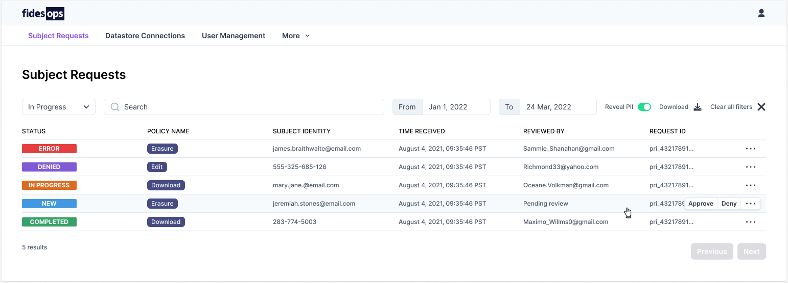
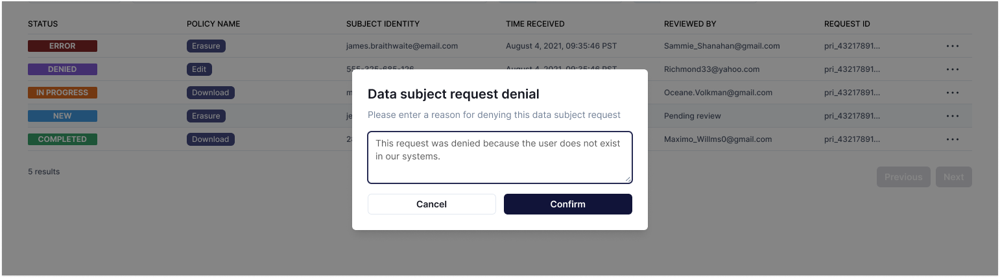
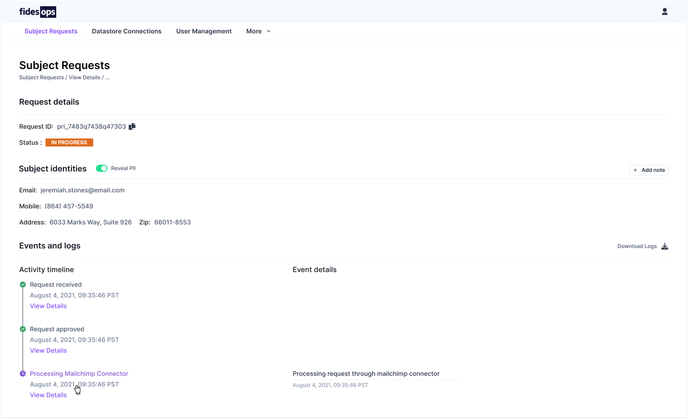

# Subject Requests

The FidesOps Admin UI is designed to provide easy, at-a-glance access to submitted Subject Requests. The Subject Request panel provides search and sort capabilities, quick approve and deny functions, and in-depth details on a request's history and status.

### Panel Options
| Option | Description |
|----|----|
| Status | Requests can be filtered by their current status: **Error**, **Denied**, **In Progress**, **New**, *Cancelled*, and **Complete**.|
| Search | The search bar filters on a given field: status, reviewer, etc. |
| Date Filter | Retrieve requests received within a certain date window. |
| Reveal PII | Toggling **Reveal PII** will display all personal information for the shown requests. |
| Download | Download a `.csv` of the shown requests. |
| Clear | Remove all search options and filters. |

## Approve or Deny Requests

Hovering over a request row will provide access to the **approve** and **deny** options for that request.

**Approving** a request will log the action, the approver's account, and begin the process of executing the request based on the associated [policy](../guides/policies.md).

**Denying** a request allows the user to input a denial reason before confirming the action.

## View Request Details

Double-clicking a request row will display the request detail page, which allows access to additional information about the request, as well as the request ID and status. 