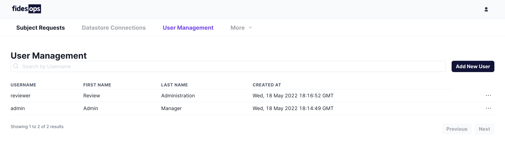
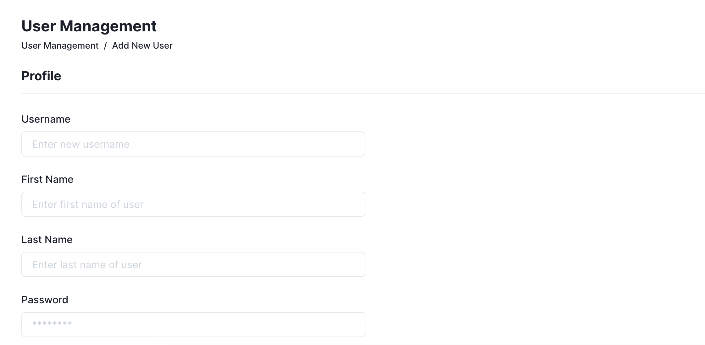
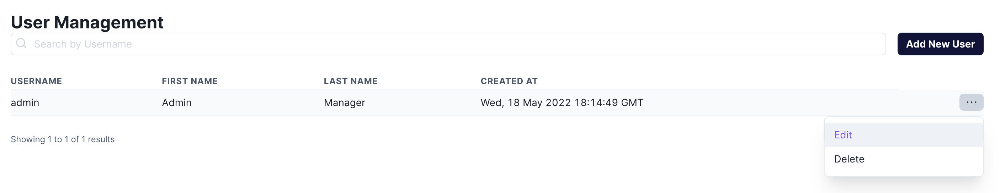

# User Management
Fidesops users can be easily managed from both the built-in control panel, and a series of [API endpoints](#managing-users-from-the-api).
## Managing Users from the UI
The User Management panel displays a view of all users within the system, and provides a search bar for retrieving users by username. 




### Creating New Users
The `Add New User` button can create a new user:



### Managing User Privileges
New users can be created with a series of privileges, or permissions, to allow or restrict their access to individual parts of your fidesops configuration. 

#### Privileges
Privileges represent individual user permissions. Ensure each user is created with the permissions applicable for their role.

| Privilege | Description |
|----|----|
| View subject requests | All users are able to view subject requests by default. |
| Approve subject requests | Allows the user to process/approve submitted DSRs. | 
| View datastore connections | Allows the user to view, but not edit, any existing connections to your datastores. |
| Create or Update datastore connections | Allows the user to create new datastore connections, and update existing connections. |
| Delete datastore connections | Allows the user to delete existing datastore connections, removing them entirely from fidesops. |
| View policies | Allows the user to view existing fidesops policies. | 
| Create policies | Allows the user to create new fidesops policies. |
| View users | Allows the user to view the User Management panel. |
| Create users | Allows the user to create new users from the User Management panel. ||
| View roles | Allows the user to view, but not edit, existing roles. |
| Create roles | Allows the user to create new roles. |

### Editing Existing Users
Existing users can be edited by selecting the "Edit" button from the side of the user row. Users may also be deleted from this drop-down menu. Note that an individual's username may not be changed.




## Managing Users from the API 

Fidesops provides several user-related endpoints for managing access to the control panel. Example requests are included in the fidesops [Postman collection](./../postman/using_postman.md).


### User and Endpoint Scopes
User permissions are managed through access tokens, which contain scopes associated to individual endpoints. Endpoint access can be restricted by removing their scope from an access token.

Creating a user currently provides access to all scopes.


### User Passwords
All user passwords must by Base64 encoded before creating a new user, logging in, or changing a users password. This can be done with [base64encode.org](https://www.base64encode.org/). After Base64 encoding, the password `Suitablylongwithnumber8andsymbol$` would become `U3VpdGFibHlsb25nd2l0aG51bWJlcjhhbmRzeW1ib2wk`.

### Logging in


```
POST api/v1/login
``` 

```json title="Request Body"
{
  "username": "test_username",
  "password": "U3VpdGFibHlsb25nd2l0aG51bWJlcjhhbmRzeW1ib2wk"
}
```

Successful POST requests to the `login` endpoint will return an `access_token` with all available scopes. This token can be used to make subsequent requests to the Users endpoints.

### Logging out 

```
POST api/v1/logout
``` 

| Authentication | Scope | Description |
|---|---|---|
| Bearer token | N/A | An `access_token` returned from `login`. |

The `logout` endpoint will invalidate the provided `access_token`, which must be included as the Bearer token in your request.

### Creating a user

```
POST api/v1/user
``` 

```json title="Request Body"
{
  "username": "new_username",
  "password": "U3VpdGFibHlsb25nd2l0aG51bWJlcjhhbmRzeW1ib2wk"
}
```

| Authentication | Scope | Description |
|---|---|---|
| Bearer token | `user:create` | An `access_token` returned from `login`. |

The `user` endpoint will create an additional user with the `username` and `password` provided in the request body. An `access_token` with a scope of `user:create` is required.


### Deleting a user

```
DELETE api/v1/user/<user_id>
``` 

| Authentication | Scope | Description |
|---|---|---|
| Bearer token | `user:delete` | An `access_token` returned from `login`. |

An `access_token` with a scope of `user:delete` is required, and must be associated to the Admin UI Root User, or the user you are trying to delete.